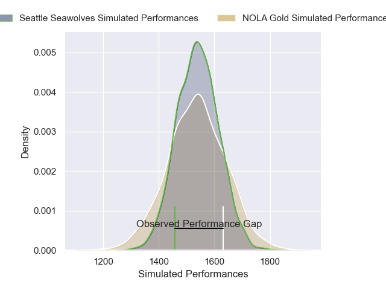
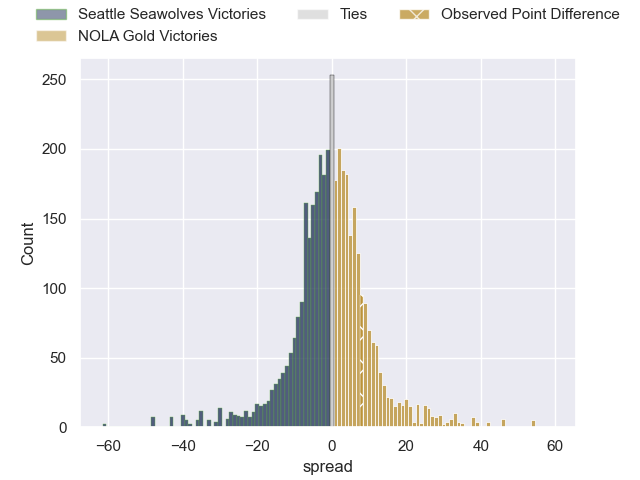
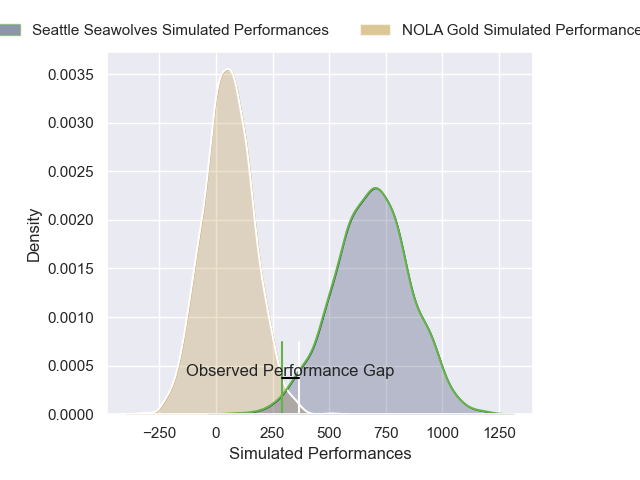
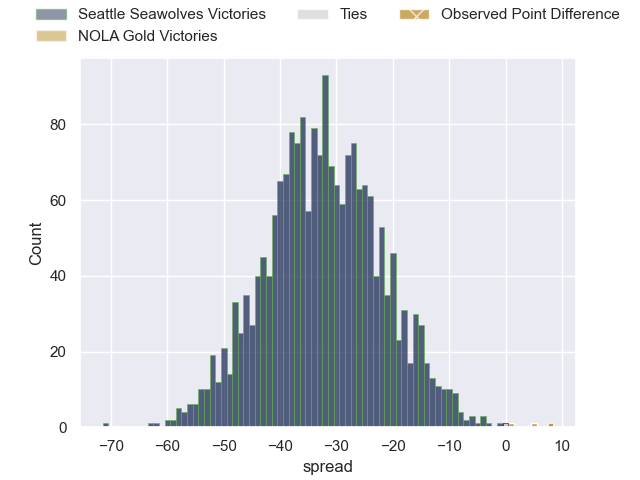

---  
layout: page  
title: Seattle Seawolves at NOLA Gold; 36-44  
date: 2025-04-27 18:00:00 -0500  
categories: "Major League Rugby 2025" match review  
---
# Seattle Seawolves at NOLA Gold; 36-44

# Club Level Predictions

The first set of predictions treats a club as the smallest object, as the club develops its members, organizes a gameplan, and deploys its players as needed for each match. This club model has a prediction of 0.497, which translates to predicting Seattle Seawolves to win by 0.1.

Our Over/Under is 57.5 - and combined with the spread above, we have a predicted scoreline of 29 to 29

Each club has a rating and a rating deviation (similar to a Glicko rating), and expected performances can be generated. This allows for simulated matches and spreads like the ones below.
## Projected Performances - Club Model

## Projected Spreads - Club Model

## Projected Results - Club Model

# Player Level Predictions

Treating teams instead as an entity made up of the currently active players, I have ratings for each player in an altogether different system. These can be combined to form team ratings once teamsheets are announced, weighting starters a bit higher than the reserves. After the match is played, players can be weighted by their minutes on the field, allowing for an accurate measure of the team's composition. With these compiled team ratings, we can make predictions, measure inaccuracy, and update the individual player ratings.
## Prediction without Player Minutes: Seattle Seawolves by 18.7

Seattle Seawolves by 22.2 on a neutral pitch

## Projected Performances - Player Model

## Projected Spreads - Player Model

## Projected Results - Player Model

|   Away Minutes | Away Player       |   Away Percentile |   Number |   Home Percentile | Home Player          |   Home Minutes |
|---------------:|:------------------|------------------:|---------:|------------------:|:---------------------|---------------:|
|             80 | Cameron Orr       |             59.58 |        1 |             63.35 | Matthew Harmon       |             39 |
|             34 | Kerron van Vuuren |             27.45 |        2 |             78.32 | Alex Lopeti          |             80 |
|             54 | Juan Pablo Zeiss  |             49.8  |        3 |             86.61 | Paul Mullen          |              2 |
|             54 | Juan Pablo Zeiss  |             49.8  |        3 |             86.61 | Paul Mullen          |             18 |
|             54 | Juan Pablo Zeiss  |             49.8  |        3 |             86.61 | Paul Mullen          |             30 |
|             54 | Juan Pablo Zeiss  |             49.8  |        3 |             86.61 | Paul Mullen          |             24 |
|             54 | Taylor Krumrei    |             61.93 |        4 |             59.8  | Jay Tuivaiti         |             12 |
|             48 | Rhyno Herbst      |             89.42 |        5 |             15.88 | Cam Dolan            |             22 |
|             55 | Rhyno Herbst      |             89.42 |        5 |             15.88 | Cam Dolan            |             22 |
|             77 | Rhyno Herbst      |             89.42 |        5 |             15.88 | Cam Dolan            |             22 |
|             53 | Rhyno Herbst      |             89.42 |        5 |             15.88 | Cam Dolan            |             22 |
|             50 | OJ Noa            |             84.59 |        6 |              5.36 | Moni Tonga'uiha      |             30 |
|             80 | Charles Elton     |             64.88 |        7 |             47.46 | Aidan King           |              0 |
|             54 | Riekert Hattingh  |             87.61 |        8 |             62.61 | Jonah Mau'u          |             27 |
|             64 | Juan Philip Smith |             67.24 |        9 |             17.24 | Ruben de Haas        |             27 |
|             80 | Rod Iona          |              6.54 |       10 |             78.94 | Dorian Jones         |             69 |
|             34 | Jade Stighling    |             78.78 |       11 |              1.43 | Nikolai Foliaki      |             64 |
|             26 | Dan Kriel         |             59.65 |       12 |              1.74 | JP Du Plessis        |             46 |
|             26 | Divan Rossouw     |              6.44 |       13 |              5.62 | Isaac Te Tamaki      |             64 |
|             80 | Lauina Futi       |             21.32 |       14 |             77.63 | Xavier Mignot        |             16 |
|             27 | Duncan Matthews   |             90.93 |       15 |             81.44 | Julian Roberts       |             80 |
|             80 | Isaia Lotawa      |            nan    |       16 |            nan    | Chase Jones          |             80 |
|             23 | Dewald Kotze      |             42.13 |       17 |              7.36 | Luke Carty           |             26 |
|             80 | Devin Short       |             15.6  |       18 |             88.64 | Joe Taufete'e        |             40 |
|             56 | Eddie Fouche      |             82.82 |       19 |             17.22 | Tupou Ma'afu-Afungia |             30 |
|             53 | Malacchi Esdale   |              7.46 |       20 |             12.46 | Luke Campbell        |             16 |
|             80 | Chance Wenglewski |            nan    |       21 |             77.32 | Kelian Galletier     |             80 |
|             80 | Brock Gallagher   |            nan    |       22 |            nan    | Bart Vermeulen       |             59 |
|            nan | nan               |            nan    |       23 |            nan    | Tyler Matchem        |             64 |

