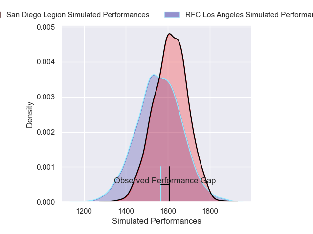
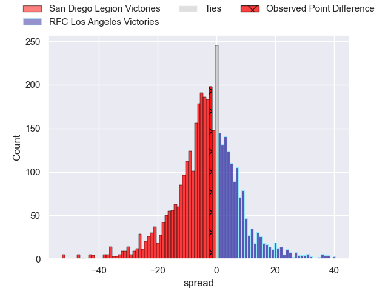
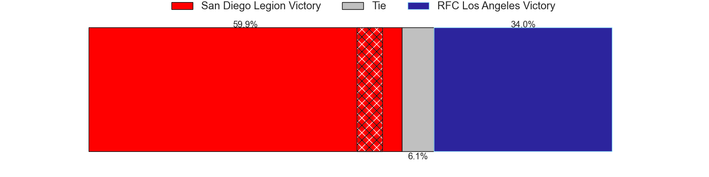
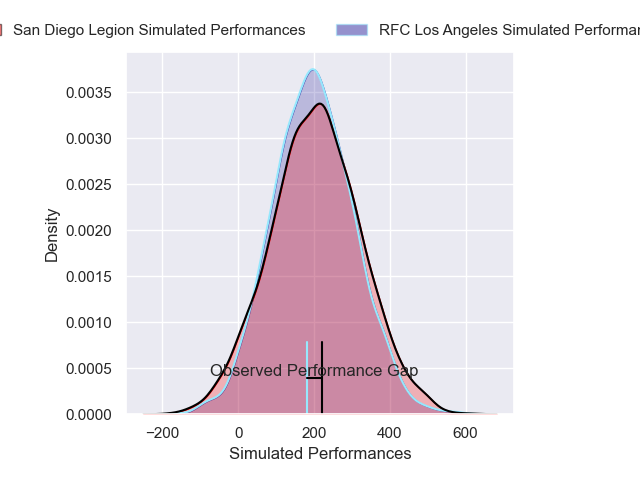
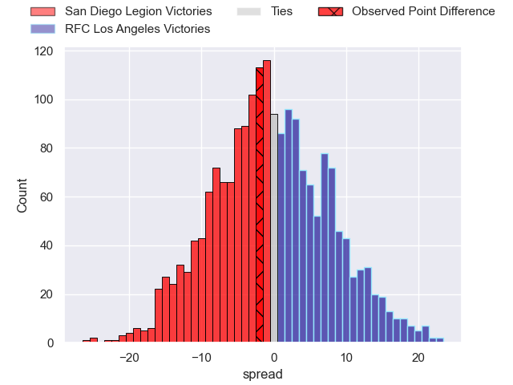
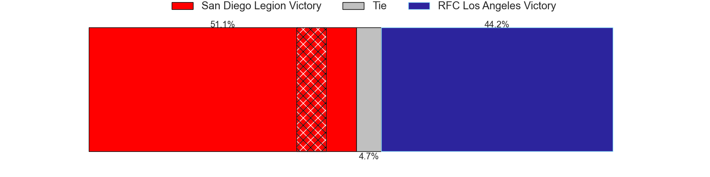

---  
layout: page  
title: San Diego Legion at RFC Los Angeles; 38-36  
date: 2025-04-27 18:00:00 -0500  
categories: "Major League Rugby 2025" match review  
---
# San Diego Legion at RFC Los Angeles; 38-36

# Club Level Predictions

The first set of predictions treats a club as the smallest object, as the club develops its members, organizes a gameplan, and deploys its players as needed for each match. This club model has a prediction of 0.429, which translates to predicting San Diego Legion to win by 2.6.

Our Over/Under is 59.5 - and combined with the spread above, we have a predicted scoreline of 31 to 28

Each club has a rating and a rating deviation (similar to a Glicko rating), and expected performances can be generated. This allows for simulated matches and spreads like the ones below.
## Projected Performances - Club Model

## Projected Spreads - Club Model

## Projected Results - Club Model

# Player Level Predictions

Treating teams instead as an entity made up of the currently active players, I have ratings for each player in an altogether different system. These can be combined to form team ratings once teamsheets are announced, weighting starters a bit higher than the reserves. After the match is played, players can be weighted by their minutes on the field, allowing for an accurate measure of the team's composition. With these compiled team ratings, we can make predictions, measure inaccuracy, and update the individual player ratings.
## Prediction without Player Minutes: RFC Los Angeles by 4.6

RFC Los Angeles by 2.2 on a neutral pitch

## Projected Performances - Player Model

## Projected Spreads - Player Model

## Projected Results - Player Model

|   Away Minutes | Away Player              |   Away Percentile |   Number |   Home Percentile | Home Player           |   Home Minutes |
|---------------:|:-------------------------|------------------:|---------:|------------------:|:----------------------|---------------:|
|             48 | Payton Telea             |             11.31 |        1 |             50.68 | Alessandro Heaney     |             46 |
|             33 | Hugh Roach               |             58.74 |        2 |             16.43 | Ben Sugars            |              7 |
|             34 | Darcy Breen              |             15.16 |        3 |             68.81 | Maliu Niuafe          |             26 |
|             46 | Jed Holloway             |             12.53 |        4 |              6.78 | Tim Anstee            |             30 |
|             30 | Vili Helu                |             22.1  |        5 |             89.69 | Jurie van Vuuren      |             50 |
|             67 | Christian Poidevin       |             74.35 |        6 |             97.13 | Semi Kunatani         |             80 |
|             80 | Brad Wilkin              |             29.86 |        7 |             66.7  | Edward Timpson        |             73 |
|             80 | Tu'Ihalangingie Hokafonu |             21.22 |        8 |             58.4  | Ben Houston           |             34 |
|             17 | Connor Tupai             |              8.36 |        9 |             87.54 | Gonzalo Bertranou     |             80 |
|              8 | Lincoln McClutchie       |             67.89 |       10 |             85.89 | Christian Leali'ifano |             80 |
|             50 | Ryan James               |              7.17 |       11 |             72.56 | Andrew Coe            |             80 |
|             32 | Cassh Maluia             |             17.57 |       12 |             94.48 | Bill Meakes           |             15 |
|             58 | Marcel Brache            |             83.04 |       13 |             58.12 | Nick Chan             |              0 |
|             13 | Tomas Aoake              |             86.33 |       14 |              3.15 | Rory van Vugt         |             34 |
|             80 | Ethan Grayson            |             41.24 |       15 |             83.92 | Reece MacDonald       |             53 |
|             80 | Tavite Lopeti            |             67.93 |       16 |            nan    | Franco van den Berg   |             50 |
|             67 | Shilo Klein              |             86.71 |       17 |             46.85 | Mike Sosene-Feagai    |             46 |
|             55 | Brooke To'omalatai       |            nan    |       18 |              0.48 | Matt Heaton           |             80 |
|             80 | Richard Judd             |             95.39 |       19 |             67.41 | Tas Smith             |             80 |
|             80 | Nathan Sylvia            |            nan    |       20 |            nan    | Mikaea Wynyard        |             13 |
|             55 | Steffan Crimp            |            nan    |       21 |             13.19 | Jack Shaw             |             48 |
|            nan | nan                      |            nan    |       22 |             61.71 | Ben Strang            |             30 |
|            nan | nan                      |            nan    |       23 |            nan    | Justus Tavai          |             30 |

