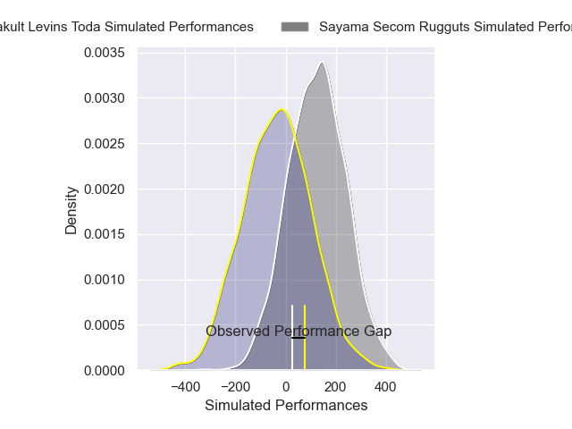
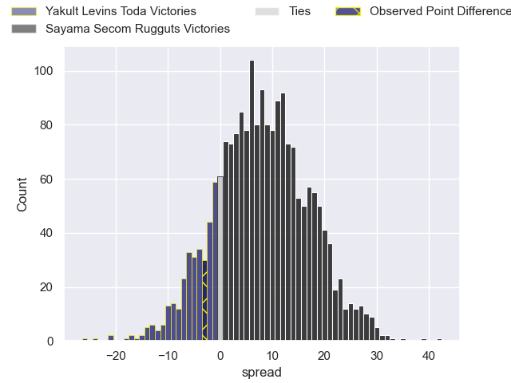
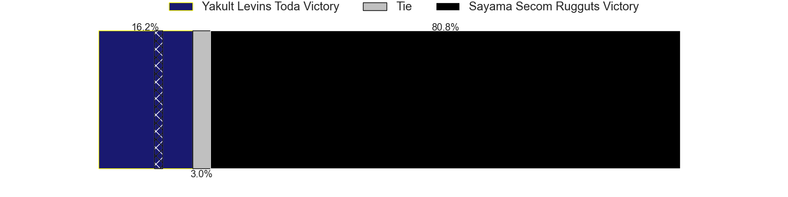

---  
layout: page  
title: Yakult Levins Toda at Sayama Secom Rugguts; 50-47  
date: 2025-04-27 18:00:00 -0500  
categories: "Japan Rugby League One D3 24/25" match review  
---
# Yakult Levins Toda at Sayama Secom Rugguts; 50-47

# Club Level Predictions

The first set of predictions treats a club as the smallest object, as the club develops its members, organizes a gameplan, and deploys its players as needed for each match. This club model has a prediction of 0.975, which translates to predicting Sayama Secom Rugguts to win by 41.6.

Our Over/Under is 57.5 - and combined with the spread above, we have a predicted scoreline of 8 to 50

Each club has a rating and a rating deviation (similar to a Glicko rating), and expected performances can be generated. This allows for simulated matches and spreads like the ones below.
## Projected Performances - Club Model

## Projected Spreads - Club Model

## Projected Results - Club Model

# Player Level Predictions

Treating teams instead as an entity made up of the currently active players, I have ratings for each player in an altogether different system. These can be combined to form team ratings once teamsheets are announced, weighting starters a bit higher than the reserves. After the match is played, players can be weighted by their minutes on the field, allowing for an accurate measure of the team's composition. With these compiled team ratings, we can make predictions, measure inaccuracy, and update the individual player ratings.
## Prediction without Player Minutes: Sayama Secom Rugguts by 8.0

Sayama Secom Rugguts by 5.8 on a neutral pitch

## Projected Performances - Player Model

## Projected Spreads - Player Model

## Projected Results - Player Model

|   Away Minutes | Away Player          |   Away Percentile |   Number |   Home Percentile | Home Player       |   Home Minutes |
|---------------:|:---------------------|------------------:|---------:|------------------:|:------------------|---------------:|
|             63 | Daichi Kono          |             51.24 |        1 |             40.18 | Sotaro Tanaka     |             45 |
|             80 | Shunsuke Tani        |             36.36 |        2 |             55.07 | Tatsuki Tanina    |             50 |
|             63 | Atsushi Furuya       |             38.25 |        3 |             27.11 | Naoto Shirakawa   |             59 |
|             67 | Masashi Ogawa        |             18.85 |        4 |             32.68 | Itsuki Fujii      |             80 |
|             60 | Daisuke Yokoyama     |             18.94 |        5 |             36.49 | Kazuki Asakura    |             69 |
|             80 | Rikiya Oishi         |             62.97 |        6 |              2.97 | Ash Parker        |             80 |
|             72 | Kosuke Urabe         |             30.72 |        7 |             29.76 | Kento Mizutani    |             64 |
|             80 | Jaycob Matiu         |              6.09 |        8 |             61.34 | Whetu Douglas     |             80 |
|             49 | Junpei Tada          |             22.7  |        9 |             14.68 | Kanaru Takahashi  |             69 |
|             80 | Nick Evemy           |             14.93 |       10 |             21.06 | Daniel Waite      |              0 |
|             80 | Masatoshi Doi        |             22.94 |       11 |             39.39 | Musashi Matsuda   |              0 |
|             49 | Takumi Furukawa      |             53.73 |       12 |             82.64 | Chase Tiatia      |             71 |
|             80 | Antonio Mikaele-Tu'u |              6.95 |       13 |             17.36 | Fisipuna Tuiaki   |             16 |
|             49 | Kagechika Ota        |             20.75 |       14 |             37.57 | Ayumu Sawada      |             80 |
|             80 | Shun Sawamura        |             22.68 |       15 |             46.39 | Yudai Ishii       |             22 |
|             80 | Yuto Usuda           |             24.7  |       16 |            nan    | Yuki Tsujioka     |             12 |
|             73 | Iori Nozaki          |             23.98 |       17 |             55.57 | Motoki Kaneko     |             68 |
|             25 | Takuya Takahashi     |             42.16 |       18 |             43.71 | Shota Okuno       |             20 |
|             35 | Kosetu Kawachi       |             62.76 |       19 |             47.55 | Kentaro Ueno      |             23 |
|             16 | Masaya Makino        |             49.86 |       20 |            nan    | Shigeto Yamashita |             80 |
|             33 | Takudo Okazaki       |            nan    |       21 |            nan    | Eito Tsutsumi     |             21 |
|             51 | Atomu Shirai         |             22.98 |       22 |            nan    | Kaito Sugahara    |             27 |
|              9 | Meishi Watanabe      |            nan    |       23 |             58.41 | Yushi Okuda       |             40 |

