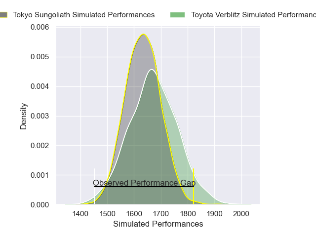
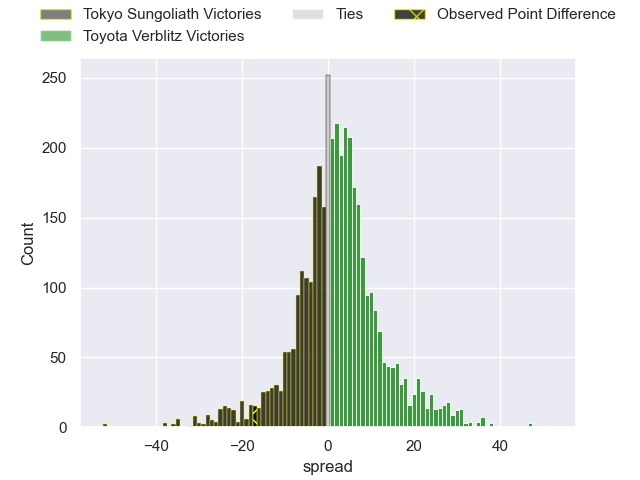
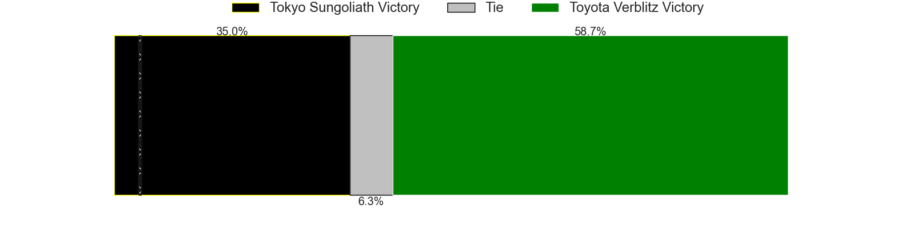
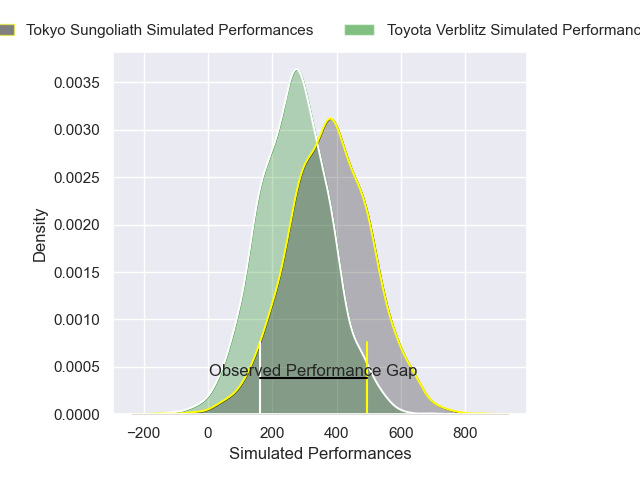
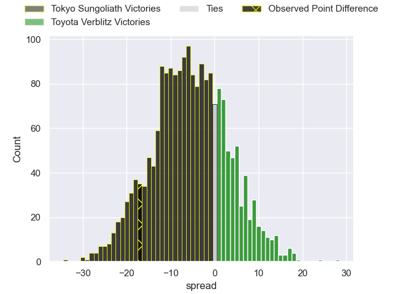
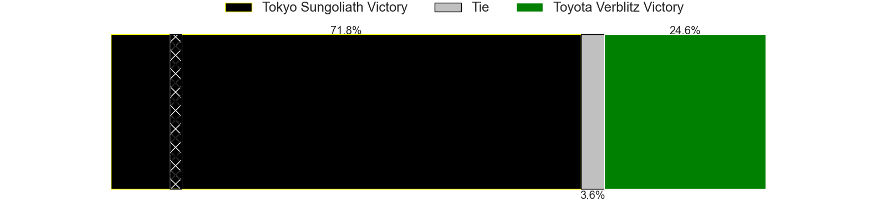

---  
layout: page  
title: Tokyo Sungoliath at Toyota Verblitz; 45-28  
date: 2025-04-27 18:00:00 -0500  
categories: "Japan Rugby League One 24/25" match review  
---
# Tokyo Sungoliath at Toyota Verblitz; 45-28

# Club Level Predictions

The first set of predictions treats a club as the smallest object, as the club develops its members, organizes a gameplan, and deploys its players as needed for each match. This club model has a prediction of 0.555, which translates to predicting Toyota Verblitz to win by 2.0.

Our Over/Under is 58.5 - and combined with the spread above, we have a predicted scoreline of 28 to 30

Each club has a rating and a rating deviation (similar to a Glicko rating), and expected performances can be generated. This allows for simulated matches and spreads like the ones below.
## Projected Performances - Club Model

## Projected Spreads - Club Model

## Projected Results - Club Model

# Player Level Predictions

Treating teams instead as an entity made up of the currently active players, I have ratings for each player in an altogether different system. These can be combined to form team ratings once teamsheets are announced, weighting starters a bit higher than the reserves. After the match is played, players can be weighted by their minutes on the field, allowing for an accurate measure of the team's composition. With these compiled team ratings, we can make predictions, measure inaccuracy, and update the individual player ratings.
## Prediction without Player Minutes: Tokyo Sungoliath by 10.7

Tokyo Sungoliath by 15.3 on a neutral pitch

## Projected Performances - Player Model

## Projected Spreads - Player Model

## Projected Results - Player Model

|   Away Minutes | Away Player       |   Away Percentile |   Number |   Home Percentile | Home Player         |   Home Minutes |
|---------------:|:------------------|------------------:|---------:|------------------:|:--------------------|---------------:|
|             80 | Yukio Morikawa    |             92.06 |        1 |             87.89 | Shogo Miura         |             55 |
|             63 | Kosuke Horikoshi  |             68.88 |        2 |             90.03 | Yoshikatsu Hikosaka |             30 |
|             53 | Kan Nakano        |             26.38 |        3 |             70.89 | Genki Sudo          |             30 |
|             80 | Sam Jeffries      |             98.33 |        4 |             32.59 | Adre Smith          |             73 |
|             40 | Harry Hockings    |             98.89 |        5 |             33.98 | Josh Dickson        |             21 |
|             40 | Kanji Shimokawa   |             80.77 |        6 |             22.78 | Will Tupou          |             25 |
|             29 | Sam Cane          |             98.66 |        7 |             45.26 | Kosei Miki          |             29 |
|             24 | Ryuga Hashimoto   |             67.23 |        8 |             53.15 | Kazuki Himeno       |             21 |
|             80 | Yutaka Nagare     |             80.03 |        9 |             33.79 | Kaisei Tamura       |             59 |
|             40 | Keisuke Moriya    |             96.52 |       10 |             32.72 | Shinya Komura       |             17 |
|             40 | Cheslin Kolbe     |             99.71 |       11 |             55.45 | Vatiliai Tuidraki   |             13 |
|             42 | Shogo Nakano      |             11.75 |       12 |             72.22 | Nicholas McCurran   |             34 |
|             63 | Isaiah Punivai    |             60.67 |       13 |              0.82 | Siosaia Fifita      |             51 |
|             71 | Seiya Ozaki       |             93.59 |       14 |              8.6  | Joseph Manu         |             77 |
|             51 | Kotaro Matsushima |             96.7  |       15 |             80.62 | Taichi Takahashi    |             80 |
|             47 | Kenta Kobayashi   |             70.41 |       16 |             72.65 | Gaku Shimizu        |             80 |
|             63 | Mikiya Takamoto   |             59.1  |       17 |             72.57 | Yusuke Kizu         |             59 |
|             80 | Kotaro Hosoki     |             38.81 |       18 |             10.43 | Blair Ryall         |             31 |
|             80 | Shodai Hirao      |            nan    |       19 |             33.96 | Kaito Shigeno       |             51 |
|             66 | Kenta Fukuda      |             72.18 |       20 |             70.55 | Matt McGahan        |             80 |
|             80 | Shota Emi         |             77.72 |       21 |             62.49 | Daichi Akiyama      |             51 |
|             80 | Sione Lavemai     |             77.94 |       22 |             42.48 | Ryusei Kato         |             80 |
|            nan | nan               |            nan    |       23 |             99.81 | Michael Hooper      |             80 |

