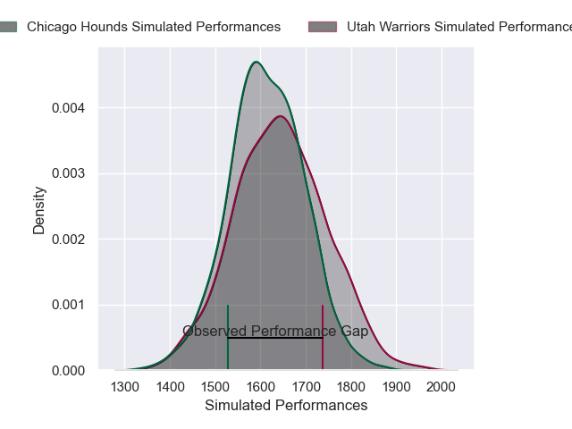
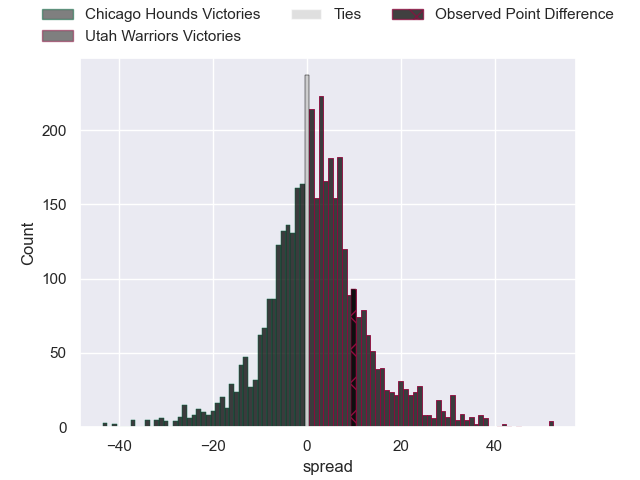
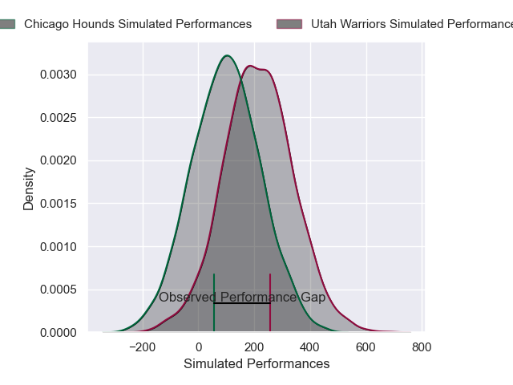
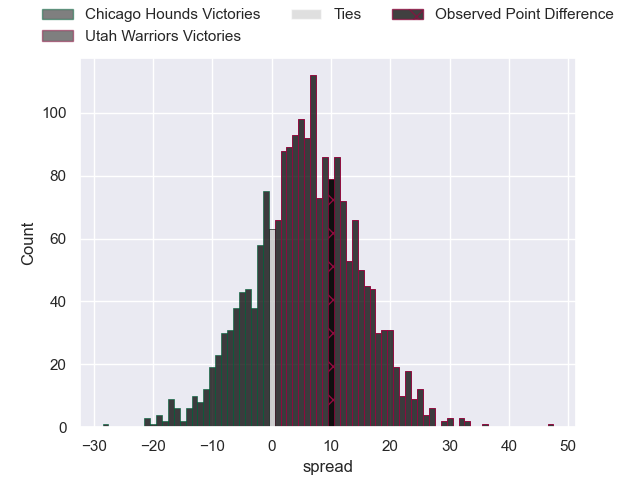

---  
layout: page  
title: Chicago Hounds at Utah Warriors; 31-41  
date: 2025-04-27 18:00:00 -0500  
categories: "Major League Rugby 2025" match review  
---
# Chicago Hounds at Utah Warriors; 31-41

# Club Level Predictions

The first set of predictions treats a club as the smallest object, as the club develops its members, organizes a gameplan, and deploys its players as needed for each match. This club model has a prediction of 0.544, which translates to predicting Utah Warriors to win by 1.6.

Our Over/Under is 55.5 - and combined with the spread above, we have a predicted scoreline of 27 to 28

Each club has a rating and a rating deviation (similar to a Glicko rating), and expected performances can be generated. This allows for simulated matches and spreads like the ones below.
## Projected Performances - Club Model

## Projected Spreads - Club Model

## Projected Results - Club Model

# Player Level Predictions

Treating teams instead as an entity made up of the currently active players, I have ratings for each player in an altogether different system. These can be combined to form team ratings once teamsheets are announced, weighting starters a bit higher than the reserves. After the match is played, players can be weighted by their minutes on the field, allowing for an accurate measure of the team's composition. With these compiled team ratings, we can make predictions, measure inaccuracy, and update the individual player ratings.
## Prediction without Player Minutes: Utah Warriors by 5.1

Utah Warriors by 1.9 on a neutral pitch

## Projected Performances - Player Model

## Projected Spreads - Player Model

## Projected Results - Player Model

|   Away Minutes | Away Player      |   Away Percentile |   Number |   Home Percentile | Home Player       |   Home Minutes |
|---------------:|:-----------------|------------------:|---------:|------------------:|:------------------|---------------:|
|             76 | Zurabi Zhvania   |             91.18 |        1 |             82.6  | Fred Apulu        |             22 |
|             48 | Dylan Fawsitt    |             96.33 |        2 |             74.48 | Phillip Bradford  |             49 |
|             80 | Ignacio Peculo   |             83.48 |        3 |             50.6  | Angus McLellan    |             59 |
|             32 | Mason Flesch     |              2.41 |        4 |             80.5  | Frank Lochore     |             60 |
|             80 | Hamish Bain      |             50.51 |        5 |             56.82 | Matt Jensen       |             25 |
|             80 | Brad Tucker      |             22.87 |        6 |             70.24 | Bailey Wilson     |             31 |
|             47 | Maclean Jones    |             25.07 |        7 |             13.68 | Lance Williams    |             25 |
|             20 | Matthew Oworu    |             42.23 |        8 |             70.59 | Reid Watson Davis |             48 |
|             60 | Michael Baska    |             18.43 |        9 |             75.94 | Logan Crowley     |             57 |
|             21 | Chris Hilsenbeck |              5.11 |       10 |             63.6  | Joel Hodgson      |             17 |
|             31 | Nate Augspurger  |             93.69 |       11 |             91.3  | Joe Mano          |             80 |
|             80 | Noah Flesch      |             37.69 |       12 |             15.32 | D'Angelo Leuila   |             76 |
|             68 | Ollie Devoto     |             14.1  |       13 |             19.1  | Kyle Brown        |             66 |
|             72 | Mark O'Keeffe    |             13.29 |       14 |             84.51 | Nic Benn          |             63 |
|             25 | Michael Hand II  |             15.05 |       15 |             87.22 | Jordan Trainor    |             80 |
|             76 | Luke White       |              3.57 |       16 |             66.08 | Aki Seiuli        |             80 |
|             64 | Mitch Short      |             41.3  |       17 |             33.92 | Tuvere Vugakoto   |             31 |
|             21 | Adriaan Carelse  |             11.75 |       18 |             92.32 | Zion Going        |             80 |
|             40 | Conall Boomer    |             79.83 |       19 |             84.28 | Remsy Lemisio     |             80 |
|             60 | Liam Fletcher    |            nan    |       20 |             42.65 | Cole Semu         |             80 |
|             40 | Jackson Zabierek |            nan    |       21 |             36.03 | Saia Uhila        |             80 |
|             50 | Koby Baker       |            nan    |       22 |              6.33 | Paul Lasike       |             80 |

