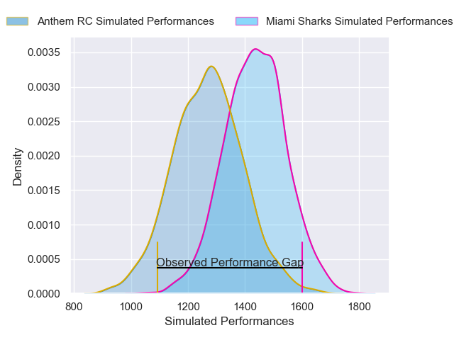
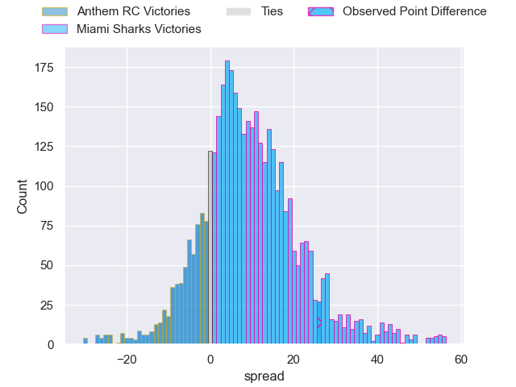
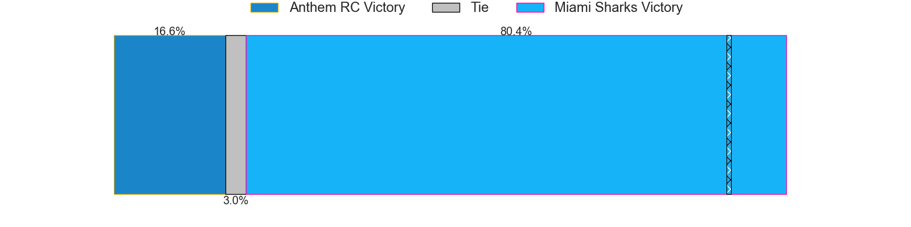
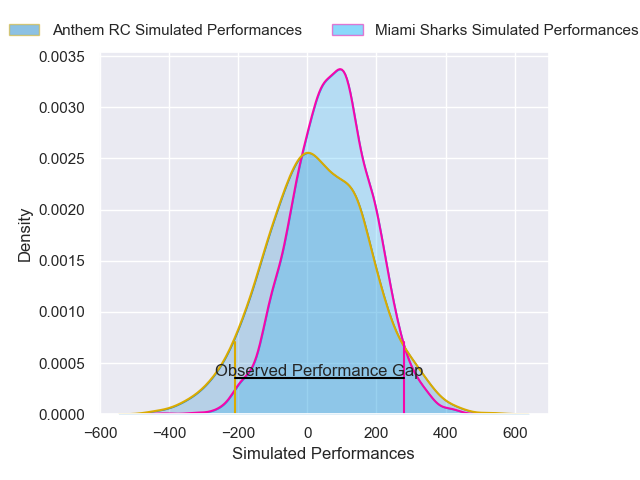
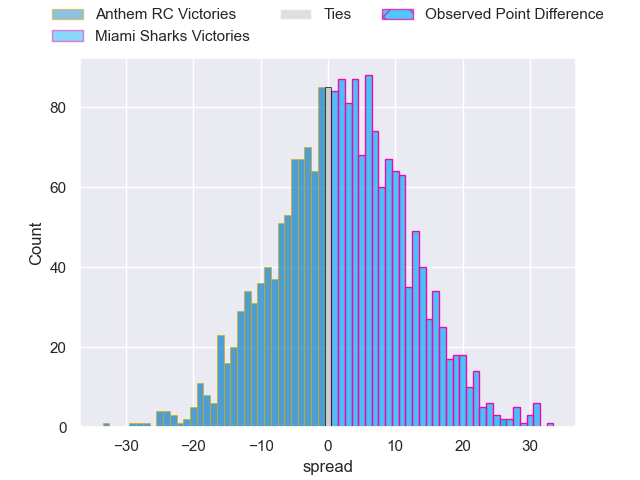

---  
layout: page  
title: Anthem RC at Miami Sharks; 5-31  
date: 2025-04-28 18:00:00 -0500  
categories: "Major League Rugby 2025" match review  
---
# Anthem RC at Miami Sharks; 5-31

# Club Level Predictions

The first set of predictions treats a club as the smallest object, as the club develops its members, organizes a gameplan, and deploys its players as needed for each match. This club model has a prediction of 0.712, which translates to predicting Miami Sharks to win by 8.5.

Our Over/Under is 59.5 - and combined with the spread above, we have a predicted scoreline of 26 to 34

Each club has a rating and a rating deviation (similar to a Glicko rating), and expected performances can be generated. This allows for simulated matches and spreads like the ones below.
## Projected Performances - Club Model

## Projected Spreads - Club Model

## Projected Results - Club Model

# Player Level Predictions

Treating teams instead as an entity made up of the currently active players, I have ratings for each player in an altogether different system. These can be combined to form team ratings once teamsheets are announced, weighting starters a bit higher than the reserves. After the match is played, players can be weighted by their minutes on the field, allowing for an accurate measure of the team's composition. With these compiled team ratings, we can make predictions, measure inaccuracy, and update the individual player ratings.
## Prediction without Player Minutes: Miami Sharks by 3.0

Miami Sharks by 0.6 on a neutral pitch

## Projected Performances - Player Model

## Projected Spreads - Player Model

## Projected Results - Player Model

|   Away Minutes | Away Player              |   Away Percentile |   Number |   Home Percentile | Home Player             |   Home Minutes |
|---------------:|:-------------------------|------------------:|---------:|------------------:|:------------------------|---------------:|
|             28 | Jake Turnbull            |              2.06 |        1 |             21.22 | Ma'ake Muti             |             56 |
|             11 | Connor Robinson          |              1.88 |        2 |             28.72 | Sean McNulty            |             11 |
|             80 | Alex Maughan             |              1.4  |        3 |             70.89 | Reinaldo Piussi Mendoza |             80 |
|             77 | Viliami Vuli             |             19.64 |        4 |             36.58 | Rick Rose               |             80 |
|             74 | Sam Golla                |             24.51 |        5 |             15.06 | Braemar Murray          |             11 |
|             52 | Alejandro Martinez Tapia |             30.62 |        6 |              0.97 | Manuel Ardao            |             69 |
|             67 | Makeen Alikhan           |             58.53 |        7 |             56.3  | Benja Bonassoa          |              3 |
|             80 | Colin Turner             |             19.21 |        8 |             73.14 | Ronan Foley             |             69 |
|             64 | Ishy Safodien            |             16.87 |        9 |             58.78 | Tomas Cubelli           |             73 |
|             80 | Cliven Loubser           |             12.92 |       10 |             95.62 | Martin Elias            |             50 |
|             69 | Toby Fricker             |              4.73 |       11 |             70.04 | Josiah Morra            |             32 |
|             80 | Junior Gafa              |              2.25 |       12 |             75.72 | Tomas Cubilla           |              6 |
|             64 | Erich Storti             |             25.51 |       13 |              6.05 | Matias Orlando          |             51 |
|             48 | Erich Storti             |             25.51 |       13 |              6.05 | Matias Orlando          |             51 |
|             80 | Erich Storti             |             25.51 |       13 |              6.05 | Matias Orlando          |             51 |
|             27 | Conner Mooneyham         |             82.14 |       14 |             59.92 | Marcos Young            |             51 |
|             51 | Mitch Wilson             |             85.45 |       15 |             72.97 | Santiago Videla         |             59 |
|             51 | Alexandre Hernandez      |            nan    |       16 |              6.84 | Kirby Myhill            |             80 |
|             80 | Albert O'Shannessey      |              0.68 |       17 |             68.75 | Alec McDonnell          |             80 |
|             27 | Dan Hanson               |             17.76 |       18 |             84.17 | Tomas Inciarte          |             51 |
|             24 | Ej Freeman               |             33.61 |       19 |             63.43 | Marques Fuala'au        |             53 |
|             61 | Ethan Howard             |             36.58 |       20 |              8.81 | Guiseppe du Toit        |             51 |
|             11 | Rhys Mitchell            |            nan    |       21 |             76.16 | Tomas Bekerman          |             30 |
|            nan | nan                      |            nan    |       22 |            nan    | Alex Tucci              |             40 |
|            nan | nan                      |            nan    |       23 |            nan    | Calvin Ihrig            |             80 |

