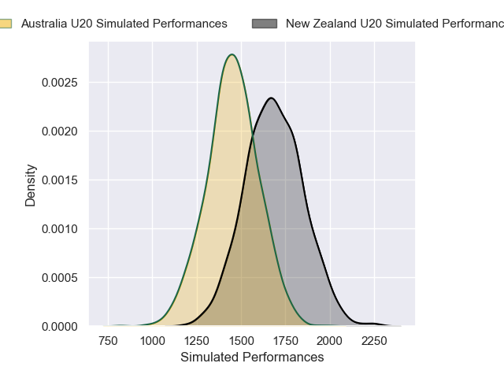
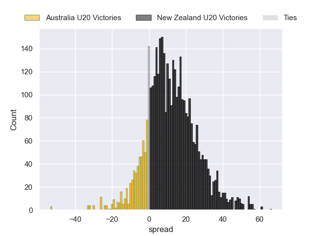
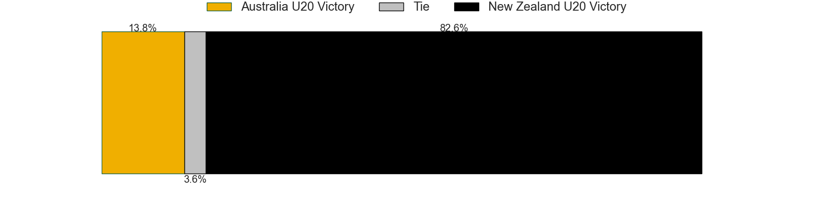
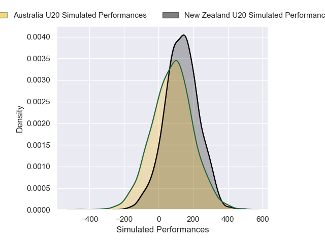
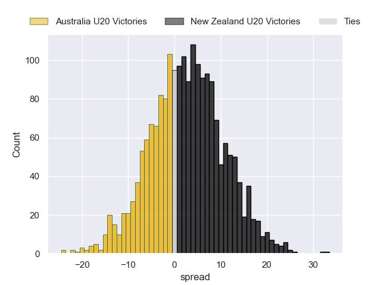
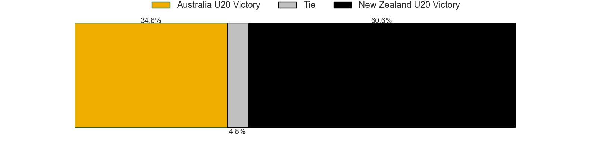

---  
layout: page  
title: Australia U20 at New Zealand U20; 29-29  
date: 2025-05-01 18:00:00 -0500  
categories: "Rugby Championship U20 2025" match review  
---
# Australia U20 at New Zealand U20; 29-29

# Club Level Predictions

The first set of predictions treats a club as the smallest object, as the club develops its members, organizes a gameplan, and deploys its players as needed for each match. This club model has a prediction of 0.763, which translates to predicting New Zealand U20 to win by 11.3.

Our Over/Under is 46.5 - and combined with the spread above, we have a predicted scoreline of 18 to 29

Each club has a rating and a rating deviation (similar to a Glicko rating), and expected performances can be generated. This allows for simulated matches and spreads like the ones below.
## Projected Performances - Club Model

## Projected Spreads - Club Model

## Projected Results - Club Model

# Player Level Predictions

Treating teams instead as an entity made up of the currently active players, I have ratings for each player in an altogether different system. These can be combined to form team ratings once teamsheets are announced, weighting starters a bit higher than the reserves. After the match is played, players can be weighted by their minutes on the field, allowing for an accurate measure of the team's composition. With these compiled team ratings, we can make predictions, measure inaccuracy, and update the individual player ratings.
## Prediction without Player Minutes: New Zealand U20 by 4.2

New Zealand U20 by 2.0 on a neutral pitch

## Projected Performances - Player Model

## Projected Spreads - Player Model

## Projected Results - Player Model

|   Away Minutes | Away Player      |   Away Percentile |   Number |   Home Percentile | Home Player     |   Home Minutes |
|---------------:|:-----------------|------------------:|---------:|------------------:|:----------------|---------------:|
|             15 | Finn Baxter      |             56.09 |        1 |             74    | Sika Pole       |             80 |
|             29 | Ollie Barrett    |             57.94 |        2 |             53.05 | Manumaua Letiu  |             80 |
|             56 | Kaleb Ah-Colt    |             52.9  |        3 |             48.16 | Robson Faleafa  |             34 |
|             80 | Eamon Doyle      |             57.39 |        4 |             45.74 | Randall Baker   |             34 |
|             80 | Joe Mangelsdorf  |             55.97 |        5 |             58.33 | Josh Tengblad   |             30 |
|             80 | Jacob Veiru      |             51.72 |        6 |             65.06 | Xavier Treacy   |             46 |
|             80 | Eli Langi        |             57.09 |        7 |             42.62 | Aio Keith       |             80 |
|             51 | Beau Morrison    |             54.37 |        8 |             68.44 | Mosese Bason    |             80 |
|             65 | Hwi Sharples     |             57.96 |        9 |             76.12 | Dylan Pledger   |             15 |
|             80 | Joey Fowler      |             29.09 |       10 |             67.47 | Rico Simpson    |             80 |
|             59 | Sidney Harvey    |             48.45 |       11 |             41.92 | Harlyn Saunoa   |             51 |
|             80 | Boston Fakafanua |             40.08 |       12 |             41.21 | Jack Wiseman    |             29 |
|             80 | Liam Grover      |             48.26 |       13 |             59.71 | Cooper Roberts  |             58 |
|             65 | Cooper Watters   |             57.4  |       14 |             53.94 | Maloni Kunawave |             15 |
|             80 | Shane Wilcox     |             43.69 |       15 |             59.63 | Stanley Solomon |             24 |

