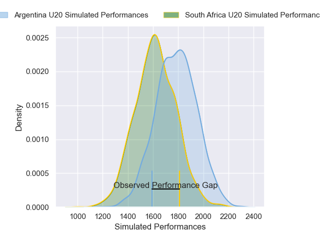
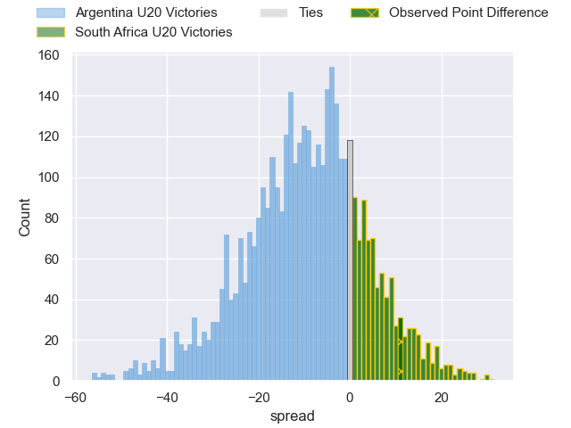
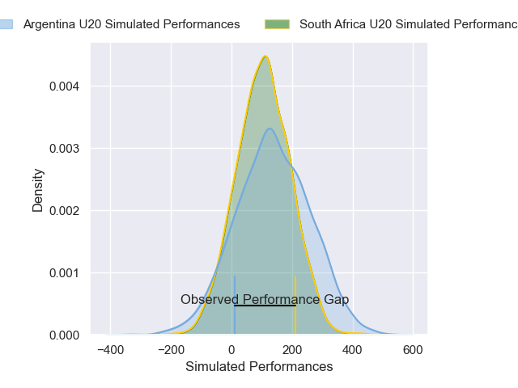
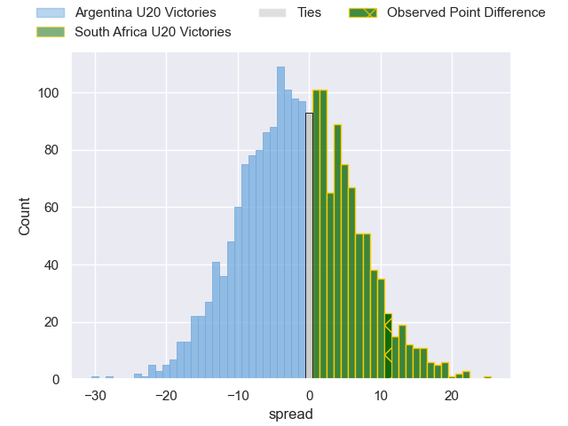

---  
layout: page  
title: Argentina U20 at South Africa U20; 25-36  
date: 2025-05-01 18:00:00 -0500  
categories: "Rugby Championship U20 2025" match review  
---
# Argentina U20 at South Africa U20; 25-36

# Club Level Predictions

The first set of predictions treats a club as the smallest object, as the club develops its members, organizes a gameplan, and deploys its players as needed for each match. This club model has a prediction of 0.297, which translates to predicting Argentina U20 to win by 8.4.

Our Over/Under is 53.5 - and combined with the spread above, we have a predicted scoreline of 31 to 22

Each club has a rating and a rating deviation (similar to a Glicko rating), and expected performances can be generated. This allows for simulated matches and spreads like the ones below.
## Projected Performances - Club Model

## Projected Spreads - Club Model

## Projected Results - Club Model

# Player Level Predictions

Treating teams instead as an entity made up of the currently active players, I have ratings for each player in an altogether different system. These can be combined to form team ratings once teamsheets are announced, weighting starters a bit higher than the reserves. After the match is played, players can be weighted by their minutes on the field, allowing for an accurate measure of the team's composition. With these compiled team ratings, we can make predictions, measure inaccuracy, and update the individual player ratings.
## Prediction without Player Minutes: South Africa U20 by 1.1

Argentina U20 by 1.2 on a neutral pitch

## Projected Performances - Player Model

## Projected Spreads - Player Model

## Projected Results - Player Model

|   Away Minutes | Away Player                 |   Away Percentile |   Number |   Home Percentile | Home Player          |   Home Minutes |
|---------------:|:----------------------------|------------------:|---------:|------------------:|:---------------------|---------------:|
|             56 | Juan Ignacio Rodriguez      |             35.45 |        1 |             66.26 | Oliver Reid          |             80 |
|             50 | Tadeo Ledesma Arocena       |             33.57 |        2 |             65.55 | Siphosethu Mnebelele |             80 |
|             50 | Emir Gael Galvan            |             74.33 |        3 |             58.6  | Simphiwe Ngobese     |             40 |
|             66 | Alejandro Michael Barrios   |             28    |        4 |             54.4  | Riley Norton         |             26 |
|             80 | Tomas Duclos                |             31.74 |        5 |             63.39 | JJ Theron            |             80 |
|             80 | Santiago Neyra              |             27.2  |        6 |             50.34 | Thando Biyela        |             18 |
|             39 | Tomas Dande                 |             36.01 |        7 |             52.66 | Matt Romao           |             25 |
|             26 | Agustin Garcia Campos       |             36.4  |        8 |             47.91 | Wandile Mlaba        |              6 |
|             40 | Jeronimo Llorens Villanueva |             60.52 |        9 |             49.57 | Hassiem Pead         |             22 |
|             19 | Rafael Benedit              |             38.37 |       10 |             45.51 | Kyle Smith           |             24 |
|             61 | Aquiles Vieyra              |             31.6  |       11 |             50.43 | Gino Cupido          |             19 |
|             49 | Felipe Ledesma              |             72.55 |       12 |             62.24 | Albie Bester         |             80 |
|             80 | Pedro Coll                  |             21.94 |       13 |             51.12 | Demitre Erasmus      |             30 |
|             54 | Bautista Lescano            |             16.71 |       14 |             63.88 | Cheswill Jooste      |             80 |
|             68 | Pascal Senillosa            |             27.69 |       15 |             41.53 | Gilermo Mentoe       |              0 |
|             32 | Jeronimo Sorondo            |            nan    |       16 |            nan    | nan                  |            nan |
|             53 | Felix Corleto               |            nan    |       17 |            nan    | nan                  |            nan |
|             44 | Ramon Fernandez Miranda     |            nan    |       18 |            nan    | nan                  |            nan |
|             80 | Pampa Storey                |            nan    |       19 |            nan    | nan                  |            nan |
|             48 | Diego Correa                |             87.69 |       20 |            nan    | nan                  |            nan |
|             41 | Jeremy Annand               |            nan    |       21 |            nan    | nan                  |            nan |
|             27 | Jeronimo Otano              |            nan    |       22 |            nan    | nan                  |            nan |
|             73 | Valentin Vicente Vidal      |            nan    |       23 |            nan    | nan                  |            nan |

