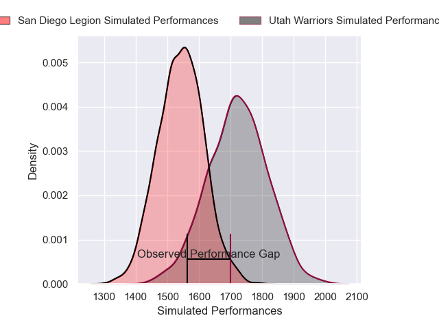
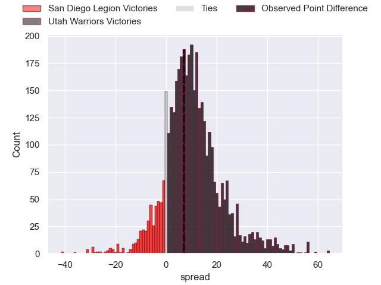
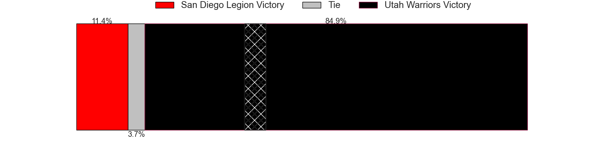
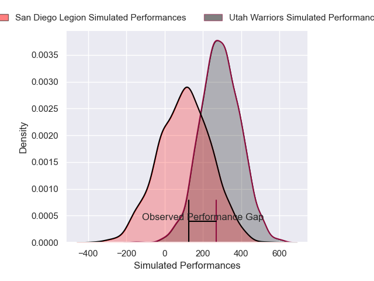
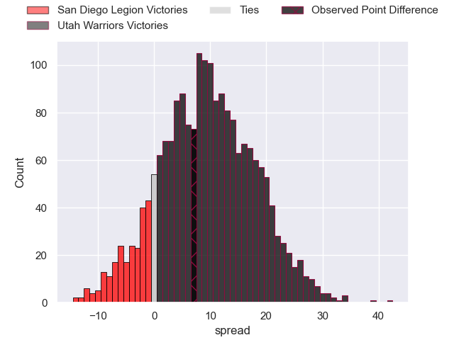

---  
layout: page  
title: San Diego Legion at Utah Warriors; 31-38  
date: 2025-05-01 18:00:00 -0500  
categories: "Major League Rugby 2025" match review  
---
# San Diego Legion at Utah Warriors; 31-38

# Club Level Predictions

The first set of predictions treats a club as the smallest object, as the club develops its members, organizes a gameplan, and deploys its players as needed for each match. This club model has a prediction of 0.731, which translates to predicting Utah Warriors to win by 8.9.

Our Over/Under is 83.5 - and combined with the spread above, we have a predicted scoreline of 37 to 46

Each club has a rating and a rating deviation (similar to a Glicko rating), and expected performances can be generated. This allows for simulated matches and spreads like the ones below.
## Projected Performances - Club Model

## Projected Spreads - Club Model

## Projected Results - Club Model

# Player Level Predictions

Treating teams instead as an entity made up of the currently active players, I have ratings for each player in an altogether different system. These can be combined to form team ratings once teamsheets are announced, weighting starters a bit higher than the reserves. After the match is played, players can be weighted by their minutes on the field, allowing for an accurate measure of the team's composition. With these compiled team ratings, we can make predictions, measure inaccuracy, and update the individual player ratings.
## Prediction without Player Minutes: Utah Warriors by 11.5

Utah Warriors by 8.2 on a neutral pitch

## Projected Performances - Player Model

## Projected Spreads - Player Model

## Projected Results - Player Model

|   Away Minutes | Away Player              |   Away Percentile |   Number |   Home Percentile | Home Player     |   Home Minutes |
|---------------:|:-------------------------|------------------:|---------:|------------------:|:----------------|---------------:|
|             57 | Nathan Sylvia            |             86.23 |        1 |             70.5  | Aki Seiuli      |             80 |
|             57 | Shilo Klein              |             88.93 |        2 |             92.79 | Liam Coltman    |             80 |
|             49 | Brooke To'omalatai       |             60.31 |        3 |             85.09 | Tonga Kofe      |             36 |
|             73 | Charlie Hewitt           |             57.87 |        4 |             85.21 | Frank Lochore   |              3 |
|             66 | James Rivers             |              5.24 |        5 |             72.66 | Matt Jensen     |             41 |
|             80 | Vili Helu                |             33.01 |        6 |             88.77 | Tamarau McGahan |             80 |
|             71 | Aminae Amiatu-Tanoi      |             43.37 |        7 |             62.44 | Kalisi Moli     |             62 |
|             49 | David Tameilau           |             56.28 |        8 |             96.65 | Dylan Nel       |             41 |
|             23 | Richard Judd             |             95.48 |        9 |             92.7  | Zion Going      |             35 |
|             80 | Harris Rutherford        |             41.63 |       10 |             55.51 | Joel Hodgson    |             35 |
|             49 | Tomas Aoake              |             73.68 |       11 |             87.22 | Nic Benn        |             48 |
|             64 | Tiaan Loots              |             75.61 |       12 |             21.43 | D'Angelo Leuila |             35 |
|             35 | Tavite Lopeti            |             79.8  |       13 |             46.94 | Cole Semu       |             39 |
|             28 | Rhian Stowers            |             18.44 |       14 |             69.45 | Sione Mahe      |             29 |
|             35 | Steffan Crimp            |             48.97 |       15 |             87.19 | Jordan Trainor  |             41 |
|             73 | Tu'Ihalangingie Hokafonu |             24.06 |       16 |            nan    | Tomasi Tonga    |             32 |
|             80 | Chris Turori             |            nan    |       17 |             83.46 | Remsy Lemisio   |             80 |
|             45 | Liki Chang-Tung          |            nan    |       18 |             25.22 | Logan Crowley   |             51 |
|             80 | Djustice Sears-Duru      |              1.79 |       19 |             33.22 | Tuvere Vugakoto |              7 |
|             80 | Oliver Kane              |            nan    |       20 |             84.76 | Emerson Prior   |             18 |
|             80 | Darius Law               |            nan    |       21 |             15.78 | Lance Williams  |             23 |
|             80 | Connor Tupai             |             11.13 |       22 |             31.84 | Saia Uhila      |             80 |
|            nan | nan                      |            nan    |       23 |              5.2  | Paul Lasike     |              0 |

