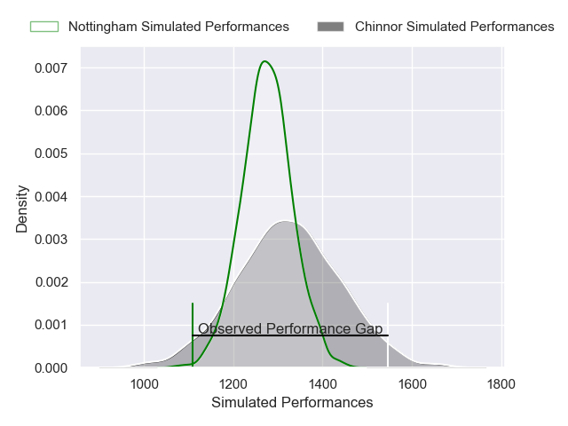
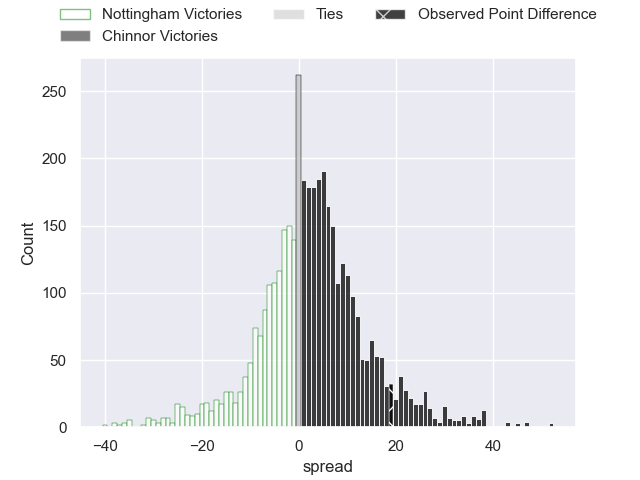
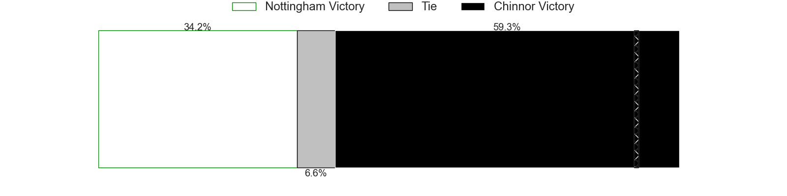
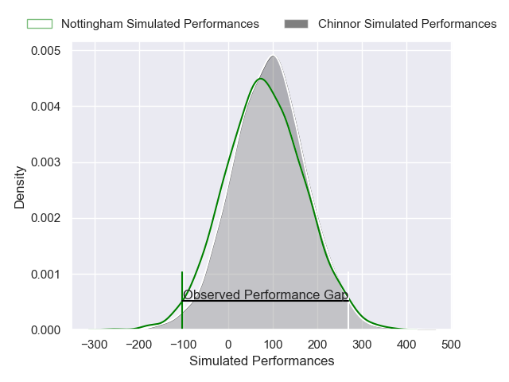
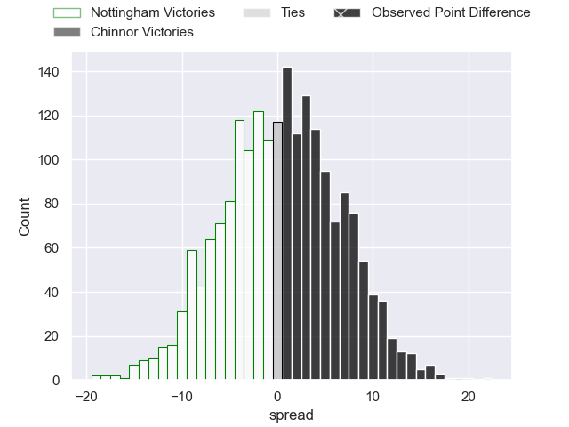

---  
layout: page  
title: Nottingham at Chinnor; 22-41  
date: 2025-05-02 18:00:00 -0500  
categories: "RFU Championship 24/25" match review  
---
# Nottingham at Chinnor; 22-41

# Club Level Predictions

The first set of predictions treats a club as the smallest object, as the club develops its members, organizes a gameplan, and deploys its players as needed for each match. This club model has a prediction of 0.57, which translates to predicting Chinnor to win by 2.5.

Our Over/Under is 52.5 - and combined with the spread above, we have a predicted scoreline of 25 to 28

Each club has a rating and a rating deviation (similar to a Glicko rating), and expected performances can be generated. This allows for simulated matches and spreads like the ones below.
## Projected Performances - Club Model

## Projected Spreads - Club Model

## Projected Results - Club Model

# Player Level Predictions

Treating teams instead as an entity made up of the currently active players, I have ratings for each player in an altogether different system. These can be combined to form team ratings once teamsheets are announced, weighting starters a bit higher than the reserves. After the match is played, players can be weighted by their minutes on the field, allowing for an accurate measure of the team's composition. With these compiled team ratings, we can make predictions, measure inaccuracy, and update the individual player ratings.
## Prediction without Player Minutes: Chinnor by 0.2

Nottingham by 2.1 on a neutral pitch

## Projected Performances - Player Model

## Projected Spreads - Player Model

## Projected Results - Player Model

|   Away Minutes | Away Player          |   Away Percentile |   Number |   Home Percentile | Home Player        |   Home Minutes |
|---------------:|:---------------------|------------------:|---------:|------------------:|:-------------------|---------------:|
|             41 | Archie Van der Flier |             49.55 |        1 |              8.59 | Tumy Onasanya      |             35 |
|             41 | Harry Clayton        |             84.82 |        2 |             45.9  | Chris Moore        |             41 |
|             80 | Ale Loman            |             48.9  |        3 |             56.75 | Rob Hardwick       |              3 |
|             29 | Osian Thomas         |             11.55 |        4 |             77.84 | Willie Ryan        |             57 |
|             80 | Tom Manz             |             38.64 |        5 |             60.32 | George Shaw        |             23 |
|             45 | Finn Carnduff        |             89.08 |        6 |             37.07 | Harry Dugmore      |             36 |
|             35 | Jacob Wright         |             34.48 |        7 |             38.22 | Max Clementson     |             18 |
|             80 | James Cherry         |             31.98 |        8 |              2.35 | Scott Hall         |             28 |
|             32 | Will Yarnell         |             13.67 |        9 |             82.87 | Luke Carter        |              7 |
|             49 | Matthew Arden        |             68.69 |       10 |             72.73 | Nathan Chamberlain |             80 |
|             35 | Harry Graham         |             62.79 |       11 |             26.15 | Kieran Goss        |              0 |
|             35 | Kegan Christian-Goss |             29.55 |       12 |             75.46 | Morgan Passman     |             57 |
|             39 | Jack Stapley         |              1.74 |       13 |             68.71 | Tom Watson         |             71 |
|             35 | David Williams       |             10.87 |       14 |             29.9  | Grant Hughes       |             66 |
|             48 | Ryan Olowofela       |             34.99 |       15 |             68.32 | Nick Smith         |             80 |

