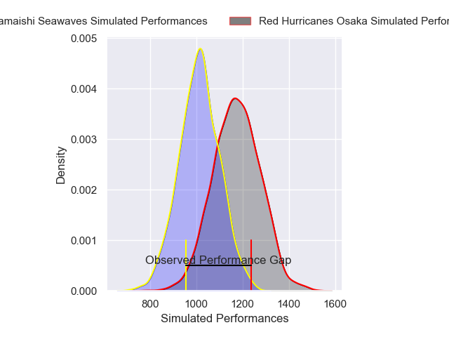
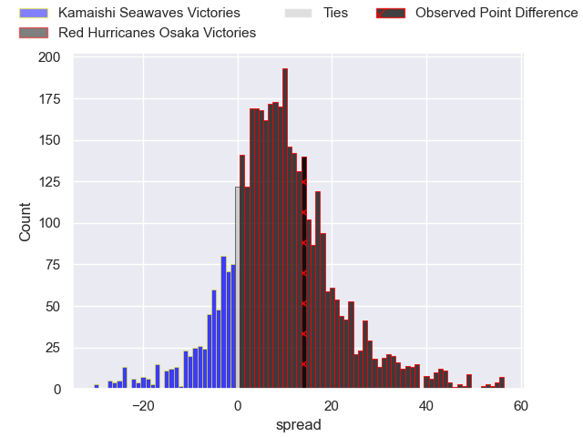
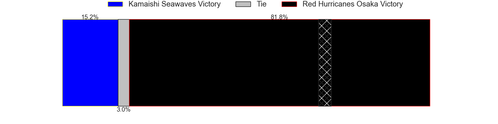
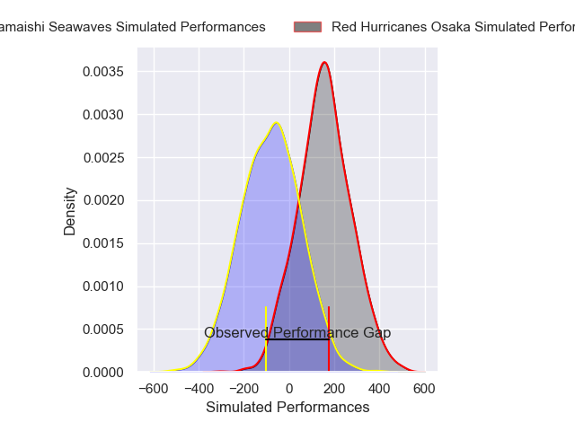
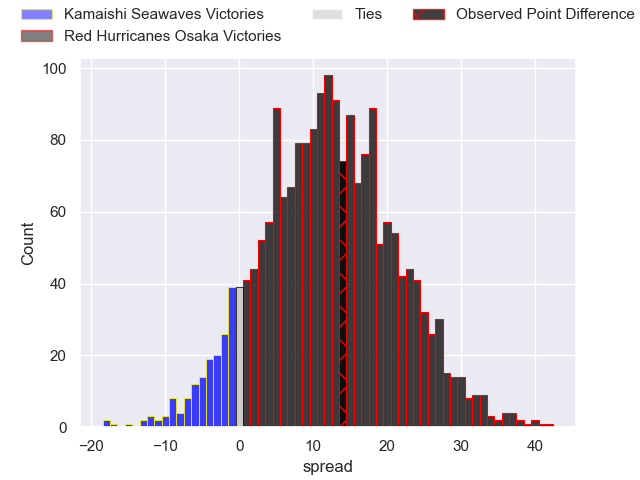
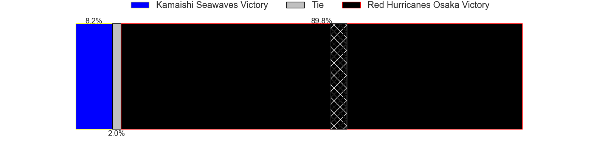

---  
layout: page  
title: Kamaishi Seawaves at Red Hurricanes Osaka; 21-35  
date: 2025-05-02 18:00:00 -0500  
categories: "Japan Rugby League One D2 24/25" match review  
---
# Kamaishi Seawaves at Red Hurricanes Osaka; 21-35

# Club Level Predictions

The first set of predictions treats a club as the smallest object, as the club develops its members, organizes a gameplan, and deploys its players as needed for each match. This club model has a prediction of 0.711, which translates to predicting Red Hurricanes Osaka to win by 8.1.

Our Over/Under is 58.5 - and combined with the spread above, we have a predicted scoreline of 25 to 33

Each club has a rating and a rating deviation (similar to a Glicko rating), and expected performances can be generated. This allows for simulated matches and spreads like the ones below.
## Projected Performances - Club Model

## Projected Spreads - Club Model

## Projected Results - Club Model

# Player Level Predictions

Treating teams instead as an entity made up of the currently active players, I have ratings for each player in an altogether different system. These can be combined to form team ratings once teamsheets are announced, weighting starters a bit higher than the reserves. After the match is played, players can be weighted by their minutes on the field, allowing for an accurate measure of the team's composition. With these compiled team ratings, we can make predictions, measure inaccuracy, and update the individual player ratings.
## Prediction without Player Minutes: Red Hurricanes Osaka by 12.1

Red Hurricanes Osaka by 8.3 on a neutral pitch

## Projected Performances - Player Model

## Projected Spreads - Player Model

## Projected Results - Player Model

|   Away Minutes | Away Player         |   Away Percentile |   Number |   Home Percentile | Home Player          |   Home Minutes |
|---------------:|:--------------------|------------------:|---------:|------------------:|:---------------------|---------------:|
|             80 | Yusuke Yamada       |             38.35 |        1 |             11.04 | Hiromichi Sakamoto   |           73   |
|             80 | Naoki Ouno          |             19.55 |        2 |             44.68 | Hisamitsu Shimada    |           51   |
|             71 | Taiki Noguchi       |             22.89 |        3 |             46.28 | Munekata Sashida     |           17   |
|             63 | Dallas Tatana       |              5.4  |        4 |              7.39 | Toru Sugishita       |            6.5 |
|             58 | Hamish Dalzell      |             10.42 |        5 |             11.84 | Tatsunari Fujita     |           58   |
|             51 | Ben Nee Nee         |             12.26 |        6 |             59.29 | Isono Kaito          |           69   |
|             23 | Ryota Kono          |             43.77 |        7 |             81.23 | Blake Gibson         |           80   |
|             51 | Kohei Ishigaki      |              3.41 |        8 |             88.06 | Jack O'Sullivan      |           11   |
|             23 | Youhei Murakami     |              3.46 |        9 |             74.74 | Tatsuya Hamano       |           41   |
|             23 | Mitch Hunt          |             57.58 |       10 |             58.59 | Fumiya Dobashi       |           80   |
|             20 | Ryuji Abe           |             12.12 |       11 |             67.4  | Kenya Nishikawa      |           72   |
|             80 | Gerdus van der Walt |             14.72 |       12 |              5.21 | Mifiposeti Paea      |           80   |
|             80 | Osuka Lloyd Murata  |              2.86 |       13 |              6.44 | Henry Taefu          |           15.5 |
|             80 | Gousuke Kawakami    |              9.13 |       14 |             15.96 | Kouki Shigeno        |           65   |
|             63 | Cam Bailey          |              1.45 |       15 |             63.56 | Taiki Yamaguchi      |           53   |
|             11 | Sei Matsuyama       |            nan    |       16 |            nan    | Shota Takai          |           33.5 |
|             64 | Hayato Nishibayashi |            nan    |       17 |            nan    | Yura Chinen          |           49   |
|             80 | Takuya Takahashi    |            nan    |       18 |            nan    | Shinnosuke Toyonaga  |           16   |
|             29 | Ryunosuke Yamada    |            nan    |       19 |            nan    | Toshihiro Yamamouchi |           71   |
|             80 | Muller Uys          |            nan    |       20 |             47.65 | Daisuke Iba          |           54   |
|             48 | Darius Thomas       |            nan    |       21 |            nan    | Kanta Kurahashi      |           61   |
|             80 | Mosese Tonga        |            nan    |       22 |            nan    | Hibiki Noda          |           61   |
|             18 | Atsushi Minami      |            nan    |       23 |            nan    | Akuyi Yamada         |           80   |

