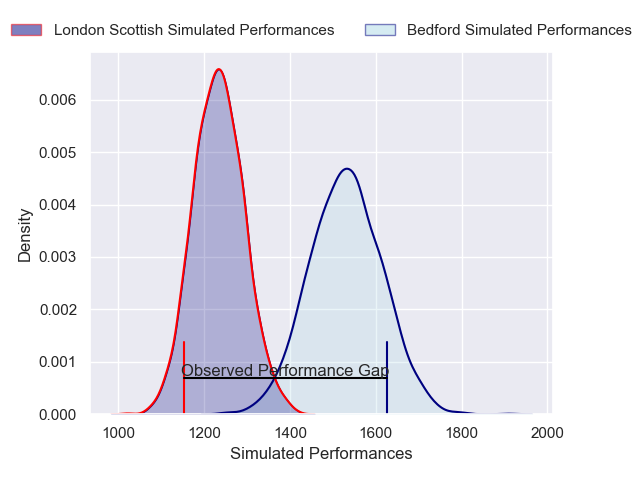
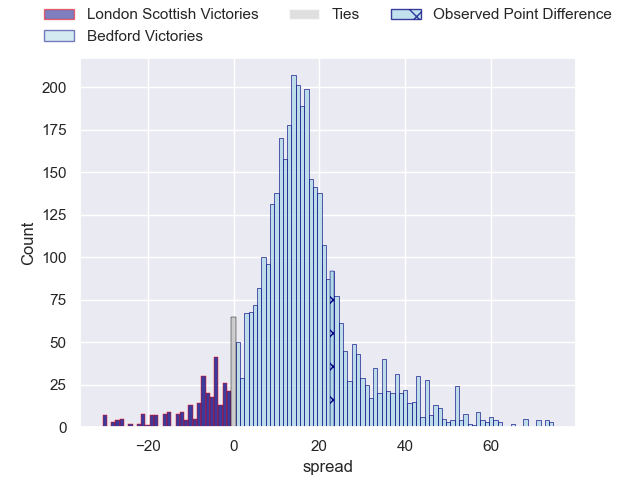
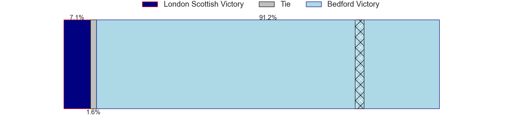
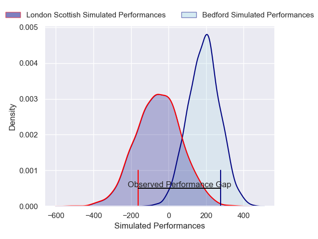
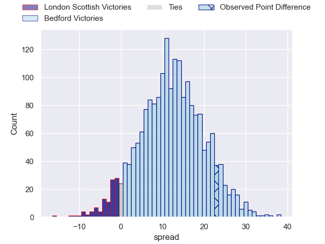
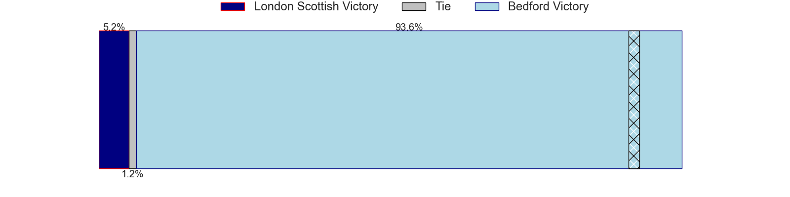

---  
layout: page  
title: London Scottish at Bedford; 38-61  
date: 2025-05-03 18:00:00 -0500  
categories: "RFU Championship 24/25" match review  
---
# London Scottish at Bedford; 38-61

# Club Level Predictions

The first set of predictions treats a club as the smallest object, as the club develops its members, organizes a gameplan, and deploys its players as needed for each match. This club model has a prediction of 0.844, which translates to predicting Bedford to win by 14.9.

Our Over/Under is 65.5 - and combined with the spread above, we have a predicted scoreline of 25 to 40

Each club has a rating and a rating deviation (similar to a Glicko rating), and expected performances can be generated. This allows for simulated matches and spreads like the ones below.
## Projected Performances - Club Model

## Projected Spreads - Club Model

## Projected Results - Club Model

# Player Level Predictions

Treating teams instead as an entity made up of the currently active players, I have ratings for each player in an altogether different system. These can be combined to form team ratings once teamsheets are announced, weighting starters a bit higher than the reserves. After the match is played, players can be weighted by their minutes on the field, allowing for an accurate measure of the team's composition. With these compiled team ratings, we can make predictions, measure inaccuracy, and update the individual player ratings.
## Prediction without Player Minutes: Bedford by 16.7

Bedford by 12.0 on a neutral pitch

## Projected Performances - Player Model

## Projected Spreads - Player Model

## Projected Results - Player Model

|   Away Minutes | Away Player           |   Away Percentile |   Number |   Home Percentile | Home Player          |   Home Minutes |
|---------------:|:----------------------|------------------:|---------:|------------------:|:---------------------|---------------:|
|             39 | Ethan Clarke          |             47.51 |        1 |             36.3  | Jamie Jack           |             80 |
|             72 | Austin Wallis         |              1.4  |        2 |             61.43 | James Fish           |             58 |
|             78 | Ntinga Mpiko          |             11.61 |        3 |             73.1  | Beltus Nonleh        |              4 |
|             70 | Matt Wilkinson        |             42.42 |        4 |             16.76 | Luke Frost           |             31 |
|             80 | Harry Browne          |             68.18 |        5 |             65.15 | Rory Ward            |             70 |
|             80 | Bailey Ransom         |             17.34 |        6 |             57.85 | Fyn Brown            |             24 |
|             80 | Jack Ingall           |              8.33 |        7 |             11.88 | Joe Howard           |             15 |
|             73 | Tom Marshall          |             16.42 |        8 |             10.45 | Freddie Tuilagi      |             26 |
|             31 | Daniel Nutton         |              5.54 |        9 |             92.21 | Alex Day             |             22 |
|             80 | Harry Sheppard        |              2.02 |       10 |             91.72 | William Maisey       |             65 |
|             80 | Alexander Lloyd-Seed  |              4.33 |       11 |             89.04 | Dean Adamson         |             23 |
|             80 | Will Simonds          |              7.26 |       12 |             70.04 | Michael Le Bourgeois |             80 |
|             80 | Robert David McCallum |              3.58 |       13 |             74.74 | Lucas Titherington   |             39 |
|             57 | Jonah Holmes          |             85    |       14 |             73.27 | Alfie Garside        |              0 |
|             41 | Josh Bellamy          |             21.74 |       15 |             61.28 | Louis James          |             62 |

