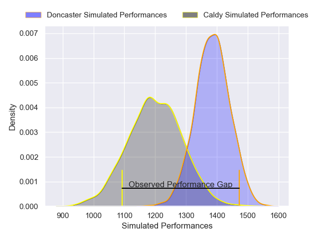
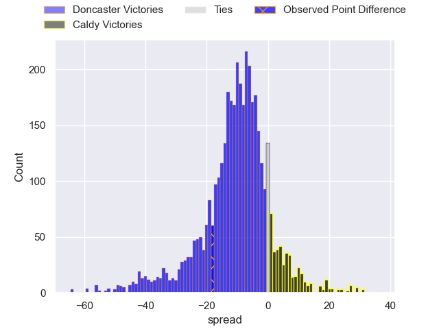
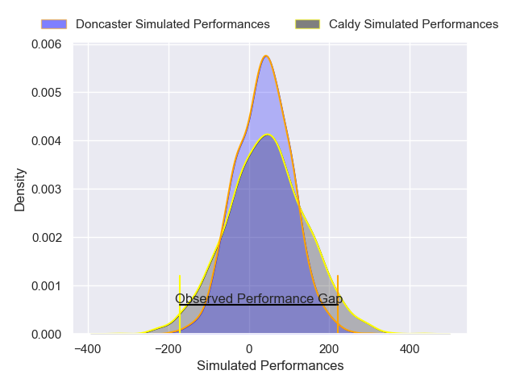
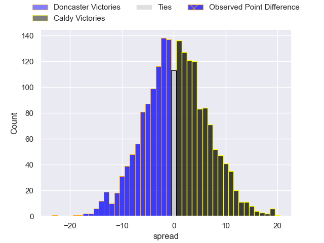

---  
layout: page  
title: Doncaster at Caldy; 33-15  
date: 2025-05-03 18:00:00 -0500  
categories: "RFU Championship 24/25" match review  
---
# Doncaster at Caldy; 33-15

# Club Level Predictions

The first set of predictions treats a club as the smallest object, as the club develops its members, organizes a gameplan, and deploys its players as needed for each match. This club model has a prediction of 0.262, which translates to predicting Doncaster to win by 9.1.

Our Over/Under is 47.5 - and combined with the spread above, we have a predicted scoreline of 29 to 19

Each club has a rating and a rating deviation (similar to a Glicko rating), and expected performances can be generated. This allows for simulated matches and spreads like the ones below.
## Projected Performances - Club Model

## Projected Spreads - Club Model

## Projected Results - Club Model

# Player Level Predictions

Treating teams instead as an entity made up of the currently active players, I have ratings for each player in an altogether different system. These can be combined to form team ratings once teamsheets are announced, weighting starters a bit higher than the reserves. After the match is played, players can be weighted by their minutes on the field, allowing for an accurate measure of the team's composition. With these compiled team ratings, we can make predictions, measure inaccuracy, and update the individual player ratings.
## Prediction without Player Minutes: Doncaster by 4.9

Doncaster by 7.5 on a neutral pitch

## Projected Performances - Player Model

## Projected Spreads - Player Model

## Projected Results - Player Model

|   Away Minutes | Away Player       |   Away Percentile |   Number |   Home Percentile | Home Player       |   Home Minutes |
|---------------:|:------------------|------------------:|---------:|------------------:|:------------------|---------------:|
|             35 | Conor Davidson    |             19.87 |        1 |             51.92 | Monty Weatherby   |             62 |
|              0 | George Roberts    |             37.87 |        2 |              2.97 | Oliver Hearn      |             80 |
|              7 | Logovi'i Mulipola |             96.97 |        3 |              4.42 | Joe Sproston      |             80 |
|             80 | Ben Murphy        |             72.16 |        4 |             19.41 | Freddie Stevenson |             65 |
|             18 | Adam Hopkinson    |             67.61 |        5 |             23.77 | Thomas Sanders    |             39 |
|             27 | Archie Smeaton    |             54.21 |        6 |              6.13 | Callum Ridgway    |             80 |
|             36 | Rhys Tait         |             47.99 |        7 |             27.97 | Jordan Jones      |              0 |
|             41 | Morgan Strong     |             61.62 |        8 |             10.23 | Josiah Dickinson  |             80 |
|             33 | Alex Dolly        |             72.84 |        9 |             32.18 | Dom Hanson        |             51 |
|             49 | Russell Bennett   |             95.76 |       10 |              8.28 | Lewis Barker      |             19 |
|             22 | Obi Ene           |             76.63 |       11 |              5.38 | William Robinson  |             50 |
|             76 | Connor Edwards    |              3.27 |       12 |             41.62 | Charlie Hyde      |             51 |
|             29 | Zach Kerr         |             12.17 |       13 |             40.49 | Jacob Mitchell    |             10 |
|             25 | Aidan Cross       |             31.54 |       14 |             14.81 | Nick Royle        |             56 |
|             22 | Jordan Olowofela  |             21.12 |       15 |             11.18 | Matt Kilcourse    |             54 |

