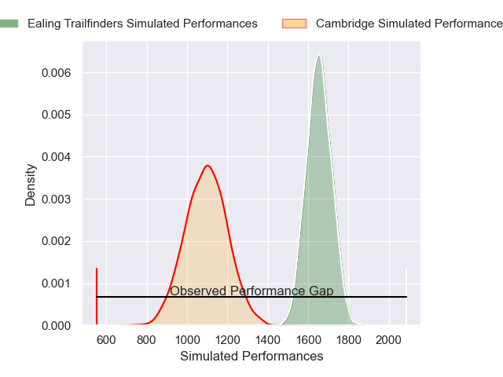
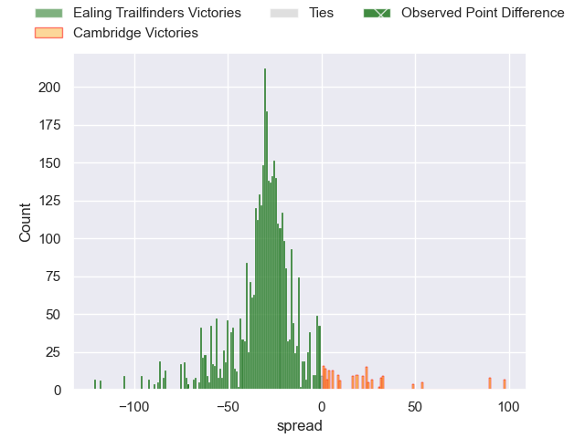
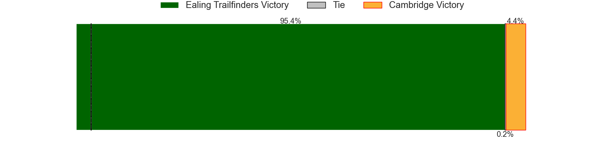
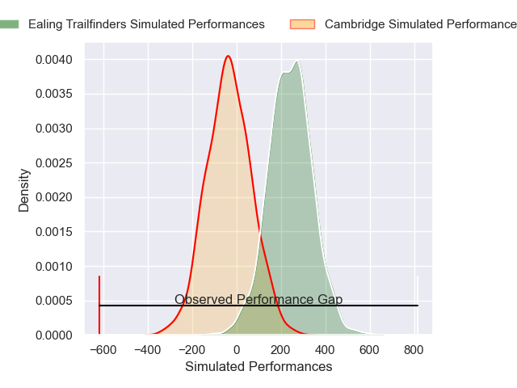
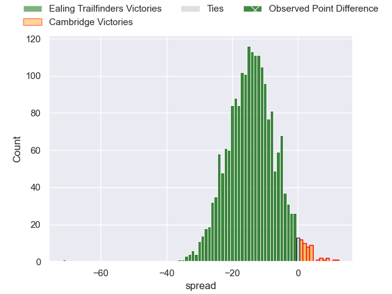

---  
layout: page  
title: Ealing Trailfinders at Cambridge; 89-18  
date: 2025-05-03 18:00:00 -0500  
categories: "RFU Championship 24/25" match review  
---
# Ealing Trailfinders at Cambridge; 89-18

# Club Level Predictions

The first set of predictions treats a club as the smallest object, as the club develops its members, organizes a gameplan, and deploys its players as needed for each match. This club model has a prediction of 0.041, which translates to predicting Ealing Trailfinders to win by 27.9.

Our Over/Under is 52.5 - and combined with the spread above, we have a predicted scoreline of 40 to 12

Each club has a rating and a rating deviation (similar to a Glicko rating), and expected performances can be generated. This allows for simulated matches and spreads like the ones below.
## Projected Performances - Club Model

## Projected Spreads - Club Model

## Projected Results - Club Model

# Player Level Predictions

Treating teams instead as an entity made up of the currently active players, I have ratings for each player in an altogether different system. These can be combined to form team ratings once teamsheets are announced, weighting starters a bit higher than the reserves. After the match is played, players can be weighted by their minutes on the field, allowing for an accurate measure of the team's composition. With these compiled team ratings, we can make predictions, measure inaccuracy, and update the individual player ratings.
## Prediction without Player Minutes: Ealing Trailfinders by 28.4

Ealing Trailfinders by 30.9 on a neutral pitch

## Projected Performances - Player Model

## Projected Spreads - Player Model

## Projected Results - Player Model

|   Away Minutes | Away Player          |   Away Percentile |   Number |   Home Percentile | Home Player          |   Home Minutes |
|---------------:|:---------------------|------------------:|---------:|------------------:|:---------------------|---------------:|
|             69 | Kyle John Whyte      |             93.89 |        1 |              6.28 | Jake Elwood          |              2 |
|             80 | Mike Willemse        |             89.98 |        2 |             15.29 | Benjamin Brownlie    |             18 |
|             80 | Biyi Alo             |             97.39 |        3 |              8.15 | Jake Bridges         |             80 |
|             16 | Sean Lonsdale        |             57.21 |        4 |              8.33 | George Bretag-Norris |             59 |
|             48 | Daniel Cutmore       |             91.85 |        5 |             18.91 | Kayde Sylvester      |             64 |
|             26 | Rob Farrar           |             93.03 |        6 |             10.45 | Iestyn Rees          |             55 |
|             12 | Jordy Reid           |             85    |        7 |             22.27 | Joseph Gaffan        |             77 |
|             33 | David Douglas Bridge |             34.52 |        8 |              2.3  | Ben Adams            |             48 |
|             36 | Micheal Stronge      |             29.22 |        9 |             89.91 | Peter White          |             53 |
|             80 | Dan Jones            |             91.43 |       10 |             34.9  | Ruaridh Dawson       |             63 |
|              0 | Tom Collins          |             99.14 |       11 |              0.48 | Elias Caven          |             47 |
|              0 | Jordan Holgate       |             97.65 |       12 |              0.41 | Sam Hanks            |             80 |
|             58 | Reuben Bird-Tulloch  |             86.63 |       13 |              1.84 | Matt Williams        |             80 |
|             80 | Ben Harris           |             76.85 |       14 |              9.22 | Josef Green          |             27 |
|             68 | Michael Dykes        |             86.16 |       15 |             10.74 | Ewan Baker           |             80 |

