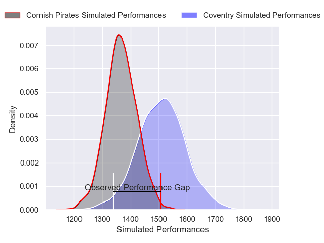
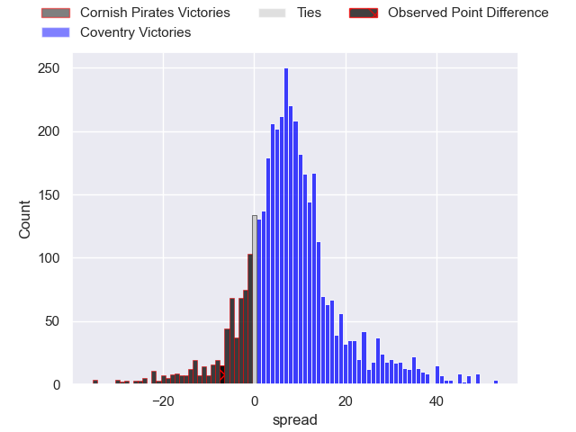
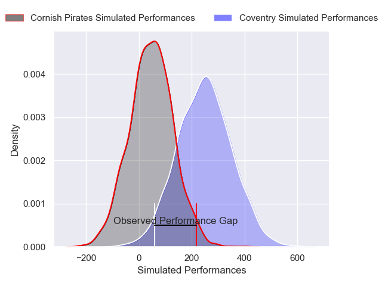
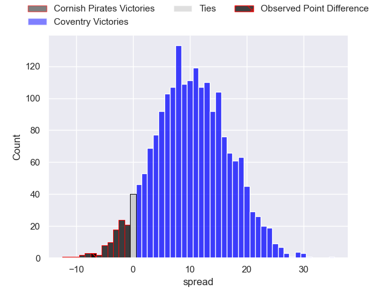

---  
layout: page  
title: Cornish Pirates at Coventry; 21-14  
date: 2025-05-03 18:00:00 -0500  
categories: "RFU Championship 24/25" match review  
---
# Cornish Pirates at Coventry; 21-14

# Club Level Predictions

The first set of predictions treats a club as the smallest object, as the club develops its members, organizes a gameplan, and deploys its players as needed for each match. This club model has a prediction of 0.69, which translates to predicting Coventry to win by 7.1.

Our Over/Under is 73.5 - and combined with the spread above, we have a predicted scoreline of 33 to 40

Each club has a rating and a rating deviation (similar to a Glicko rating), and expected performances can be generated. This allows for simulated matches and spreads like the ones below.
## Projected Performances - Club Model

## Projected Spreads - Club Model

## Projected Results - Club Model

# Player Level Predictions

Treating teams instead as an entity made up of the currently active players, I have ratings for each player in an altogether different system. These can be combined to form team ratings once teamsheets are announced, weighting starters a bit higher than the reserves. After the match is played, players can be weighted by their minutes on the field, allowing for an accurate measure of the team's composition. With these compiled team ratings, we can make predictions, measure inaccuracy, and update the individual player ratings.
## Prediction without Player Minutes: Coventry by 11.1

Coventry by 7.4 on a neutral pitch

## Projected Performances - Player Model

## Projected Spreads - Player Model

## Projected Results - Player Model

|   Away Minutes | Away Player     |   Away Percentile |   Number |   Home Percentile | Home Player      |   Home Minutes |
|---------------:|:----------------|------------------:|---------:|------------------:|:-----------------|---------------:|
|             53 | Billy Young     |             42.38 |        1 |             95.68 | Toby Trinder     |             15 |
|             80 | Sol Moody       |             28.47 |        2 |             92.62 | Jordon Poole     |             33 |
|             80 | James French    |             52.89 |        3 |             40.67 | Eliot Salt       |             47 |
|             25 | Charlie Rice    |             38.2  |        4 |             39.33 | Dan Green        |             41 |
|             77 | Alfie Bell      |             64.7  |        5 |             17.79 | Rhys Anstey      |             54 |
|             32 | Josh King       |             58.18 |        6 |             87.12 | Tom Ball         |             67 |
|             32 | Jack Forsythe   |             56.53 |        7 |             87.61 | Suva Ma'asi      |             80 |
|              0 | Alex Everett    |             53.97 |        8 |             15.06 | Chester Owen     |             80 |
|             16 | Dan Hiscocks    |             34.61 |        9 |              8.52 | Sam Maunder      |             77 |
|             26 | Bruce Houston   |             82.45 |       10 |             65.31 | Tommy Mathews    |             12 |
|             63 | Matthew McNab   |             85.98 |       11 |             92.12 | James Martin     |             80 |
|             28 | Chester Ribbons |             60    |       12 |             45.82 | Thomas Hitchcock |             80 |
|             44 | Charlie McCaig  |             30    |       13 |             28.27 | Oli Morris       |             80 |
|             33 | Arthur Relton   |             71.09 |       14 |             35.25 | Ryan Hutler      |             80 |
|              3 | Will Trewin     |             84.09 |       15 |             34.3  | Logan Trotter    |             18 |

