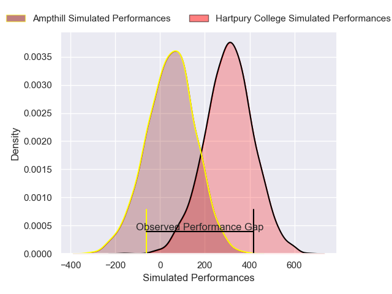
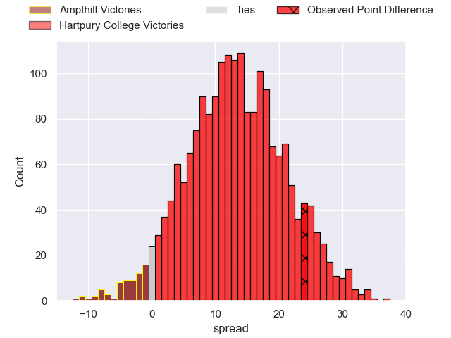
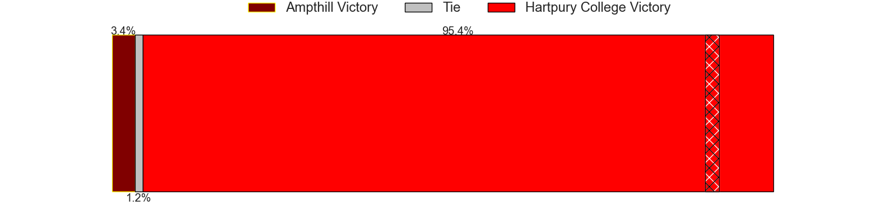

---  
layout: page  
title: Ampthill at Hartpury College; 14-38  
date: 2025-05-03 18:00:00 -0500  
categories: "RFU Championship 24/25" match review  
---
# Ampthill at Hartpury College; 14-38

# Club Level Predictions

The first set of predictions treats a club as the smallest object, as the club develops its members, organizes a gameplan, and deploys its players as needed for each match. This club model has a prediction of 0.753, which translates to predicting Hartpury College to win by 9.9.

Our Over/Under is 70.5 - and combined with the spread above, we have a predicted scoreline of 30 to 40

Each club has a rating and a rating deviation (similar to a Glicko rating), and expected performances can be generated. This allows for simulated matches and spreads like the ones below.
## Projected Performances - Club Model

## Projected Spreads - Club Model

## Projected Results - Club Model

# Player Level Predictions

Treating teams instead as an entity made up of the currently active players, I have ratings for each player in an altogether different system. These can be combined to form team ratings once teamsheets are announced, weighting starters a bit higher than the reserves. After the match is played, players can be weighted by their minutes on the field, allowing for an accurate measure of the team's composition. With these compiled team ratings, we can make predictions, measure inaccuracy, and update the individual player ratings.
## Prediction without Player Minutes: Hartpury College by 16.9

Hartpury College by 12.5 on a neutral pitch

## Projected Performances - Player Model

## Projected Spreads - Player Model

## Projected Results - Player Model

|   Away Minutes | Away Player                 |   Away Percentile |   Number |   Home Percentile | Home Player          |   Home Minutes |
|---------------:|:----------------------------|------------------:|---------:|------------------:|:---------------------|---------------:|
|             18 | Harrison Courtney           |             63.78 |        1 |             91.41 | Aristot Benz-Salomon |             67 |
|             51 | Rhys Marshall               |             97.03 |        2 |             82.72 | William Crane        |             55 |
|              4 | James Johnston              |             15.37 |        3 |             26.74 | Alex Gibson          |             80 |
|             51 | Aidan King                  |             10.23 |        4 |             78.69 | Dale Lemon           |             29 |
|             58 | Kaden Pearce-Paul           |             51.14 |        5 |             68.66 | Jack Rees Davies     |             29 |
|             29 | Tino Mapapalangi            |              6.61 |        6 |             76.15 | Samuel Lewis         |             80 |
|             26 | Charles Rylands             |              6.51 |        7 |             93.2  | Harry Short          |             80 |
|             51 | Nathan Michelow             |             39.45 |        8 |             65.25 | Cameron Cobbett      |             80 |
|             58 | Rory Morgan                 |             14.36 |        9 |             89.45 | Michael Austin       |             80 |
|             54 | Louie Johnson               |             10.91 |       10 |             84.04 | Harry Bazalgette     |             58 |
|             55 | Brandon Jackson-Richards    |             38.75 |       11 |             85.77 | Oliver Holliday      |             22 |
|             51 | Fraser James Kevin Strachan |             66.46 |       12 |             47.44 | Robbie Smith         |             55 |
|             61 | Sione Va'enuku              |             22.19 |       13 |             54.7  | James Short          |             58 |
|             40 | Jack Bracken                |             59.13 |       14 |             85.29 | Bradley Denty        |             80 |
|             58 | Josh Barton                 |              6.21 |       15 |             94.62 | Matt Protheroe       |             80 |

