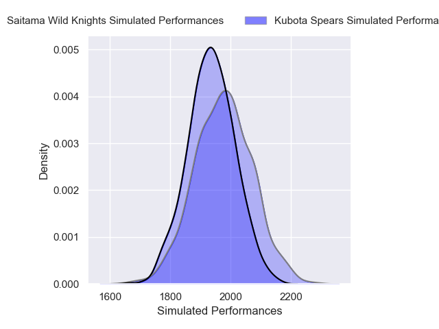
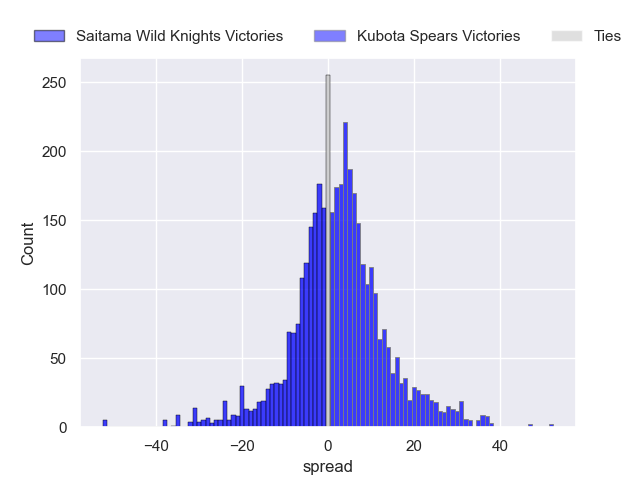
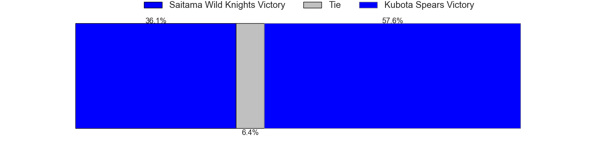
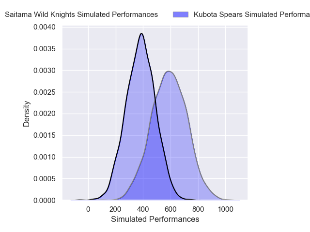
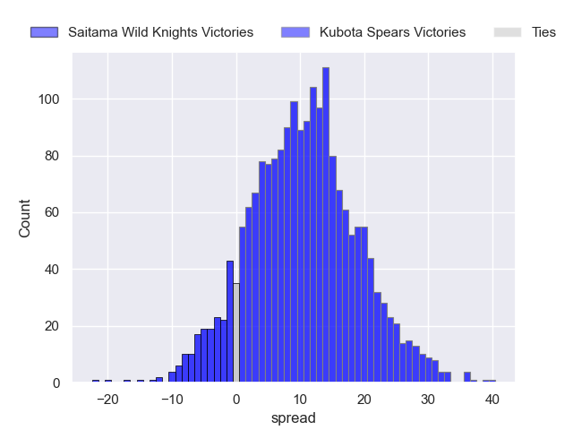
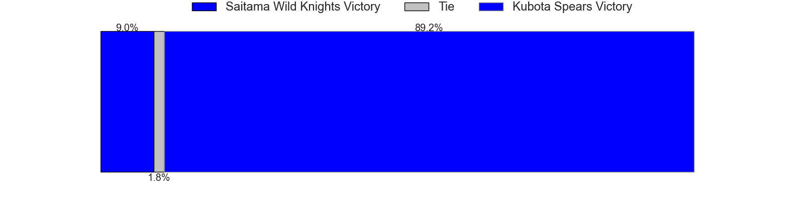

---  
layout: page  
title: Saitama Wild Knights at Kubota Spears; 29-29  
date: 2025-05-03 18:00:00 -0500  
categories: "Japan Rugby League One 24/25" match review  
---
# Saitama Wild Knights at Kubota Spears; 29-29

# Club Level Predictions

The first set of predictions treats a club as the smallest object, as the club develops its members, organizes a gameplan, and deploys its players as needed for each match. This club model has a prediction of 0.554, which translates to predicting Kubota Spears to win by 1.9.

Our Over/Under is 74.5 - and combined with the spread above, we have a predicted scoreline of 36 to 38

Each club has a rating and a rating deviation (similar to a Glicko rating), and expected performances can be generated. This allows for simulated matches and spreads like the ones below.
## Projected Performances - Club Model

## Projected Spreads - Club Model

## Projected Results - Club Model

# Player Level Predictions

Treating teams instead as an entity made up of the currently active players, I have ratings for each player in an altogether different system. These can be combined to form team ratings once teamsheets are announced, weighting starters a bit higher than the reserves. After the match is played, players can be weighted by their minutes on the field, allowing for an accurate measure of the team's composition. With these compiled team ratings, we can make predictions, measure inaccuracy, and update the individual player ratings.
## Prediction without Player Minutes: Kubota Spears by 1.0

Saitama Wild Knights by 3.2 on a neutral pitch

## Projected Performances - Player Model

## Projected Spreads - Player Model

## Projected Results - Player Model

|   Away Minutes | Away Player       |   Away Percentile |   Number |   Home Percentile | Home Player         |   Home Minutes |
|---------------:|:------------------|------------------:|---------:|------------------:|:--------------------|---------------:|
|             80 | Keita Inagaki     |             97.71 |        1 |             73.43 | Yota Kamimori       |              0 |
|             50 | Atsushi Sakate    |             93.02 |        2 |            100    | Malcolm Marx        |             12 |
|             23 | Lisala Finau      |             53.88 |        3 |             88.55 | Opeti Helu          |             80 |
|              9 | Liam Mitchell     |             81.82 |        4 |             51.89 | David Van Zeeland   |             50 |
|             40 | Lood de Jager     |             97.63 |        5 |             83.81 | David Bulbring      |             80 |
|             28 | Itsuki Onishi     |             94.92 |        6 |             97.61 | Tyler Paul          |              0 |
|             40 | Lachlan Boshier   |             98.95 |        7 |             91.57 | Takeo Suenaga       |             60 |
|             28 | Jack Cornelsen    |             97.44 |        8 |             80.6  | Faulua Makisi       |             30 |
|             39 | Taiki Koyama      |             95.16 |        9 |             69.55 | Shinobu Fujiwara    |             80 |
|              8 | Kyohei Yamasawa   |             73.74 |       10 |             99.19 | Bernard Foley       |             80 |
|             64 | Tomoki Osada      |             30.29 |       11 |             89.23 | Koga Nezuka         |             80 |
|             26 | Damian de Allende |             99.59 |       12 |             87.12 | Harumichi Tatekawa  |             59 |
|             29 | Dylan Riley       |             98.26 |       13 |             37.63 | Rikus Pretorius     |             61 |
|             80 | Ryuji Noguchi     |             97.98 |       14 |             83.27 | Halatoa Vailea      |             65 |
|              7 | Takuya Yamasawa   |             96.07 |       15 |             60.66 | Atsushi Oshikawa    |             80 |
|             20 | Craig Millar      |            nan    |       16 |             99.62 | Ruan Botha          |             71 |
|             50 | Asaeli Ai Valu    |             98.69 |       17 |            nan    | Yamada Hibiki       |             32 |
|             60 | Ockie Barnard     |             61.17 |       18 |             94.28 | Kota Kaishi         |             80 |
|             80 | Esei Ha'angana    |             72.54 |       19 |             82.37 | Hayate Era          |             80 |
|             80 | Vince Aso         |             58.18 |       20 |             82.5  | Keijiro Tamefusa    |             59 |
|             18 | Kenji Sato        |             20.94 |       21 |             94.06 | Lappies Labuschagne |             80 |
|             80 | Shota Fukui       |             28.45 |       22 |             74.23 | Merwe Olivier       |             13 |
|            nan | nan               |            nan    |       23 |             96.89 | Bryn Hall           |             21 |

