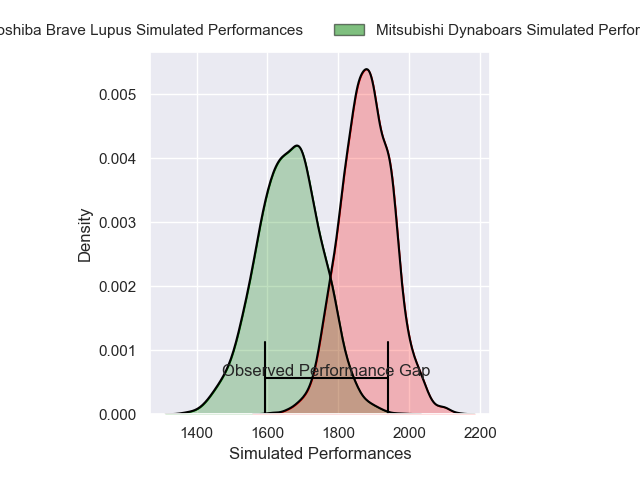
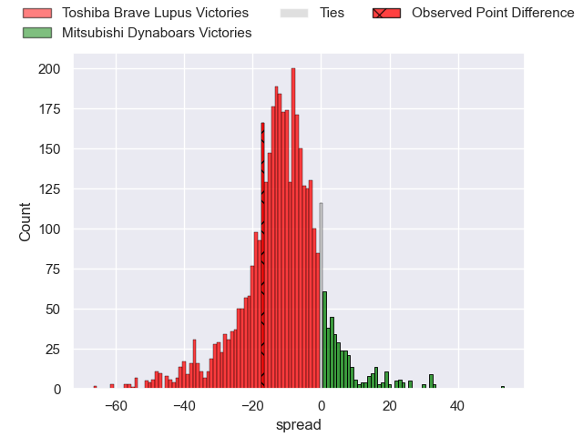
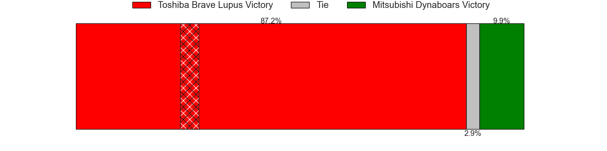
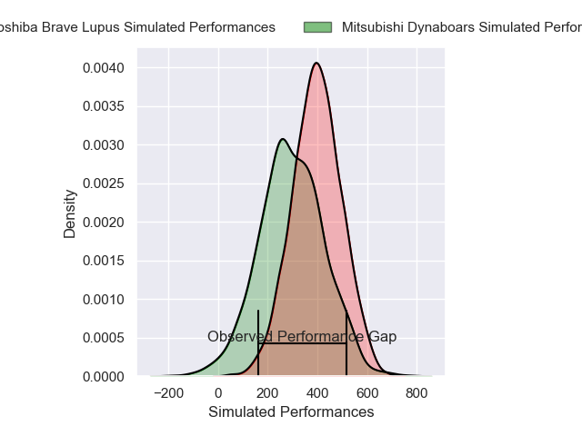
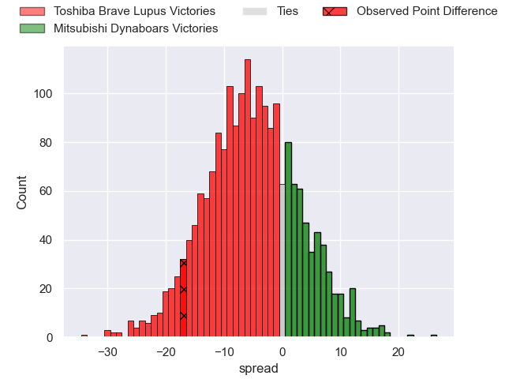
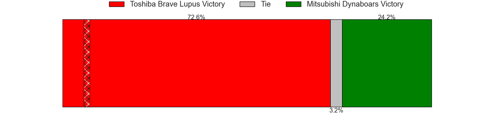

---  
layout: page  
title: Toshiba Brave Lupus at Mitsubishi Dynaboars; 45-28  
date: 2025-05-03 18:00:00 -0500  
categories: "Japan Rugby League One 24/25" match review  
---
# Toshiba Brave Lupus at Mitsubishi Dynaboars; 45-28

# Club Level Predictions

The first set of predictions treats a club as the smallest object, as the club develops its members, organizes a gameplan, and deploys its players as needed for each match. This club model has a prediction of 0.227, which translates to predicting Toshiba Brave Lupus to win by 10.9.

Our Over/Under is 60.5 - and combined with the spread above, we have a predicted scoreline of 36 to 25

Each club has a rating and a rating deviation (similar to a Glicko rating), and expected performances can be generated. This allows for simulated matches and spreads like the ones below.
## Projected Performances - Club Model

## Projected Spreads - Club Model

## Projected Results - Club Model

# Player Level Predictions

Treating teams instead as an entity made up of the currently active players, I have ratings for each player in an altogether different system. These can be combined to form team ratings once teamsheets are announced, weighting starters a bit higher than the reserves. After the match is played, players can be weighted by their minutes on the field, allowing for an accurate measure of the team's composition. With these compiled team ratings, we can make predictions, measure inaccuracy, and update the individual player ratings.
## Prediction without Player Minutes: Toshiba Brave Lupus by 16.5

Toshiba Brave Lupus by 19.8 on a neutral pitch

## Projected Performances - Player Model

## Projected Spreads - Player Model

## Projected Results - Player Model

|   Away Minutes | Away Player      |   Away Percentile |   Number |   Home Percentile | Home Player               |   Home Minutes |
|---------------:|:-----------------|------------------:|---------:|------------------:|:--------------------------|---------------:|
|           26   | Sena Kimura      |             93.21 |        1 |             31.07 | Yuji Chae                 |           80   |
|           32   | Mamoru Harada    |             95.64 |        2 |             61.61 | Yoshimitsu Yasue          |           80   |
|           68   | Taufa Latu       |             86.18 |        3 |             57.73 | Khuthuzani Kingdom Mchunu |           53   |
|           32   | Jacob Pierce     |             99.72 |        4 |             66.29 | Walt Steenkamp            |           80   |
|           37   | Warner Dearns    |             92.14 |        5 |              5.11 | Epineri Uluiviti          |           62   |
|           32   | Shannon Frizell  |             94.54 |        6 |             69.06 | Kyo Yoshida               |           80   |
|           23.5 | Takeshi Sasaki   |             94.64 |        7 |             94.16 | Masataka Tsuruya          |           79   |
|            4   | Michael Leitch   |             96.16 |        8 |             17.7  | Marino Mikaele-Tu'u       |           48   |
|           12   | Yuhei Sugiyama   |             91.52 |        9 |             15.74 | Ryuta Nakamori            |           80   |
|           16   | Richie Mo'unga   |            100    |       10 |             39.8  | James Grayson             |           80   |
|           48   | Yuto Mori        |             76.44 |       11 |             70.38 | Honeti Taumoha'apai       |           80   |
|           25   | Rob Thompson     |             63.91 |       12 |             92.23 | Charlie Lawrence          |           40   |
|           67   | Seta Tamanivalu  |             98.57 |       13 |             38.51 | Matt Vaega                |           46   |
|           48   | Jone Naikabula   |             82.4  |       14 |             34.42 | DJ Kashima                |           50   |
|           66   | Shohei Toyoshima |             87.99 |       15 |             64.8  | Satoshi Koizumi           |           15   |
|           62   | Yuta Kokaji      |             95.01 |       16 |              7.6  | Hayato Hosoda             |           20   |
|           26   | Samuela Anise    |             63.73 |       17 |            nan    | Shoma Sagawa              |           80   |
|           13   | Takahiro Ogawa   |            nan    |       18 |             18.3  | Haniteli Vailea           |           80   |
|           32   | Daigo Hashimoto  |             86.91 |       19 |             91.29 | Friedle Olivier           |           43   |
|           26   | Teruo Makabe     |            nan    |       20 |             96.08 | Tomoaki Ishii             |           73   |
|           33   | Taichi Mano      |             84.56 |       21 |            nan    | Kohki Matsumoto           |           80   |
|           13   | Michael Collins  |             97.03 |       22 |            nan    | Koki Hattori              |            7   |
|           32   | Shohei Ito       |             57.48 |       23 |            nan    | Ryoto Fukuyama            |           23.5 |

