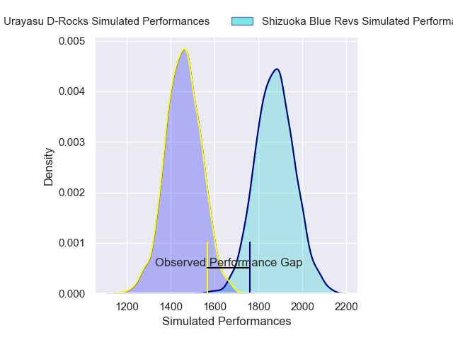
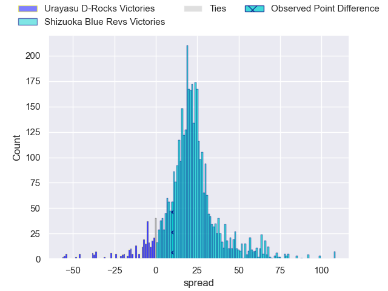
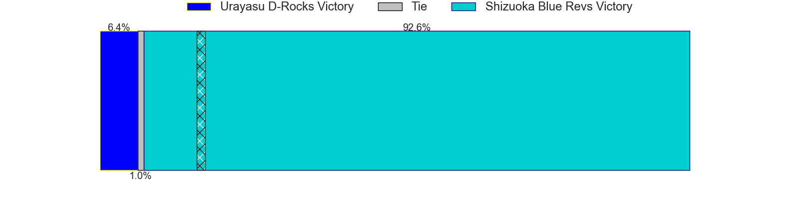
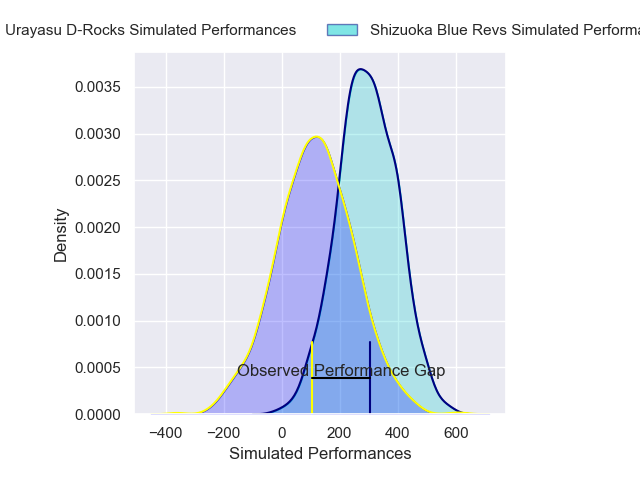
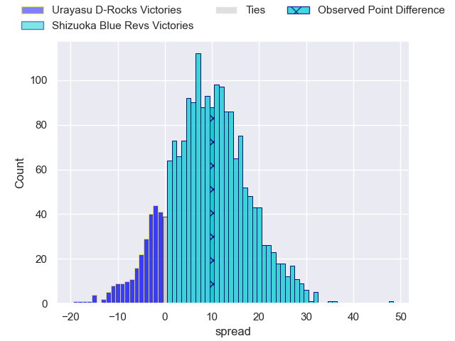
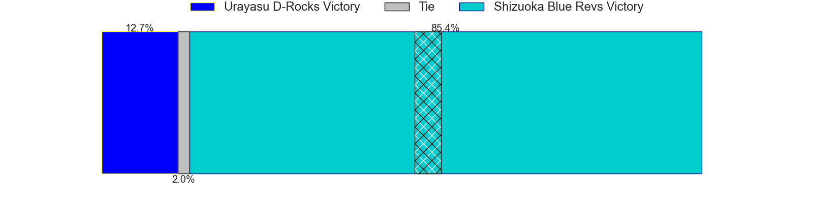

---  
layout: page  
title: Urayasu D-Rocks at Shizuoka Blue Revs; 52-62  
date: 2025-05-03 18:00:00 -0500  
categories: "Japan Rugby League One 24/25" match review  
---
# Urayasu D-Rocks at Shizuoka Blue Revs; 52-62

# Club Level Predictions

The first set of predictions treats a club as the smallest object, as the club develops its members, organizes a gameplan, and deploys its players as needed for each match. This club model has a prediction of 0.913, which translates to predicting Shizuoka Blue Revs to win by 21.1.

Our Over/Under is 80.5 - and combined with the spread above, we have a predicted scoreline of 30 to 51

Each club has a rating and a rating deviation (similar to a Glicko rating), and expected performances can be generated. This allows for simulated matches and spreads like the ones below.
## Projected Performances - Club Model

## Projected Spreads - Club Model

## Projected Results - Club Model

# Player Level Predictions

Treating teams instead as an entity made up of the currently active players, I have ratings for each player in an altogether different system. These can be combined to form team ratings once teamsheets are announced, weighting starters a bit higher than the reserves. After the match is played, players can be weighted by their minutes on the field, allowing for an accurate measure of the team's composition. With these compiled team ratings, we can make predictions, measure inaccuracy, and update the individual player ratings.
## Prediction without Player Minutes: Shizuoka Blue Revs by 10.7

Shizuoka Blue Revs by 6.3 on a neutral pitch

## Projected Performances - Player Model

## Projected Spreads - Player Model

## Projected Results - Player Model

|   Away Minutes | Away Player          |   Away Percentile |   Number |   Home Percentile | Home Player             |   Home Minutes |
|---------------:|:---------------------|------------------:|---------:|------------------:|:------------------------|---------------:|
|             80 | Hidetomo Nabeshima   |              4.89 |        1 |             56.4  | Kenta Yamashita         |             30 |
|             80 | Junichiro Matsushita |              6.33 |        2 |             79.61 | Shunsuke Sakuta         |             21 |
|             29 | Sekonaia Pole        |             82.56 |        3 |             93.64 | Heiichiro Ito           |             51 |
|             27 | Hunter Morrison      |             47    |        4 |             48.22 | Shumpei Miura           |             19 |
|             29 | Lourens Erasmus      |             67.23 |        5 |             72.1  | Justin Sangster         |             21 |
|             21 | Yuzuki Sasaki        |             46.08 |        6 |             28.17 | Vueti Tupou             |             43 |
|             80 | Brody MacAskill      |             89.64 |        7 |             87.03 | Kwagga Smith            |              4 |
|             29 | Nathan Hughes        |             84.52 |        8 |             58.79 | Malgene Ilaua           |             37 |
|             27 | Ren Iinuma           |             43.65 |        9 |             66.43 | Shuntaro Kitamura       |             80 |
|             76 | Yu Tamura            |             81.02 |       10 |             83.27 | Kenta Iemura            |             74 |
|             68 | Kai Ishii            |              9.8  |       11 |             56.1  | Kakeru Okamura          |             80 |
|             55 | Samu Kerevi          |             95.51 |       12 |             81.43 | Sylvian Mahuza          |             56 |
|             64 | Shane Gates          |             25.1  |       13 |             96.53 | Charles Piutau          |             29 |
|             80 | Soma Matsumoto       |             58.98 |       14 |             81.65 | Valynce Te Whare-Crosby |             14 |
|             80 | Otere Black          |             58.68 |       15 |             63.22 | Futo Yamaguchi          |             39 |
|             80 | Uwe Helu             |             34.27 |       16 |             19.48 | Takayoshi Mohara        |             80 |
|             47 | Siosifa Lisala       |            nan    |       17 |             74    | Sean Vete               |             80 |
|             50 | Kaisei Umeda         |            nan    |       18 |             71.65 | Kodai Okazaki           |             34 |
|             31 | Kim Ryom             |             58.44 |       19 |             72.59 | Richmond Tongatama      |             15 |
|             80 | Shokei Kin           |            nan    |       20 |             94.49 | Sanele Nohamba          |             51 |
|             55 | James Moore          |            nan    |       21 |             83.05 | Eishin Kuwano           |             29 |
|             80 | Takuya Shirae        |            nan    |       22 |             89.29 | Viliami Tahitu'a        |             29 |
|             40 | Daiki Sato           |            nan    |       23 |             28.85 | Takuma Shoji            |             59 |

