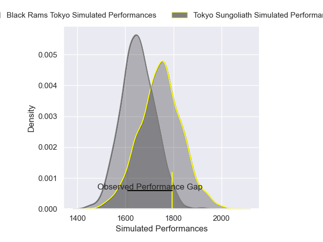
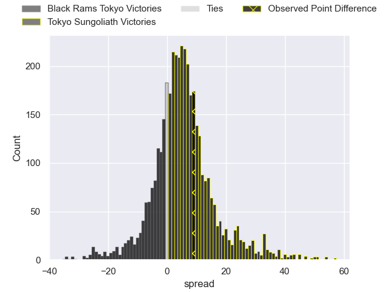
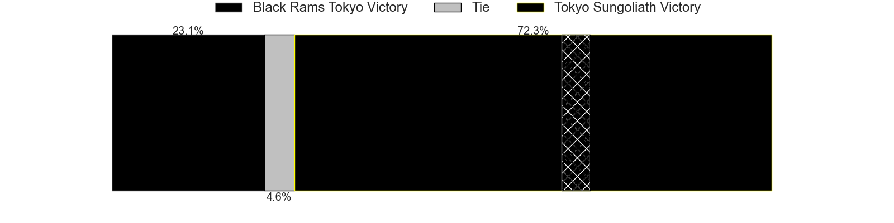
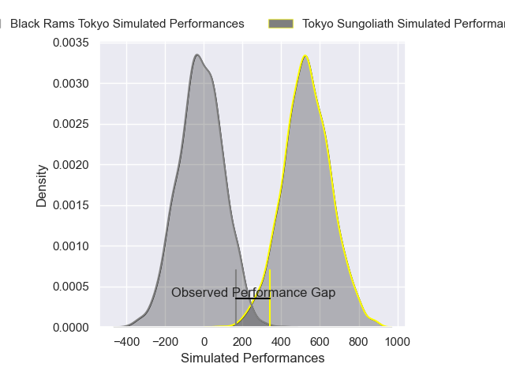
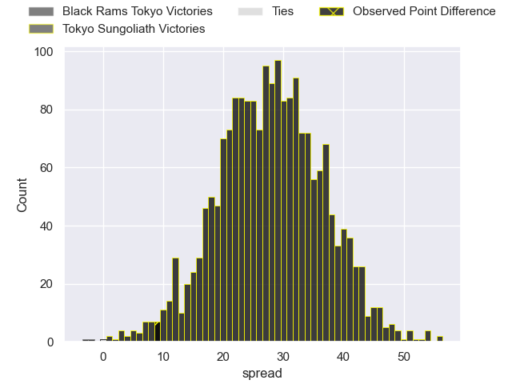
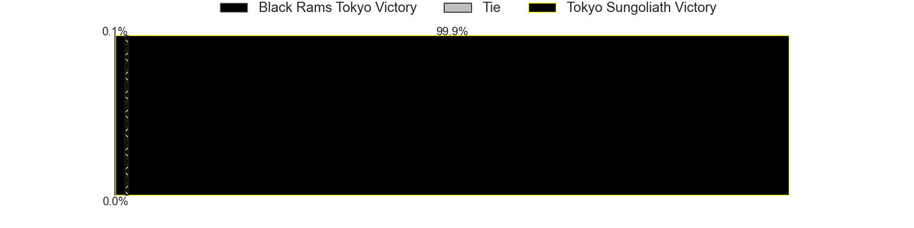

---  
layout: page  
title: Black Rams Tokyo at Tokyo Sungoliath; 34-43  
date: 2025-05-03 18:00:00 -0500  
categories: "Japan Rugby League One 24/25" match review  
---
# Black Rams Tokyo at Tokyo Sungoliath; 34-43

# Club Level Predictions

The first set of predictions treats a club as the smallest object, as the club develops its members, organizes a gameplan, and deploys its players as needed for each match. This club model has a prediction of 0.631, which translates to predicting Tokyo Sungoliath to win by 4.8.

Our Over/Under is 69.5 - and combined with the spread above, we have a predicted scoreline of 32 to 37

Each club has a rating and a rating deviation (similar to a Glicko rating), and expected performances can be generated. This allows for simulated matches and spreads like the ones below.
## Projected Performances - Club Model

## Projected Spreads - Club Model

## Projected Results - Club Model

# Player Level Predictions

Treating teams instead as an entity made up of the currently active players, I have ratings for each player in an altogether different system. These can be combined to form team ratings once teamsheets are announced, weighting starters a bit higher than the reserves. After the match is played, players can be weighted by their minutes on the field, allowing for an accurate measure of the team's composition. With these compiled team ratings, we can make predictions, measure inaccuracy, and update the individual player ratings.
## Prediction without Player Minutes: Tokyo Sungoliath by 28.9

Tokyo Sungoliath by 23.9 on a neutral pitch

## Projected Performances - Player Model

## Projected Spreads - Player Model

## Projected Results - Player Model

|   Away Minutes | Away Player       |   Away Percentile |   Number |   Home Percentile | Home Player       |   Home Minutes |
|---------------:|:------------------|------------------:|---------:|------------------:|:------------------|---------------:|
|             22 | Taishi Tsumura    |             33.01 |        1 |             82.8  | Wataru Kobayashi  |              8 |
|             30 | Shin Ouchi        |             71    |        2 |             65.91 | Kosuke Horikoshi  |             80 |
|             30 | Paddy Ryan        |              4.73 |        3 |             26.08 | Kan Nakano        |             54 |
|             29 | Paddy Ryan        |              4.73 |        3 |             26.08 | Kan Nakano        |             54 |
|             28 | Mike Stolberg     |              2.62 |        4 |             97.47 | Sam Jeffries      |             37 |
|             10 | Harrison Fox      |             26.97 |        5 |             98.6  | Harry Hockings    |             67 |
|             25 | Brodi McCurran    |             55.76 |        6 |             72.22 | Kanji Shimokawa   |             75 |
|             46 | Liam Gill         |             78.9  |        7 |             98.45 | Sam Cane          |             80 |
|             62 | Amato Fakatava    |              2.72 |        8 |             70.92 | Ryuga Hashimoto   |             68 |
|             47 | TJ Perenara       |             95.83 |        9 |             38.96 | Yutaka Nagare     |             80 |
|             68 | Kotaro Ito        |             15.51 |       10 |             96.53 | Keisuke Moriya    |             48 |
|             25 | Netani Vakayalia  |             61.67 |       11 |             99.52 | Cheslin Kolbe     |             80 |
|             44 | Yuki Ikeda        |             48.67 |       12 |              5.92 | Shogo Nakano      |             54 |
|             54 | Penieli Jr Latu   |             26.33 |       13 |             52.04 | Isaiah Punivai    |             33 |
|             33 | Taira Main        |             50.62 |       14 |             90.78 | Seiya Ozaki       |             74 |
|             80 | Isaac Lucas       |             72.73 |       15 |             93.39 | Kotaro Matsushima |             48 |
|             32 | Reijiro Yamamoto  |             44.94 |       16 |             15.9  | Tamati Ioane      |             25 |
|             80 | Kazuma Nishi      |             44.74 |       17 |             62.86 | Mikiya Takamoto   |             30 |
|             80 | Shohei Oyama      |             13.53 |       18 |             91.04 | Yukio Morikawa    |             80 |
|             80 | Ryohei Isoda      |             65.61 |       19 |             39.2  | Kotaro Hosoki     |             67 |
|             66 | Masaaki Onishi    |            nan    |       20 |            nan    | Kienori Go        |             80 |
|             80 | Viliami Lolohea   |              7.65 |       21 |            nan    | Koji Iino         |             61 |
|             49 | Shuhei Matsuhashi |             65.54 |       22 |             72    | Kenta Fukuda      |             76 |
|            nan | nan               |            nan    |       23 |             77.52 | Shota Emi         |             22 |

