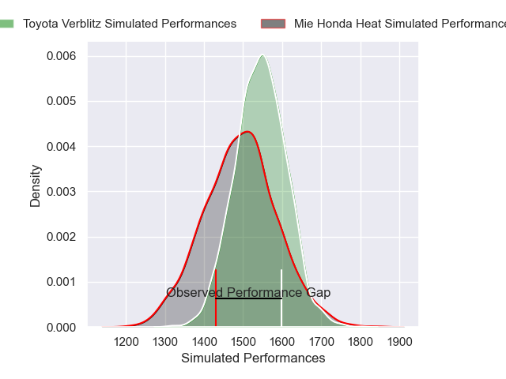
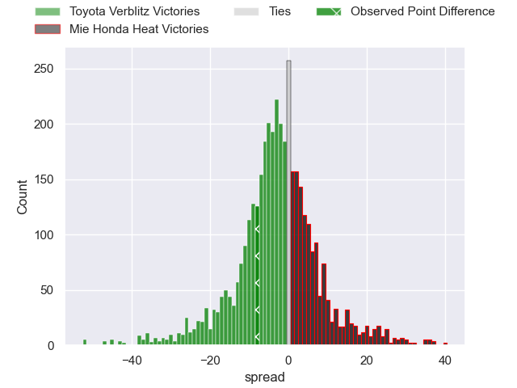
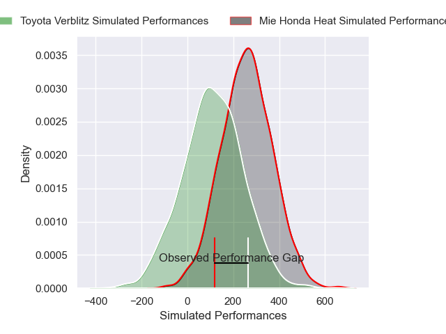
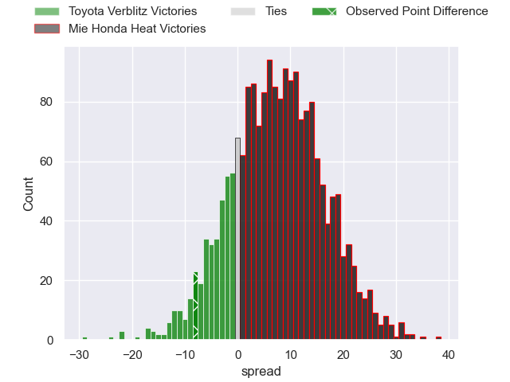
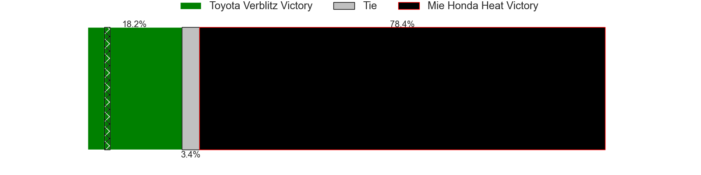

---  
layout: page  
title: Toyota Verblitz at Mie Honda Heat; 38-30  
date: 2025-05-04 18:00:00 -0500  
categories: "Japan Rugby League One 24/25" match review  
---
# Toyota Verblitz at Mie Honda Heat; 38-30

# Club Level Predictions

The first set of predictions treats a club as the smallest object, as the club develops its members, organizes a gameplan, and deploys its players as needed for each match. This club model has a prediction of 0.429, which translates to predicting Toyota Verblitz to win by 2.5.

Our Over/Under is 77.5 - and combined with the spread above, we have a predicted scoreline of 40 to 38

Each club has a rating and a rating deviation (similar to a Glicko rating), and expected performances can be generated. This allows for simulated matches and spreads like the ones below.
## Projected Performances - Club Model

## Projected Spreads - Club Model

## Projected Results - Club Model

# Player Level Predictions

Treating teams instead as an entity made up of the currently active players, I have ratings for each player in an altogether different system. These can be combined to form team ratings once teamsheets are announced, weighting starters a bit higher than the reserves. After the match is played, players can be weighted by their minutes on the field, allowing for an accurate measure of the team's composition. With these compiled team ratings, we can make predictions, measure inaccuracy, and update the individual player ratings.
## Prediction without Player Minutes: Mie Honda Heat by 4.3

Mie Honda Heat by 0.7 on a neutral pitch

## Projected Performances - Player Model

## Projected Spreads - Player Model

## Projected Results - Player Model

|   Away Minutes | Away Player         |   Away Percentile |   Number |   Home Percentile | Home Player          |   Home Minutes |
|---------------:|:--------------------|------------------:|---------:|------------------:|:---------------------|---------------:|
|             70 | Shogo Miura         |             92.26 |        1 |              6.36 | Tatsuhiko Tsurukawa  |             80 |
|             80 | Yoshikatsu Hikosaka |             90.33 |        2 |             32.34 | Koki Hida            |             29 |
|             28 | Yusuke Kizu         |             68.13 |        3 |             12.31 | Matthys Basson       |             80 |
|             52 | Adre Smith          |             61.7  |        4 |             14.89 | Mark Abbott          |             68 |
|             30 | Josh Dickson        |             22.19 |        5 |             88.95 | Franco Mostert       |             80 |
|             23 | Will Tupou          |             24.2  |        6 |              2.42 | Ryota Kobayashi      |             17 |
|             20 | Kosei Miki          |             32.43 |        7 |              4.74 | Tony Ray Hunt        |             65 |
|             20 | Kazuki Himeno       |             44.77 |        8 |             55.23 | Tevita Tupou         |             53 |
|             17 | Aaron Smith         |             96.17 |        9 |             42.09 | Azuma Doei           |             28 |
|             80 | Shinya Komura       |             46.53 |       10 |              9.18 | Gwangtee Oh          |             53 |
|             80 | Viliame Tuidraki    |             90.11 |       11 |             73.39 | Larry Steven Sulunga |             50 |
|             70 | Nicholas McCurran   |             82.86 |       12 |             31.43 | Kyogo Okano          |             53 |
|             80 | Siosaia Fifita      |              0.71 |       13 |             92.86 | Tevita Li            |             80 |
|             80 | Joseph Manu         |             14.41 |       14 |              9.61 | Haruhiko Uemura      |             13 |
|             52 | Taichi Takahashi    |             83.06 |       15 |             76.03 | Tom Banks            |             80 |
|             70 | Gaku Shimizu        |            nan    |       16 |             99.23 | Pablo Matera         |             52 |
|             57 | Runya Choi          |            nan    |       17 |            nan    | Shogo Nezuka         |             29 |
|             80 | Kaito Shigeno       |             17.57 |       18 |             52.9  | Connor Wihongi       |             20 |
|             68 | Daichi Akiyama      |             59.74 |       19 |            nan    | Takumi Fuji          |             24 |
|             53 | Keito Aoki          |             33.59 |       20 |             25.75 | Katsuyuki Hoshino    |             50 |
|             75 | Ryuhei Arita        |            nan    |       21 |             70.47 | Ikuma Yamada         |             29 |
|             60 | Matt McGahan        |             71.43 |       22 |             87.45 | Janko Swanepoel      |             23 |
|             60 | Blair Ryall         |             13.07 |       23 |             84.69 | Hayata Nakao         |             50 |

