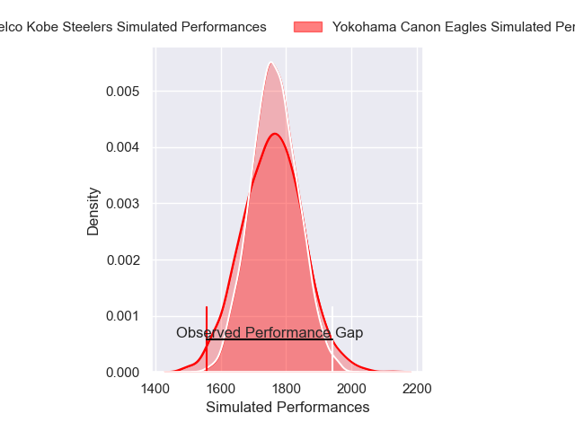
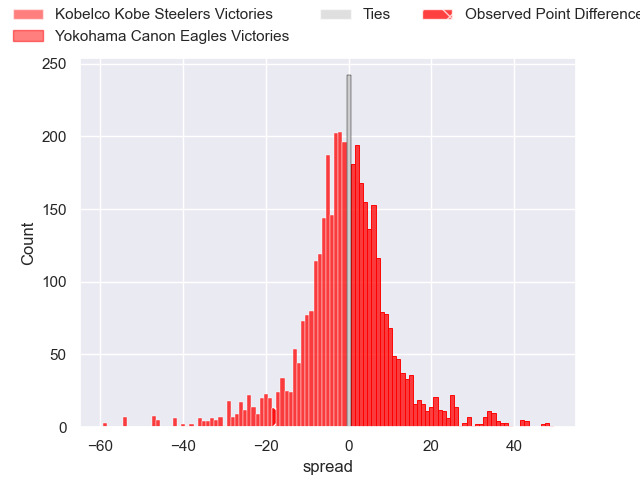
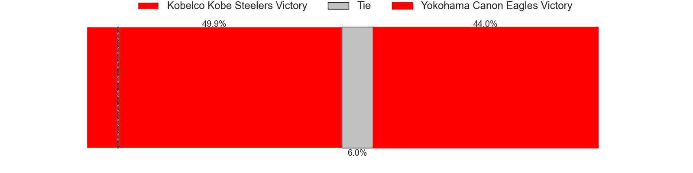
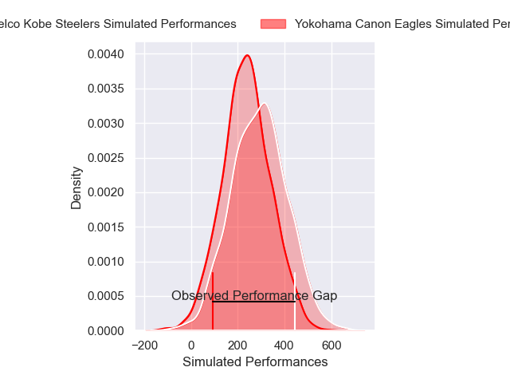
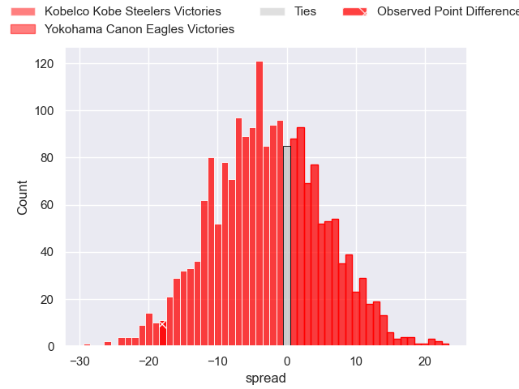
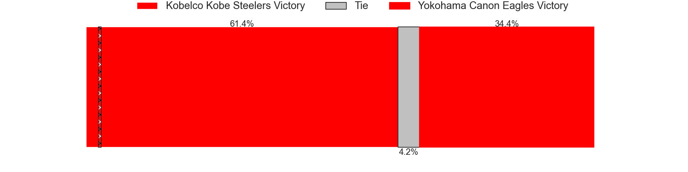

---  
layout: page  
title: Kobelco Kobe Steelers at Yokohama Canon Eagles; 47-29  
date: 2025-05-04 18:00:00 -0500  
categories: "Japan Rugby League One 24/25" match review  
---
# Kobelco Kobe Steelers at Yokohama Canon Eagles; 47-29

# Club Level Predictions

The first set of predictions treats a club as the smallest object, as the club develops its members, organizes a gameplan, and deploys its players as needed for each match. This club model has a prediction of 0.488, which translates to predicting Kobelco Kobe Steelers to win by 0.4.

Our Over/Under is 65.5 - and combined with the spread above, we have a predicted scoreline of 33 to 32

Each club has a rating and a rating deviation (similar to a Glicko rating), and expected performances can be generated. This allows for simulated matches and spreads like the ones below.
## Projected Performances - Club Model

## Projected Spreads - Club Model

## Projected Results - Club Model

# Player Level Predictions

Treating teams instead as an entity made up of the currently active players, I have ratings for each player in an altogether different system. These can be combined to form team ratings once teamsheets are announced, weighting starters a bit higher than the reserves. After the match is played, players can be weighted by their minutes on the field, allowing for an accurate measure of the team's composition. With these compiled team ratings, we can make predictions, measure inaccuracy, and update the individual player ratings.
## Prediction without Player Minutes: Kobelco Kobe Steelers by 1.2

Kobelco Kobe Steelers by 5.5 on a neutral pitch

## Projected Performances - Player Model

## Projected Spreads - Player Model

## Projected Results - Player Model

|   Away Minutes | Away Player          |   Away Percentile |   Number |   Home Percentile | Home Player         |   Home Minutes |
|---------------:|:---------------------|------------------:|---------:|------------------:|:--------------------|---------------:|
|             80 | Shigure Takao        |             80.21 |        1 |             97.47 | Takato Okabe        |             52 |
|             60 | George Turner        |             99.83 |        2 |              5.06 | Shin Kawamura       |             65 |
|             47 | Jiwon Gu             |             40.88 |        3 |              5.64 | Tatsuro Sugimoto    |             49 |
|              0 | Waisake Raratubua    |             82.2  |        4 |              9.85 | Jeandre Labuschagne |             80 |
|             27 | Brodie Retallick     |            100    |        5 |             30.87 | Matt Philip         |             40 |
|             52 | Tiennan Costley      |             83.24 |        6 |             53.35 | Billy Harmon        |             62 |
|             15 | Solomone Funaki      |             50.29 |        7 |             31.42 | Masato Furukawa     |             49 |
|             29 | Amanaki Saumaki      |             62.9  |        8 |             90.83 | Amanaki Mafi        |             80 |
|             27 | Atsushi Hiwasa       |             92.73 |        9 |             69.38 | Kouki Arai          |             27 |
|             68 | Bryn Gatland         |             94.75 |       10 |             83.43 | Yu Tamura           |             27 |
|             30 | Kazuma Ueda          |             53.46 |       11 |             52.31 | Chihito Matsui      |             30 |
|             80 | Tali Ioasa           |             62.27 |       12 |             63.5  | Naoya Minamihashi   |             24 |
|             59 | Timothy Lafaele      |             65.34 |       13 |             98.67 | Jesse Kriel         |             33 |
|             50 | Inoke Burua          |             87.31 |       14 |             18.85 | Kippei Ishida       |             51 |
|             50 | Seungsin Lee         |              3.93 |       15 |             98.34 | Jumpei Ogura        |             30 |
|             23 | Kauvaka Kaivelata    |             39.9  |       16 |              5.78 | Liaki Moli          |             30 |
|             28 | Takuya Kitade        |            nan    |       17 |             66.15 | Ryosuke Iwaihara    |             70 |
|             53 | Hiroshi Yamashita    |             97.55 |       18 |            nan    | Yuragi Muto         |             80 |
|             53 | Hayata Tsujino       |            nan    |       19 |            nan    | Hayate Hiraishi     |             58 |
|             65 | Ataata Moeakiola     |             37.5  |       20 |            nan    | Tomoki Minami       |             80 |
|             53 | Gerard Cowley-Tuioti |             85.32 |       21 |             20.31 | Naoto Shimada       |             19 |
|             80 | Hikaru Hashimoto     |            nan    |       22 |            nan    | Toshiki Amano       |             23 |
|             70 | Daiki Nakajima       |            nan    |       23 |             90.27 | Brendan Owen        |             17 |

