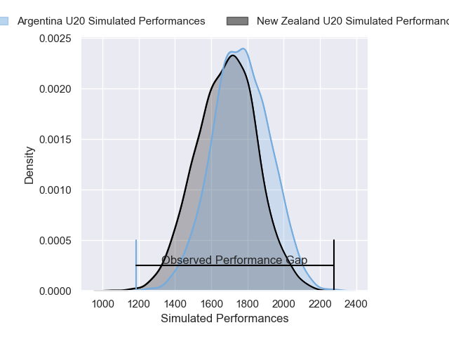
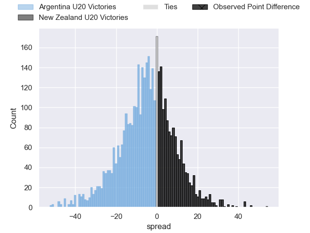
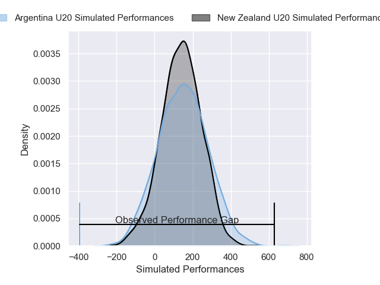
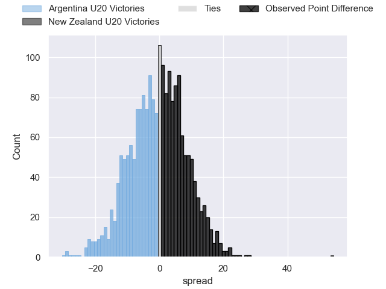

---  
layout: page  
title: Argentina U20 at New Zealand U20; 21-75  
date: 2025-05-06 18:00:00 -0500  
categories: "Rugby Championship U20 2025" match review  
---
# Argentina U20 at New Zealand U20; 21-75

# Club Level Predictions

The first set of predictions treats a club as the smallest object, as the club develops its members, organizes a gameplan, and deploys its players as needed for each match. This club model has a prediction of 0.394, which translates to predicting Argentina U20 to win by 4.2.

Our Over/Under is 59.5 - and combined with the spread above, we have a predicted scoreline of 32 to 28

Each club has a rating and a rating deviation (similar to a Glicko rating), and expected performances can be generated. This allows for simulated matches and spreads like the ones below.
## Projected Performances - Club Model

## Projected Spreads - Club Model

## Projected Results - Club Model

# Player Level Predictions

Treating teams instead as an entity made up of the currently active players, I have ratings for each player in an altogether different system. These can be combined to form team ratings once teamsheets are announced, weighting starters a bit higher than the reserves. After the match is played, players can be weighted by their minutes on the field, allowing for an accurate measure of the team's composition. With these compiled team ratings, we can make predictions, measure inaccuracy, and update the individual player ratings.
## Prediction without Player Minutes: New Zealand U20 by 1.5

Argentina U20 by 0.7 on a neutral pitch

## Projected Performances - Player Model

## Projected Spreads - Player Model

## Projected Results - Player Model

|   Away Minutes | Away Player             |   Away Percentile |   Number |   Home Percentile | Home Player     |   Home Minutes |
|---------------:|:------------------------|------------------:|---------:|------------------:|:----------------|---------------:|
|             80 | Juan Ignacio Rodriguez  |             18.42 |        1 |             78.92 | Sika Pole       |             65 |
|             80 | Nicolas Cambiasso       |             21.13 |        2 |             64.44 | Eli Oudenryn    |             49 |
|             67 | Emir Gael Galvan        |             39.1  |        3 |             71.81 | Riley Tofilau   |             80 |
|             60 | Tomas Duclos            |             23.71 |        4 |             66.15 | Xavier Treacy   |             80 |
|             63 | Alvaro Garcia Iandolino |             47.32 |        5 |             67.71 | Josh Tengblad   |             80 |
|             32 | Tomas Dande             |             28.54 |        6 |             50.29 | Finn McLeod     |             13 |
|             32 | Pampa Storey            |             25.67 |        7 |             68.97 | Caleb Woodley   |             80 |
|             23 | Agustin Garcia Campos   |             24.42 |        8 |             59.45 | Mosese Bason    |             40 |
|             32 | Felix Corleto           |             20.14 |        9 |             62.59 | Charlie Sinton  |             55 |
|              4 | Ramon Fernandez Miranda |             34.88 |       10 |             43.34 | Will Cole       |              6 |
|             20 | Martiniano Arrieta      |             25.68 |       11 |             57.98 | David Lewai     |             31 |
|             47 | Felipe Ledesma          |             62.18 |       12 |             56.32 | Taine Harvey    |             40 |
|             80 | Valentin Maldonado      |             21.13 |       13 |             42.77 | Cooper Roberts  |             13 |
|             55 | Juan Ignacio Carreras   |             27.33 |       14 |             60.99 | Maloni Kunawave |             56 |
|             72 | Sebastian Dubuc         |             20.64 |       15 |             51.28 | Stanley Solomon |             31 |
|             80 | Pedro Coll              |             30.84 |       16 |            nan    | Micah Fale      |             17 |
|             13 | Franco Benitez          |            nan    |       17 |            nan    | Jai Tamati      |             80 |
|             63 | Diego Correa            |             87.48 |       18 |             42.16 | Robson Faleafa  |              7 |
|             80 | Tadeo Ledesma Arocena   |             39.44 |       19 |             67.02 | Rico Simpson    |             22 |
|             54 | Pascal Senillosa        |             28.3  |       20 |            nan    | Harry Irving    |             59 |
|             67 | Valentino Reggiardo     |            nan    |       21 |            nan    | Tamiano Ahloo   |             20 |
|             74 | Ignacio Orsetti         |            nan    |       22 |            nan    | Taniela Maisiri |             13 |
|             67 | Jeremy Annand           |            nan    |       23 |            nan    | Shaun Kempton   |             31 |

