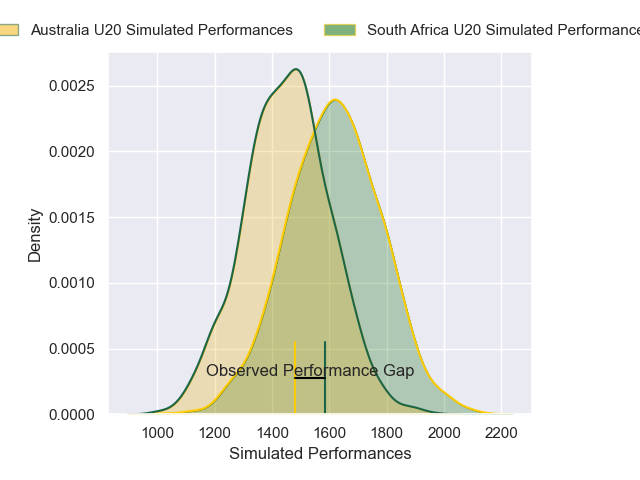
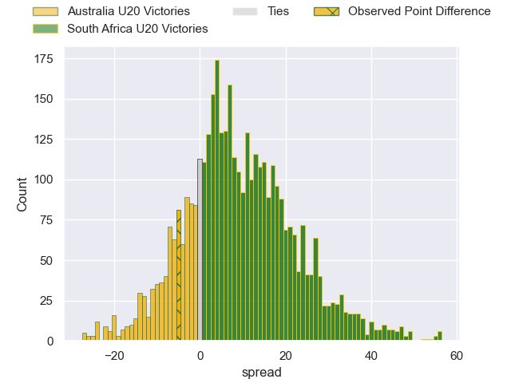
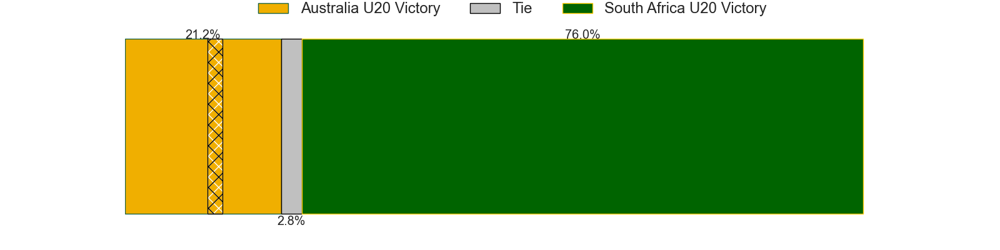
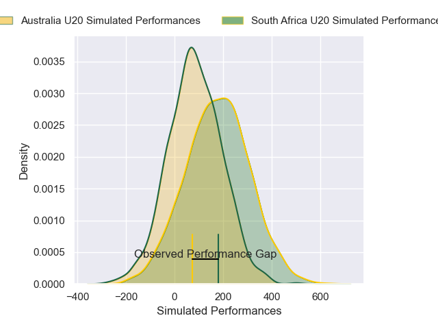
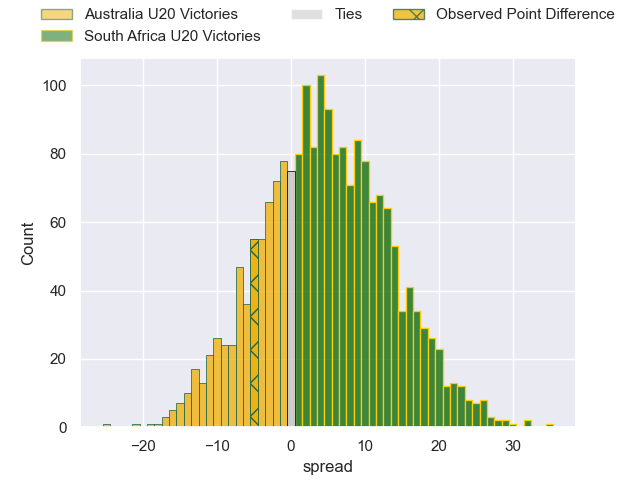
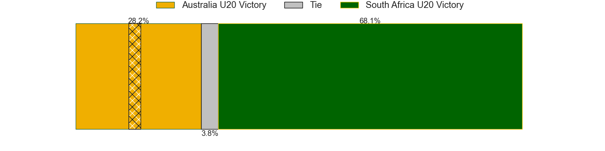

---  
layout: page  
title: Australia U20 at South Africa U20; 29-24  
date: 2025-05-06 18:00:00 -0500  
categories: "Rugby Championship U20 2025" match review  
---
# Australia U20 at South Africa U20; 29-24

# Club Level Predictions

The first set of predictions treats a club as the smallest object, as the club develops its members, organizes a gameplan, and deploys its players as needed for each match. This club model has a prediction of 0.704, which translates to predicting South Africa U20 to win by 8.3.

Our Over/Under is 43.5 - and combined with the spread above, we have a predicted scoreline of 18 to 26

Each club has a rating and a rating deviation (similar to a Glicko rating), and expected performances can be generated. This allows for simulated matches and spreads like the ones below.
## Projected Performances - Club Model

## Projected Spreads - Club Model

## Projected Results - Club Model

# Player Level Predictions

Treating teams instead as an entity made up of the currently active players, I have ratings for each player in an altogether different system. These can be combined to form team ratings once teamsheets are announced, weighting starters a bit higher than the reserves. After the match is played, players can be weighted by their minutes on the field, allowing for an accurate measure of the team's composition. With these compiled team ratings, we can make predictions, measure inaccuracy, and update the individual player ratings.
## Prediction without Player Minutes: South Africa U20 by 3.5

South Africa U20 by 1.2 on a neutral pitch

## Projected Performances - Player Model

## Projected Spreads - Player Model

## Projected Results - Player Model

|   Away Minutes | Away Player      |   Away Percentile |   Number |   Home Percentile | Home Player        |   Home Minutes |
|---------------:|:-----------------|------------------:|---------:|------------------:|:-------------------|---------------:|
|             32 | Finn Baxter      |             56.09 |        1 |             56.01 | Simphiwe Ngobese   |             58 |
|             33 | Ollie Barrett    |             57.94 |        2 |             29.67 | Jaundre Schoeman   |             80 |
|             29 | Trevor King      |             45.13 |        3 |             42.19 | Herman Lubbe       |             38 |
|             13 | Joe Mangelsdorf  |             55.97 |        4 |             46.88 | Riley Norton       |             80 |
|             14 | Eamon Doyle      |             57.39 |        5 |             32.67 | Morne Venter       |             80 |
|             61 | Luca Cleverley   |             57.28 |        6 |             28.35 | Xola Nyali         |             80 |
|             34 | Eli Langi        |             57.09 |        7 |             69.54 | Batho Hlekani      |             80 |
|             35 | Beau Morrison    |             54.37 |        8 |             54.8  | Wandile Mlaba      |             51 |
|             75 | Hwi Sharples     |             57.96 |        9 |             37.54 | Ceano Everson      |             47 |
|             61 | Finn Prass       |             52.73 |       10 |             37.37 | Vusi Simphiwe Moyo |             33 |
|             32 | Cooper Watters   |             57.4  |       11 |             30.19 | Siya Ndlozi        |             80 |
|             40 | Malakye Enasio   |             51.33 |       12 |             29.35 | Dominic Malgas     |             80 |
|             40 | Xavier Rubens    |             18.51 |       13 |             33.13 | Scott Nel          |             54 |
|             22 | Nick Conway      |             50.19 |       14 |             51.35 | Cheswill Jooste    |             16 |
|             15 | Sidney Harvey    |             48.45 |       15 |             23.6  | JC Mars            |             80 |
|             29 | Boston Fakafanua |             40.08 |       16 |             65.58 | Oliver Reid        |             26 |
|             23 | Charlie Brosnan  |            nan    |       17 |            nan    | Jean Erasmus       |             80 |
|             36 | Ollie Aylmer     |            nan    |       18 |             51.63 | Thando Biyela      |             45 |
|             80 | Edwin Langi      |            nan    |       19 |             47.68 | Kyle Smith         |             47 |
|             80 | Joey Fowler      |             29.09 |       20 |             56.73 | Gino Cupido        |             47 |
|             80 | Lipina Ata       |            nan    |       21 |            nan    | HB Odendaal        |             64 |
|             80 | Nick Hill        |            nan    |       22 |            nan    | Erich Visser       |             80 |
|             65 | James Martens    |            nan    |       23 |            nan    | Neil Hansen        |             43 |

