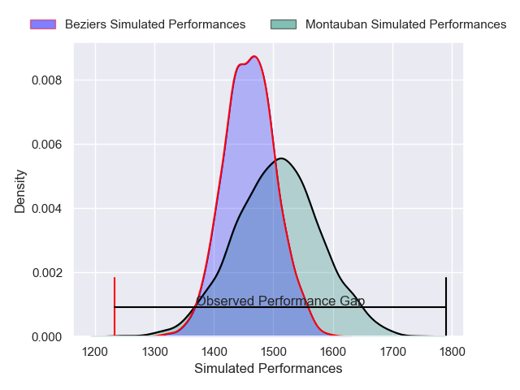
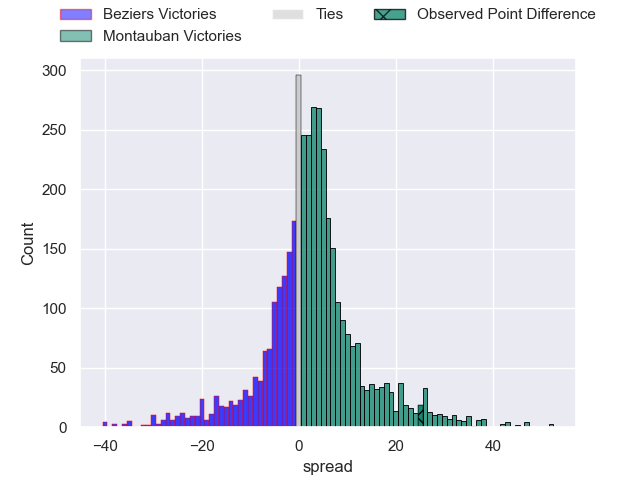
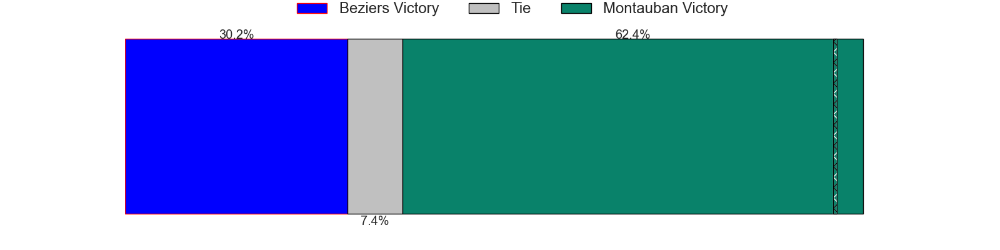
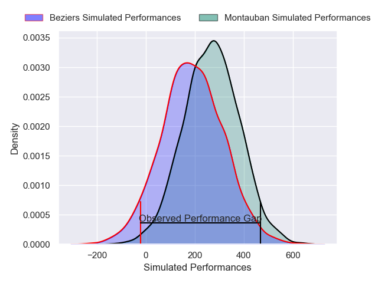
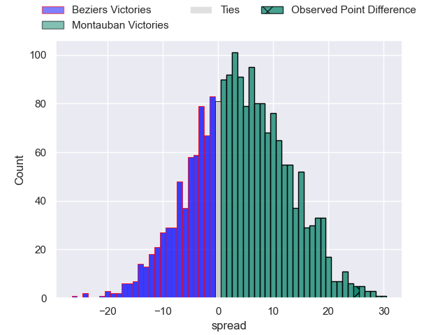
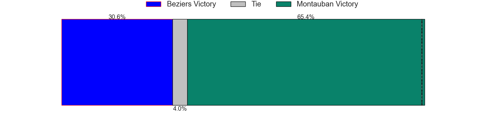

---  
layout: page  
title: Beziers at Montauban; 17-42  
date: 2025-05-08 18:00:00 -0500  
categories: "Pro D2 24/25" match review  
---
# Beziers at Montauban; 17-42

# Club Level Predictions

The first set of predictions treats a club as the smallest object, as the club develops its members, organizes a gameplan, and deploys its players as needed for each match. This club model has a prediction of 0.569, which translates to predicting Montauban to win by 2.4.

Our Over/Under is 44.5 - and combined with the spread above, we have a predicted scoreline of 21 to 23

Each club has a rating and a rating deviation (similar to a Glicko rating), and expected performances can be generated. This allows for simulated matches and spreads like the ones below.
## Projected Performances - Club Model

## Projected Spreads - Club Model

## Projected Results - Club Model

# Player Level Predictions

Treating teams instead as an entity made up of the currently active players, I have ratings for each player in an altogether different system. These can be combined to form team ratings once teamsheets are announced, weighting starters a bit higher than the reserves. After the match is played, players can be weighted by their minutes on the field, allowing for an accurate measure of the team's composition. With these compiled team ratings, we can make predictions, measure inaccuracy, and update the individual player ratings.
## Prediction without Player Minutes: Montauban by 3.0

Beziers by 8.2 on a neutral pitch

## Projected Performances - Player Model

## Projected Spreads - Player Model

## Projected Results - Player Model

|   Away Minutes | Away Player                 |   Away Percentile |   Number |   Home Percentile | Home Player       |   Home Minutes |
|---------------:|:----------------------------|------------------:|---------:|------------------:|:------------------|---------------:|
|             46 | Francisco Fernandes Moreira |              5.49 |        1 |             47.74 | Leo Aouf          |             73 |
|             15 | Yvann Lalevee               |             72.18 |        2 |              3.87 | Jeremie Maurouard |             80 |
|             80 | Christian Judge             |             55.65 |        3 |             53.88 | Facundo Pomponio  |             46 |
|             80 | Cam Dodson                  |             60.59 |        4 |             76.39 | Clément Bitz      |             46 |
|             46 | Pierre Gayraud              |             41.76 |        5 |             44.68 | Noa Kanika        |             64 |
|             80 | Clement Doumenc             |             86.59 |        6 |              2.2  | Frédéric Quercy   |             70 |
|             17 | Gillian Benoy               |              9.67 |        7 |              6.7  | Tjuee Uanivi      |             77 |
|              8 | Sias Koen                   |             69.43 |        8 |             24.84 | Tomas Lezana      |             80 |
|             80 | Damien Añon                 |             32.55 |        9 |             75.18 | Joe Powell        |             53 |
|             32 | Tim Nanai-Williams          |             92.18 |       10 |             41.23 | Thomas Fortunel   |             50 |
|             50 | Nicolas Plazy               |             49.22 |       11 |             18.09 | Josua Vici        |             80 |
|              7 | Taylor Gontineac            |             85.04 |       12 |             81.9  | Simon Renda       |             33 |
|             50 | Paul Recor                  |             53.69 |       13 |             23.05 | JT Jackson        |             26 |
|             67 | Pierre Courtaud             |              8.95 |       14 |             80.64 | Yvan Reilhac      |             80 |
|             80 | Gabin Lorre                 |             84.04 |       15 |             81.06 | Baptiste Mouchous |             30 |
|             67 | Yannick Arroyo              |             81.1  |       16 |             74.14 | Kyllian Ringuet   |             30 |
|             80 | Marco Trauth                |             68.09 |       17 |              4.1  | Victor Moreaux    |             26 |
|             80 | Jose Luis Gonzalez          |             91.55 |       18 |             52.87 | Sikhumbuzo Notshe |              0 |
|             55 | Baptiste Abescat-Leroy      |             43.32 |       19 |             72.37 | Tietie Tuimauga   |             34 |
|             58 | Shahn Eru                   |              0.29 |       20 |              8.99 | Hugo Zabalza      |             34 |
|             48 | Hugo Gomes Camacho          |            nan    |       21 |             38.45 | Thomas Bue        |             80 |
|             55 | Watisoni Votu               |             78.31 |       22 |             44.01 | Ru-Hann Greyling  |             34 |
|            nan | nan                         |            nan    |       23 |             85.84 | Jérôme Bosviel    |             80 |

