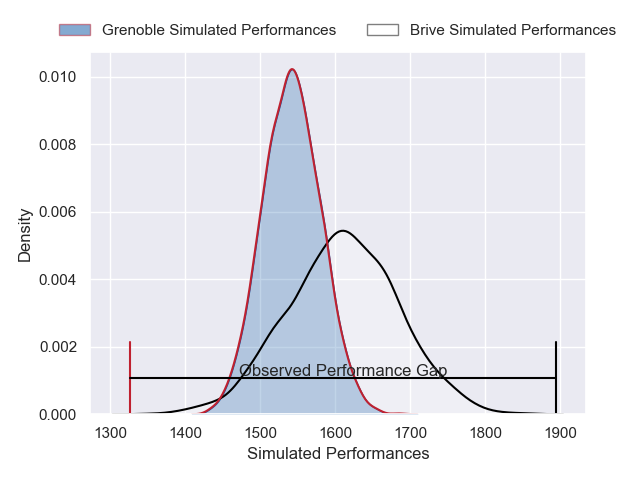
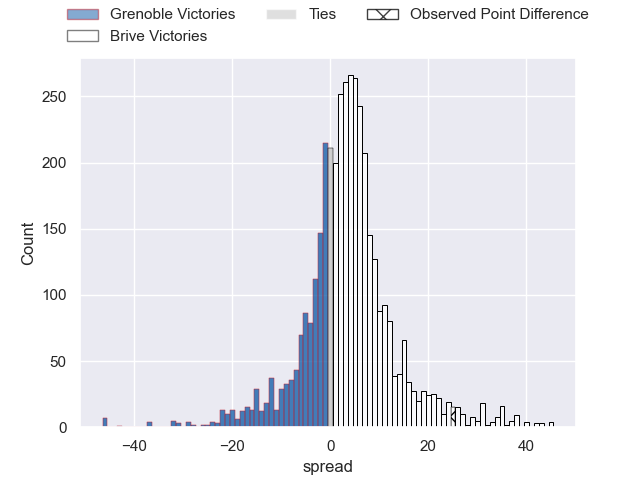
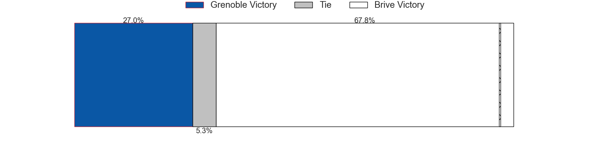
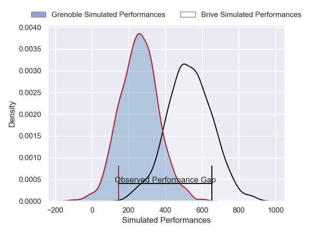
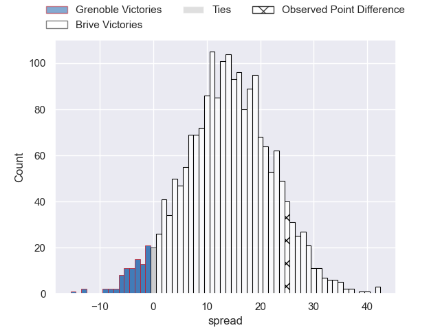
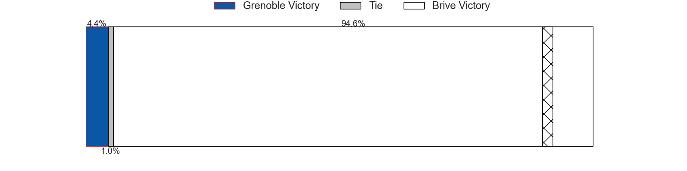

---  
layout: page  
title: Grenoble at Brive; 13-38  
date: 2025-05-09 18:00:00 -0500  
categories: "Pro D2 24/25" match review  
---
# Grenoble at Brive; 13-38

# Club Level Predictions

The first set of predictions treats a club as the smallest object, as the club develops its members, organizes a gameplan, and deploys its players as needed for each match. This club model has a prediction of 0.598, which translates to predicting Brive to win by 3.5.

Our Over/Under is 46.5 - and combined with the spread above, we have a predicted scoreline of 21 to 25

Each club has a rating and a rating deviation (similar to a Glicko rating), and expected performances can be generated. This allows for simulated matches and spreads like the ones below.
## Projected Performances - Club Model

## Projected Spreads - Club Model

## Projected Results - Club Model

# Player Level Predictions

Treating teams instead as an entity made up of the currently active players, I have ratings for each player in an altogether different system. These can be combined to form team ratings once teamsheets are announced, weighting starters a bit higher than the reserves. After the match is played, players can be weighted by their minutes on the field, allowing for an accurate measure of the team's composition. With these compiled team ratings, we can make predictions, measure inaccuracy, and update the individual player ratings.
## Prediction without Player Minutes: Brive by 14.4

Brive by 1.4 on a neutral pitch

## Projected Performances - Player Model

## Projected Spreads - Player Model

## Projected Results - Player Model

|   Away Minutes | Away Player        |   Away Percentile |   Number |   Home Percentile | Home Player               |   Home Minutes |
|---------------:|:-------------------|------------------:|---------:|------------------:|:--------------------------|---------------:|
|           80   | Eli Eglaine        |             50.84 |        1 |             66.8  | Nathan Fraissenon         |           32   |
|           29   | Bastien Soury      |             66.26 |        2 |             56.77 | Benjamin Boudou           |           64   |
|           30.5 | Giorgi Pertaia     |             85.71 |        3 |             84.28 | Francisco Coria Marchetti |           62   |
|           40   | Thomas Lainault    |             29.84 |        4 |             93.11 | Asier Usarraga            |           80   |
|           36.5 | Giorgi Javakhia    |             81.21 |        5 |             10.95 | Konstantin Mikautadze     |           80   |
|           80   | Antonin Berruyer   |             82.01 |        6 |             77.56 | Samuel Maximin            |           80   |
|           80   | Victor Guillaumond |             79.01 |        7 |             97.87 | Courtney Lawes            |           30   |
|           71   | Mathis Baret       |             27.22 |        8 |             41.14 | Taniela Sadrugu           |           19   |
|           80   | Eric Escande       |             91.3  |        9 |             73.39 | Mathis Ferté              |           80   |
|           66   | Max Clement        |             84.84 |       10 |             94.95 | Stuart Olding             |           80   |
|           75   | Kaminieli Rasaku   |             90.13 |       11 |             89.56 | Erwan Dridi               |           51   |
|            0   | Yan Lestrade       |             89.07 |       12 |             69.84 | Georges Shvelidze         |           80   |
|           25   | Julien Heriteau    |             74.49 |       13 |             98.28 | Matias Moroni             |           72   |
|           19   | Hugo Trouilloud    |             72.39 |       14 |             63.57 | Benjamin Lefranc          |           54   |
|           34   | Marc Palmier       |              8.39 |       15 |             73.79 | Thomas Laranjeira         |           36.5 |
|           16   | Zack Gauthier      |             89.47 |       16 |             90.99 | Curwin Bosch              |           30.5 |
|           51   | Julien Farnoux     |             98.11 |       17 |             24.26 | Simon-Pierre Chauvac      |           52   |
|           12   | Lilian Rossi       |             79.09 |       18 |             55.71 | Lucas da Silva            |           80   |
|           40   | Cody Thomas        |             50.44 |       19 |             12.13 | Marcel van der Merwe      |           80   |
|           51   | Kelian Boissier    |            nan    |       20 |             81.74 | Leo Carbonneau            |           12   |
|           22   | Jose Madeira       |             91.22 |       21 |             72.14 | Renger van Eerten         |           51   |
|            5   | Thibaut Martel     |             74.95 |       22 |             53.38 | Rahboni Warren-Vosayaco   |           80   |
|           26   | Romain Fusier      |             63.97 |       23 |             18.18 | Sasha Gue                 |           80   |

