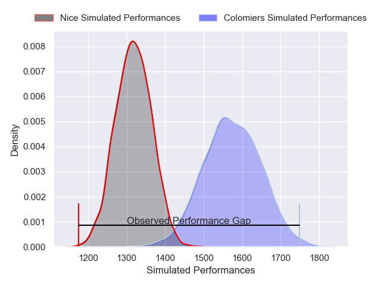
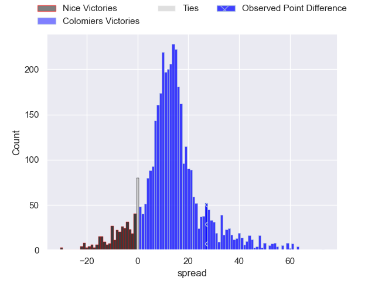
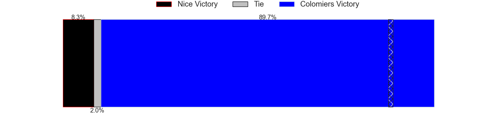
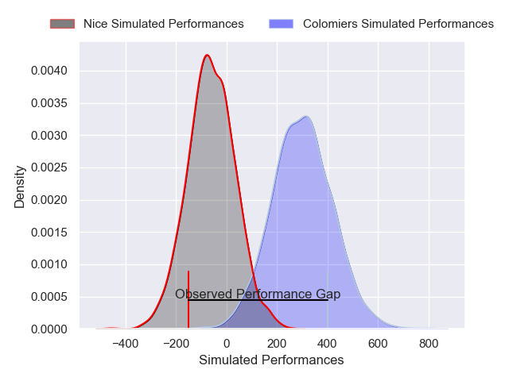
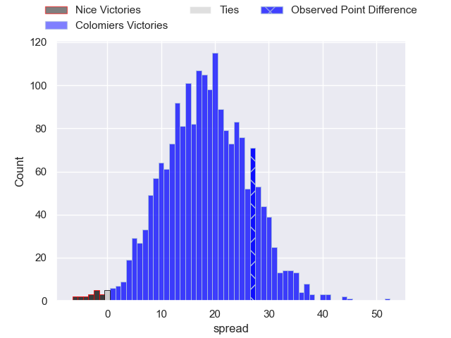
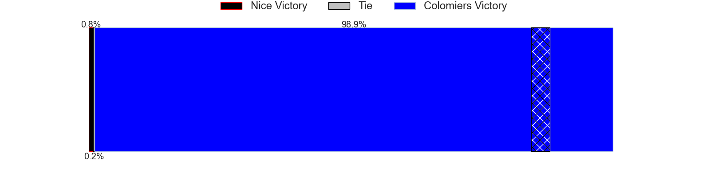

---  
layout: page  
title: Nice at Colomiers; 19-46  
date: 2025-05-09 18:00:00 -0500  
categories: "Pro D2 24/25" match review  
---
# Nice at Colomiers; 19-46

# Club Level Predictions

The first set of predictions treats a club as the smallest object, as the club develops its members, organizes a gameplan, and deploys its players as needed for each match. This club model has a prediction of 0.813, which translates to predicting Colomiers to win by 12.9.

Our Over/Under is 54.5 - and combined with the spread above, we have a predicted scoreline of 21 to 34

Each club has a rating and a rating deviation (similar to a Glicko rating), and expected performances can be generated. This allows for simulated matches and spreads like the ones below.
## Projected Performances - Club Model

## Projected Spreads - Club Model

## Projected Results - Club Model

# Player Level Predictions

Treating teams instead as an entity made up of the currently active players, I have ratings for each player in an altogether different system. These can be combined to form team ratings once teamsheets are announced, weighting starters a bit higher than the reserves. After the match is played, players can be weighted by their minutes on the field, allowing for an accurate measure of the team's composition. With these compiled team ratings, we can make predictions, measure inaccuracy, and update the individual player ratings.
## Prediction without Player Minutes: Colomiers by 19.2

Colomiers by 6.7 on a neutral pitch

## Projected Performances - Player Model

## Projected Spreads - Player Model

## Projected Results - Player Model

|   Away Minutes | Away Player           |   Away Percentile |   Number |   Home Percentile | Home Player        |   Home Minutes |
|---------------:|:----------------------|------------------:|---------:|------------------:|:-------------------|---------------:|
|             80 | Fabio Gonzalez        |             51.21 |        1 |             42.41 | Elias El Ansari    |             80 |
|             47 | Pierre Strippoli      |              5.46 |        2 |             82.22 | Pablo Dimcheff     |             80 |
|             58 | Tom Ross              |              3.88 |        3 |             66.24 | Michael Simutoga   |              5 |
|             45 | Thibault Rey          |              1.46 |        4 |             60.78 | Jean Thomas        |             27 |
|             32 | Clément Chartier      |              4.29 |        5 |             58.83 | Maxime Granouillet |             58 |
|             55 | Hugo Sarrasin         |              4.98 |        6 |             47.41 | Anthony Coletta    |             23 |
|              0 | Louis Suaud           |             86.3  |        7 |             74.43 | Aldric Lescure     |             34 |
|             30 | Kylian Laurans        |             12.1  |        8 |             52.02 | Caleb Timu         |             80 |
|             22 | Jules Solinas         |              6.83 |        9 |             48.2  | Sadek Deghmache    |             56 |
|             12 | Mathis Viard          |             66.81 |       10 |              0.21 | Brett Herron       |             65 |
|             24 | Alexis Bouton         |             38.23 |       11 |             59.34 | Anzelo Tuitavuki   |             58 |
|              2 | Luca Cutayar          |             34.58 |       12 |             63.4  | Ray Nu'u           |             64 |
|             30 | Nathan Courtade       |             14.05 |       13 |             10.82 | Martin Dulon       |             77 |
|             18 | Benjamin Dutard       |             42.7  |       14 |             85.31 | Vincent Pinto      |             30 |
|             59 | Paul Auradou          |              3.19 |       15 |              2.98 | Valentin Saurs     |             77 |
|             26 | Joris Sylvestre Simon |             21.46 |       16 |             91.28 | Guillaume Tartas   |             48 |
|             64 | Sacha Idoumi          |              6.51 |       17 |             65.59 | Hugo Pirlet        |             48 |
|             16 | Nicolas Ciancio       |             63.65 |       18 |             14.26 | Thomas Larrieu     |             57 |
|             25 | Tom Murday            |             98.34 |       19 |              5.27 | Jack Whetton       |             59 |
|             32 | Martin Freytes        |             20.78 |       20 |             27.6  | Jeremy Bechu       |             62 |
|             32 | Sunia Vola            |             70.76 |       21 |             76.15 | Gregoire Bazin     |             47 |
|              0 | Christa Powell        |              1.72 |       22 |            nan    | Natan Culinat      |             80 |
|             80 | Matéo Jeune Joly      |            nan    |       23 |            nan    | Eliott Arandiga    |             63 |

