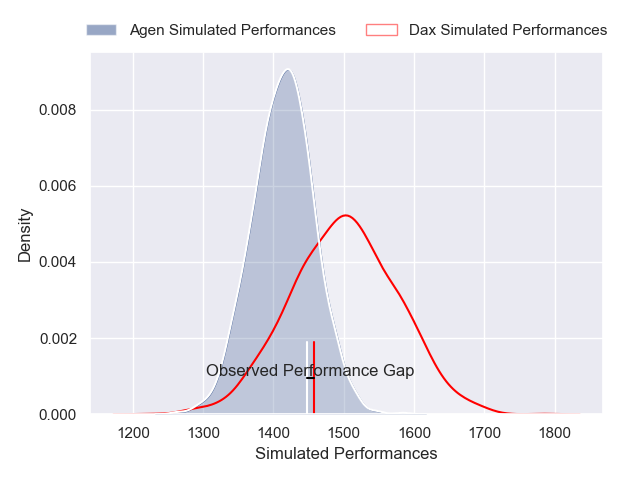
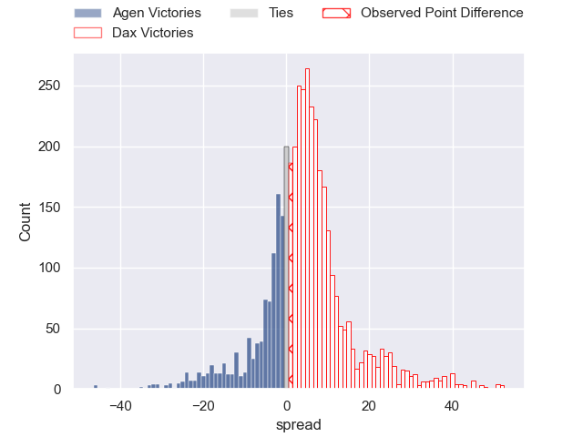
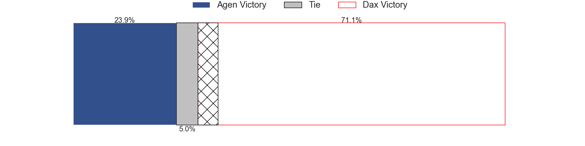
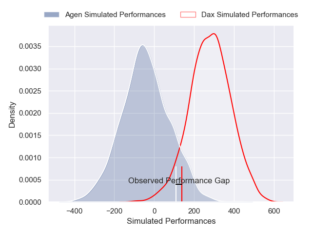
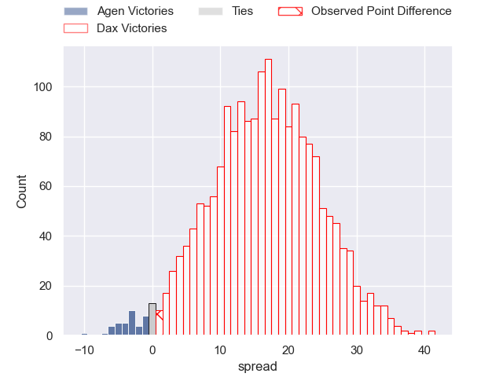
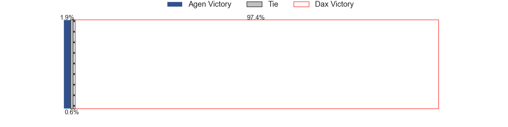

---  
layout: page  
title: Agen at Dax; 9-10  
date: 2025-05-09 18:00:00 -0500  
categories: "Pro D2 24/25" match review  
---
# Agen at Dax; 9-10

# Club Level Predictions

The first set of predictions treats a club as the smallest object, as the club develops its members, organizes a gameplan, and deploys its players as needed for each match. This club model has a prediction of 0.624, which translates to predicting Dax to win by 4.4.

Our Over/Under is 53.5 - and combined with the spread above, we have a predicted scoreline of 25 to 29

Each club has a rating and a rating deviation (similar to a Glicko rating), and expected performances can be generated. This allows for simulated matches and spreads like the ones below.
## Projected Performances - Club Model

## Projected Spreads - Club Model

## Projected Results - Club Model

# Player Level Predictions

Treating teams instead as an entity made up of the currently active players, I have ratings for each player in an altogether different system. These can be combined to form team ratings once teamsheets are announced, weighting starters a bit higher than the reserves. After the match is played, players can be weighted by their minutes on the field, allowing for an accurate measure of the team's composition. With these compiled team ratings, we can make predictions, measure inaccuracy, and update the individual player ratings.
## Prediction without Player Minutes: Dax by 12.3

Dax by 0.0 on a neutral pitch

## Projected Performances - Player Model

## Projected Spreads - Player Model

## Projected Results - Player Model

|   Away Minutes | Away Player                |   Away Percentile |   Number |   Home Percentile | Home Player          |   Home Minutes |
|---------------:|:---------------------------|------------------:|---------:|------------------:|:---------------------|---------------:|
|             67 | Florent Guion              |             12.29 |        1 |             21.71 | Raphaël Laboille     |             47 |
|             54 | Hayam El Bibouji           |             73.99 |        2 |             20.39 | Louis Barrere        |             60 |
|             64 | Alex Burin                 |             33.44 |        3 |             14.21 | David Lolohea        |             54 |
|             80 | Evan Olmstead              |              4.44 |        4 |             27.48 | Brice Ferrer         |             54 |
|             62 | William Demotte            |             80.36 |        5 |              5.29 | Jean-Baptiste Singer |             25 |
|             30 | Julien Lebian              |              8.32 |        6 |             40.43 | Arnaud Aletti        |             22 |
|             80 | Valentin Gayraud           |             35.4  |        7 |             59.77 | Paul Arnaud Ausset   |             34 |
|             40 | Matthieu Bonnet            |             48.73 |        8 |             42.19 | Ratu Nacika          |             80 |
|             68 | Dorian Bellot              |             74.96 |        9 |             24.52 | Sylvère Reteau       |             80 |
|             40 | Emile Dayral               |             13.05 |       10 |             48.21 | Hugo Cerisier        |             80 |
|             17 | Iban Etcheverry            |             17.93 |       11 |              3.42 | Maxime Oltmann       |             80 |
|             26 | Kolinio Ramoka             |             68.22 |       12 |              1.82 | Jale Vatubua         |             22 |
|             26 | Theo Belan                 |             74.19 |       13 |             25.4  | Bastien Daguerre     |             12 |
|             73 | Dylan Noudofinin Cazemajou |             62.9  |       14 |             24.67 | Viliame Tutuvili     |             50 |
|             80 | Loris Tolot                |              1.26 |       15 |             35.64 | Théo Duprat          |             18 |
|             25 | Ethan Randle               |             32.09 |       16 |             84.7  | Paul Ravier          |             40 |
|             51 | Luca Tabarot               |             61.85 |       17 |             48.86 | Iban Hiriart-Urruty  |             55 |
|              8 | Mamuka Mstoiani            |             34.64 |       18 |             73.98 | Louis Mary           |             49 |
|              4 | Santiago Socino            |             91.39 |       19 |             23.46 | Diogo Hasse Ferreira |             80 |
|             40 | Mathieu de Giovanni        |             56.75 |       20 |             20.45 | Benjamin Puntous     |             49 |
|             80 | Fotu Lokotui               |              4.64 |       21 |            nan    | Mattieu Bidau        |              0 |
|             76 | Theo Idjellidaine          |             26.26 |       22 |             17.89 | Théo Tremeau         |             50 |
|             20 | Franck Pourteau            |             86.95 |       23 |            nan    | Alexandre Pilati     |             20 |

