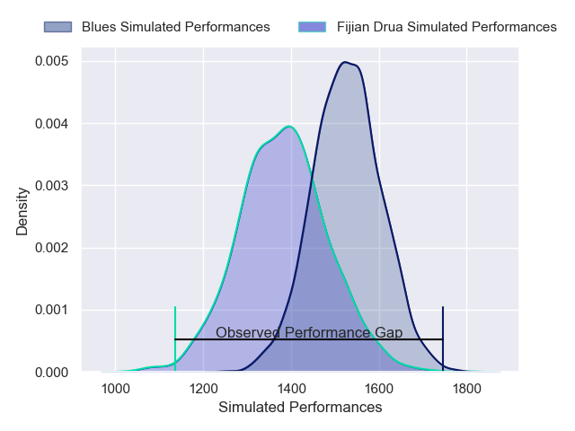
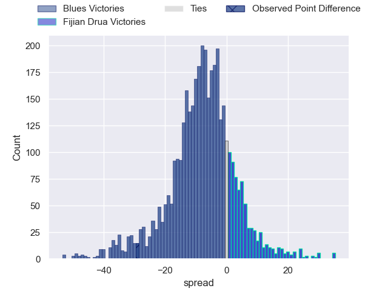
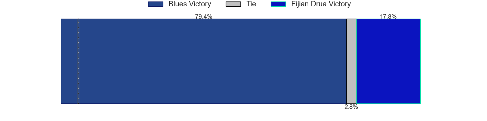
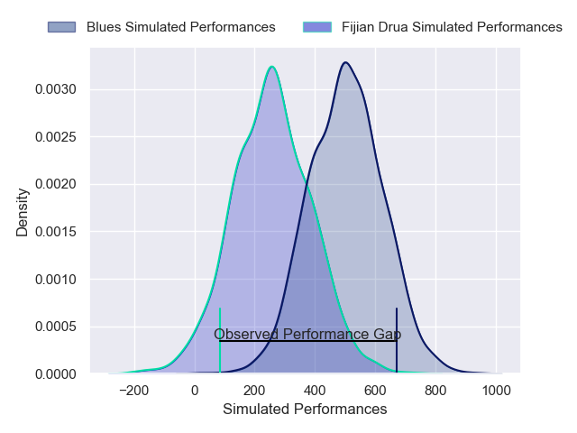
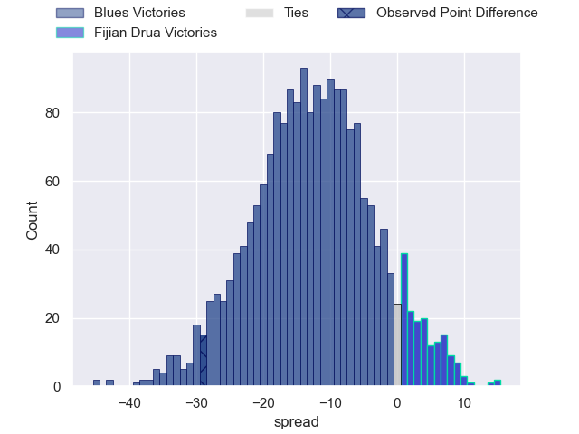
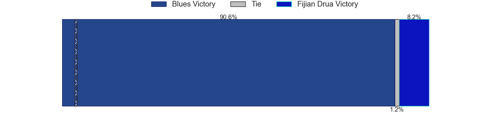

---  
layout: page  
title: Blues at Fijian Drua; 34-5  
date: 2025-05-09 18:00:00 -0500  
categories: "Super Rugby Pacific 2025" match review  
---
# Blues at Fijian Drua; 34-5

# Club Level Predictions

The first set of predictions treats a club as the smallest object, as the club develops its members, organizes a gameplan, and deploys its players as needed for each match. This club model has a prediction of 0.311, which translates to predicting Blues to win by 7.1.

Our Over/Under is 64.5 - and combined with the spread above, we have a predicted scoreline of 36 to 29

Each club has a rating and a rating deviation (similar to a Glicko rating), and expected performances can be generated. This allows for simulated matches and spreads like the ones below.
## Projected Performances - Club Model

## Projected Spreads - Club Model

## Projected Results - Club Model

# Player Level Predictions

Treating teams instead as an entity made up of the currently active players, I have ratings for each player in an altogether different system. These can be combined to form team ratings once teamsheets are announced, weighting starters a bit higher than the reserves. After the match is played, players can be weighted by their minutes on the field, allowing for an accurate measure of the team's composition. With these compiled team ratings, we can make predictions, measure inaccuracy, and update the individual player ratings.
## Prediction without Player Minutes: Blues by 14.6

Blues by 17.6 on a neutral pitch

## Projected Performances - Player Model

## Projected Spreads - Player Model

## Projected Results - Player Model

|   Away Minutes | Away Player        |   Away Percentile |   Number |   Home Percentile | Home Player             |   Home Minutes |
|---------------:|:-------------------|------------------:|---------:|------------------:|:------------------------|---------------:|
|           80   | Josh Fusitu'a      |             84.76 |        1 |             83.16 | Haereiti Hetet          |           80   |
|           80   | Ricky Riccitelli   |             88.75 |        2 |             47.8  | Zuriel Togiatama        |           63   |
|           80   | Marcel Renata      |             92.66 |        3 |             20.19 | Mesake Doge             |           71   |
|           58   | Patrick Tuipulotu  |             96.03 |        4 |             72.33 | Mesake Vocevoce         |           39   |
|           33.5 | Patrick Tuipulotu  |             96.03 |        4 |             72.33 | Mesake Vocevoce         |           39   |
|           30   | Laghlan McWhannell |             96.51 |        5 |             55.9  | Isoa Nasilasila         |           16   |
|           80   | Anton Segner       |             83.08 |        6 |             60.15 | Joseva Tamani           |           61   |
|           63   | Dalton Papalii     |             98.94 |        7 |             28.34 | Isoa Tuwai              |           57   |
|           41   | Hoskins Sotutu     |             97.05 |        8 |             14.98 | Kitione Salawa          |           33.5 |
|           15.5 | Taufa Funaki       |             33.22 |        9 |             33.74 | Simione Kuruvoli        |           71   |
|           65   | Beauden Barrett    |             99.58 |       10 |             24.63 | Kemu Valetini           |           73   |
|           61   | AJ Lam             |             92.03 |       11 |             19.07 | Taniela Rakuro          |           51   |
|           72   | Xavi Taele         |             63.77 |       12 |             77.13 | Inia Tabuavou           |           11   |
|           80   | Rieko Ioane        |             88.77 |       13 |             69.53 | Vuate Karawalevu        |            6.5 |
|           53   | Cole Forbes        |             91.56 |       14 |             35.48 | Ponipate Loganimasi     |           51   |
|           49   | Corey Evans        |             55.77 |       15 |             91.82 | Selestino Ravutaumada   |           51   |
|           15.5 | Kurt Eklund        |             90.69 |       16 |             92.62 | Tevita Ikanivere        |           57   |
|           15   | Mason Tupaea       |            nan    |       17 |             74.78 | Peni Ravai Kovekalou    |           30   |
|           27   | Angus Ta'avao      |             94.89 |       18 |             27.21 | Samu Tawake             |           17   |
|            8   | Josh Beehre        |             79.51 |       19 |            nan    | Sailosi Vukalokalo      |            0   |
|           80   | Adrian Choat       |             65.96 |       20 |             64.77 | Elia Canakaivata        |           64   |
|           19   | Finlay Christie    |             86.26 |       21 |             35.13 | Philip Baselala         |           23   |
|           17   | Harry Plummer      |             95.37 |       22 |              6.5  | Isaiah Armstrong-Ravula |           80   |
|           17   | Harry Plummer      |             95.37 |       22 |              6.5  | Isaiah Armstrong-Ravula |           61   |
|           17   | Harry Plummer      |             95.37 |       22 |              6.5  | Isaiah Armstrong-Ravula |           54   |
|            6.5 | Zarn Sullivan      |             83.65 |       23 |              9.26 | Isikeli Rabitu          |           11   |

