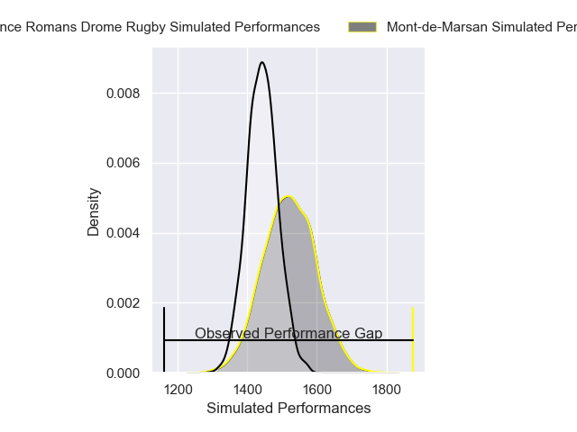
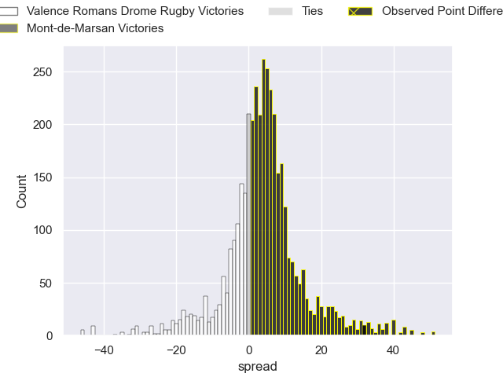
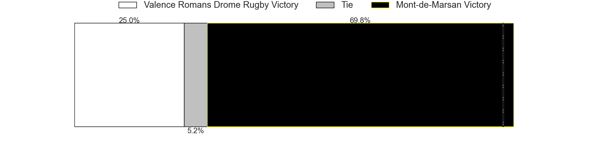
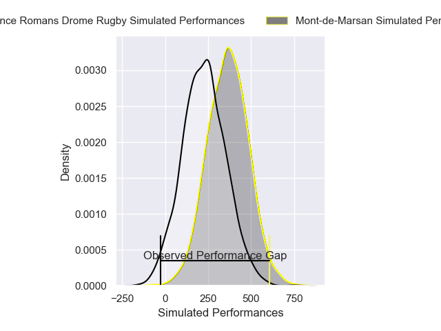
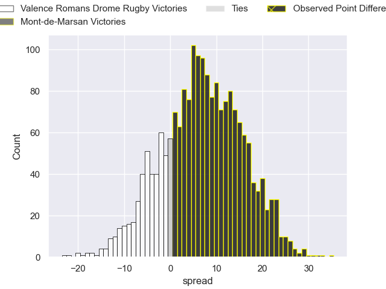

---  
layout: page  
title: Valence Romans Drome Rugby at Mont-de-Marsan; 20-52  
date: 2025-05-09 18:00:00 -0500  
categories: "Pro D2 24/25" match review  
---
# Valence Romans Drome Rugby at Mont-de-Marsan; 20-52

# Club Level Predictions

The first set of predictions treats a club as the smallest object, as the club develops its members, organizes a gameplan, and deploys its players as needed for each match. This club model has a prediction of 0.611, which translates to predicting Mont-de-Marsan to win by 4.0.

Our Over/Under is 39.5 - and combined with the spread above, we have a predicted scoreline of 18 to 22

Each club has a rating and a rating deviation (similar to a Glicko rating), and expected performances can be generated. This allows for simulated matches and spreads like the ones below.
## Projected Performances - Club Model

## Projected Spreads - Club Model

## Projected Results - Club Model

# Player Level Predictions

Treating teams instead as an entity made up of the currently active players, I have ratings for each player in an altogether different system. These can be combined to form team ratings once teamsheets are announced, weighting starters a bit higher than the reserves. After the match is played, players can be weighted by their minutes on the field, allowing for an accurate measure of the team's composition. With these compiled team ratings, we can make predictions, measure inaccuracy, and update the individual player ratings.
## Prediction without Player Minutes: Mont-de-Marsan by 7.9

Valence Romans Drome Rugby by 5.0 on a neutral pitch

## Projected Performances - Player Model

## Projected Spreads - Player Model

## Projected Results - Player Model

|   Away Minutes | Away Player          |   Away Percentile |   Number |   Home Percentile | Home Player           |   Home Minutes |
|---------------:|:---------------------|------------------:|---------:|------------------:|:----------------------|---------------:|
|             80 | Julien Royer         |             14.7  |        1 |             55.17 | Luka Goginava         |             80 |
|             48 | Brice Humbert        |             74.65 |        2 |             48.06 | Samuel Lagrange       |             80 |
|             19 | Vincent Vial         |             65.91 |        3 |             85.22 | Mattéo Lalanne        |             80 |
|             69 | Éloi Massot          |              8.29 |        4 |             76.1  | Romain Durand         |             80 |
|             11 | Yassine Maamry       |             68.59 |        5 |             14.63 | Aston Fortuin         |             61 |
|             80 | Axel Bruchet         |             27.49 |        6 |             12.16 | Waël Ponpon           |             80 |
|             80 | Loan Real            |             53.83 |        7 |             45.11 | Nicolas Garrault      |             79 |
|             80 | Sven Bernat Girlando |             83.23 |        8 |             92.57 | Ioane Iashagashvili   |             22 |
|             54 | Mattéo Rodor         |             12.59 |        9 |             35.61 | Christophe Loustalot  |              0 |
|             80 | Lucas Meret          |             50.32 |       10 |             90.91 | Willie du Plessis     |             62 |
|             12 | Adam Vargas          |             96.79 |       11 |             93.29 | Pierre Sayerse        |             49 |
|             80 | Louis Marrou         |             80.99 |       12 |             88.68 | Nacani Wakaya         |             62 |
|             58 | Anatole Pauvert      |             82.71 |       13 |             69.77 | Gatien Masse          |             49 |
|             80 | George Worth         |             35.7  |       14 |             11.19 | Simao Bento           |             27 |
|             49 | Joris De Moura       |             85.53 |       15 |             19.36 | Yoann Laousse Azpiazu |             27 |
|             66 | Charles Bouldoire    |             85.11 |       16 |             65.12 | Patricio Fernandez    |             69 |
|             69 | Philippe Laville     |             21.44 |       17 |             47.89 | Florian Dufour        |             39 |
|             64 | Otar Giorgadze       |            nan    |       18 |             13.57 | Anthony Alves         |             64 |
|             26 | Andrea Pontanier     |             83.6  |       19 |              7.71 | Myles Edwards         |             80 |
|             26 | Gareth Milasinovich  |             21.57 |       20 |             27.18 | Aurélien Lafforgue    |             54 |
|              3 | Tim Menzel           |             89.03 |       21 |             39.9  | Thomas Bultel         |             16 |
|             33 | Nathan Huguen        |             56.2  |       22 |             18.72 | Théo Cortes           |             46 |
|             44 | Dorian Marco Pena    |             86.44 |       23 |             53.6  | Nicolas Darquier      |             53 |

