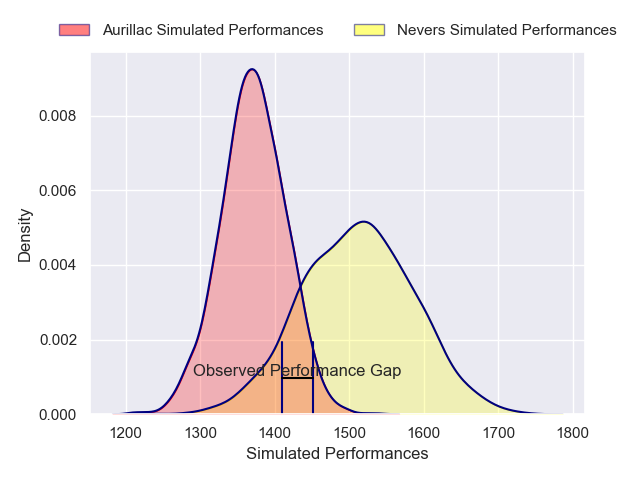
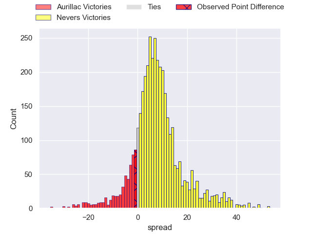
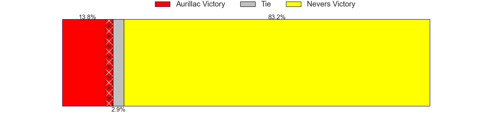
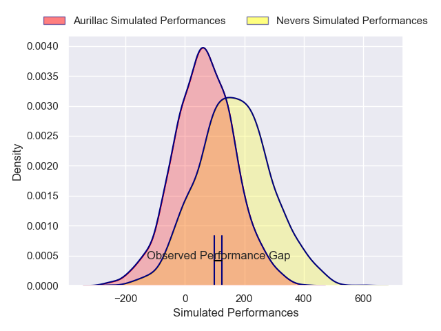
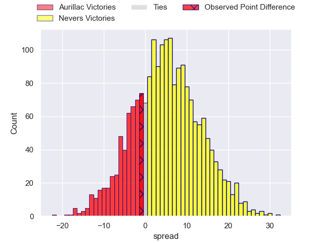
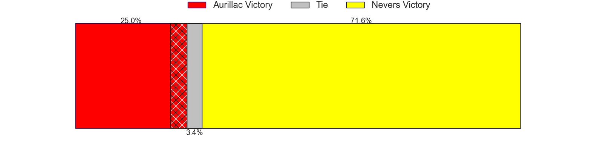

---  
layout: page  
title: Aurillac at Nevers; 21-20  
date: 2025-05-09 18:00:00 -0500  
categories: "Pro D2 24/25" match review  
---
# Aurillac at Nevers; 21-20

# Club Level Predictions

The first set of predictions treats a club as the smallest object, as the club develops its members, organizes a gameplan, and deploys its players as needed for each match. This club model has a prediction of 0.688, which translates to predicting Nevers to win by 6.9.

Our Over/Under is 64.5 - and combined with the spread above, we have a predicted scoreline of 29 to 36

Each club has a rating and a rating deviation (similar to a Glicko rating), and expected performances can be generated. This allows for simulated matches and spreads like the ones below.
## Projected Performances - Club Model

## Projected Spreads - Club Model

## Projected Results - Club Model

# Player Level Predictions

Treating teams instead as an entity made up of the currently active players, I have ratings for each player in an altogether different system. These can be combined to form team ratings once teamsheets are announced, weighting starters a bit higher than the reserves. After the match is played, players can be weighted by their minutes on the field, allowing for an accurate measure of the team's composition. With these compiled team ratings, we can make predictions, measure inaccuracy, and update the individual player ratings.
## Prediction without Player Minutes: Nevers by 4.6

Aurillac by 0.5 on a neutral pitch

## Projected Performances - Player Model

## Projected Spreads - Player Model

## Projected Results - Player Model

|   Away Minutes | Away Player           |   Away Percentile |   Number |   Home Percentile | Home Player                |   Home Minutes |
|---------------:|:----------------------|------------------:|---------:|------------------:|:---------------------------|---------------:|
|             80 | Robert Rodgers        |             29.44 |        1 |             16.52 | Lasha Pkhakadze            |             80 |
|             17 | Ronan Loughnane       |             25.13 |        2 |             20.71 | Jean-Maxence Jules-Rosette |             14 |
|             32 | Giorgi Kartvelishvili |             30.91 |        3 |             18.97 | Hugo Ndiaye                |             47 |
|             25 | Louis Bruinsma        |             20.67 |        4 |             46.51 | Ugo Vignolles              |             57 |
|             65 | Martial Rolland       |             51.87 |        5 |             33.68 | Chris Gabriel              |             80 |
|             80 | Tim De Jong           |             70.75 |        6 |             44.73 | Luka Plataret              |             80 |
|             20 | Lucas Oudard          |             54.8  |        7 |             88.6  | Hugues Bastide             |             49 |
|             40 | Didier Tison          |             10.22 |        8 |             33.74 | Steven David               |             80 |
|             20 | Mikheil Alania        |             39.22 |        9 |              3.18 | Hugo Bouyssou              |             73 |
|             80 | Ugo Seunes            |             40.38 |       10 |             13.81 | Shaun Reynolds             |             35 |
|             20 | Axel Bevia            |             68.42 |       11 |             11.2  | Arthur Mathiron            |             35 |
|             15 | Ofa Manuofetoa        |             67.49 |       12 |             27.28 | Noa Pommelet               |             40 |
|             49 | Karl Martin           |             29.13 |       13 |             38.36 | Alivereti Loaloa           |             24 |
|             80 | Juun Pieters          |             78.56 |       14 |             18.85 | Dylan Jaminet              |             30 |
|             67 | Jake Strachan         |             21.78 |       15 |             35.94 | Perry Mayo                 |             21 |
|              8 | Luka Nioradze         |              8.66 |       16 |             27.18 | George Smith               |             55 |
|              0 | Abongile Nonkontwana  |              0.96 |       17 |             76.26 | Julien Kazubek             |             80 |
|             34 | Mehdi Slamani         |             39.9  |       18 |             48.05 | Efi Ma'afu                 |             20 |
|             30 | Gymael Jean-Jacques   |             29.35 |       19 |             65.82 | Aselo Ikahehegi            |             80 |
|             30 | Hugo Bastard          |             68.31 |       20 |             66.15 | Luka Ungiadze              |             80 |
|             80 | Hugo Huurman          |             70.18 |       21 |             27.18 | Paula Walisolio            |             70 |
|             13 | Léopold Dupas         |             74.56 |       22 |             12.76 | Tom Deleuze                |             80 |
|            nan | nan                   |            nan    |       23 |             15.72 | Simon Tarel                |             80 |

