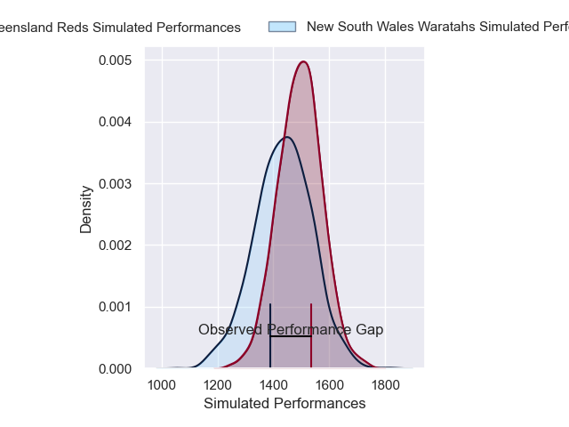
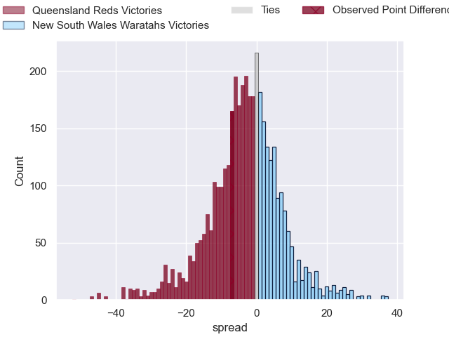
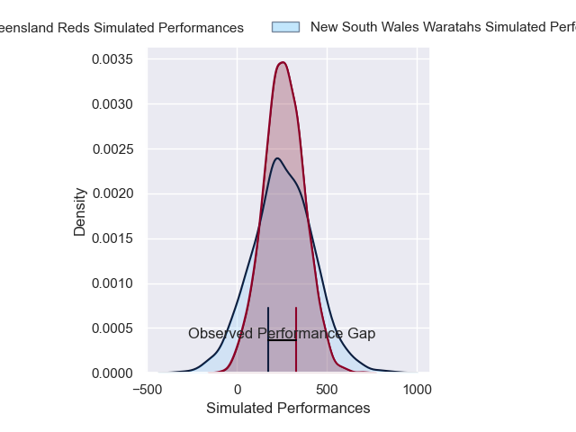
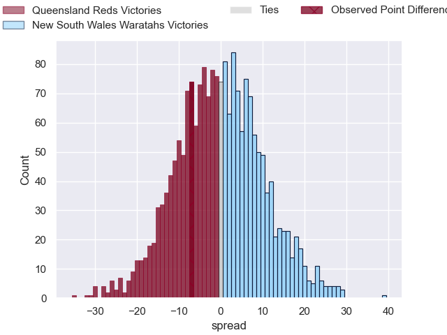

---  
layout: page  
title: Queensland Reds at New South Wales Waratahs; 28-21  
date: 2025-05-09 18:00:00 -0500  
categories: "Super Rugby Pacific 2025" match review  
---
# Queensland Reds at New South Wales Waratahs; 28-21

# Club Level Predictions

The first set of predictions treats a club as the smallest object, as the club develops its members, organizes a gameplan, and deploys its players as needed for each match. This club model has a prediction of 0.413, which translates to predicting Queensland Reds to win by 3.2.

Our Over/Under is 58.5 - and combined with the spread above, we have a predicted scoreline of 31 to 28

Each club has a rating and a rating deviation (similar to a Glicko rating), and expected performances can be generated. This allows for simulated matches and spreads like the ones below.
## Projected Performances - Club Model

## Projected Spreads - Club Model

## Projected Results - Club Model

# Player Level Predictions

Treating teams instead as an entity made up of the currently active players, I have ratings for each player in an altogether different system. These can be combined to form team ratings once teamsheets are announced, weighting starters a bit higher than the reserves. After the match is played, players can be weighted by their minutes on the field, allowing for an accurate measure of the team's composition. With these compiled team ratings, we can make predictions, measure inaccuracy, and update the individual player ratings.
## Prediction without Player Minutes: New South Wales Waratahs by 0.4

Queensland Reds by 6.8 on a neutral pitch

## Projected Performances - Player Model

## Projected Spreads - Player Model

## Projected Results - Player Model

|   Away Minutes | Away Player               |   Away Percentile |   Number |   Home Percentile | Home Player           |   Home Minutes |
|---------------:|:--------------------------|------------------:|---------:|------------------:|:----------------------|---------------:|
|             48 | Sef Fa'agase              |             72.87 |        1 |             86.11 | Angus Bell            |             55 |
|             48 | Sef Fa'agase              |             72.87 |        1 |             86.11 | Angus Bell            |             80 |
|             48 | Sef Fa'agase              |             72.87 |        1 |             86.11 | Angus Bell            |             62 |
|             80 | Richie Asiata             |             90.51 |        2 |             81.9  | Dave Porecki          |             50 |
|             49 | Zane Nonggorr             |             83.24 |        3 |             49.32 | Daniel Botha          |             74 |
|             80 | Josh Canham               |             32.29 |        4 |              7.74 | Fergus Lee-Warner     |             58 |
|             80 | Josh Canham               |             32.29 |        4 |              7.74 | Fergus Lee-Warner     |             73 |
|             80 | Josh Canham               |             32.29 |        4 |              7.74 | Fergus Lee-Warner     |             80 |
|             80 | Josh Canham               |             32.29 |        4 |              7.74 | Fergus Lee-Warner     |             63 |
|              0 | Lukhan Salakaia-Loto      |              9.44 |        5 |              3.02 | Miles Amatosero       |             61 |
|             50 | Seru Uru                  |             59.09 |        6 |              3.38 | Rob Leota             |             28 |
|             26 | Fraser McReight           |             95.84 |        7 |             51.45 | Charlie Gamble        |             80 |
|             50 | John Bryant               |             72.57 |        8 |             64.98 | Langi Gleeson         |             19 |
|             53 | Tate McDermott            |             80.52 |        9 |             78.43 | Jake Gordon           |             24 |
|             51 | Tom Lynagh                |             85.47 |       10 |             13.89 | Tane Edmed            |             39 |
|             53 | Tim Ryan                  |             36.34 |       11 |             28.08 | Triston Reilly        |             40 |
|             32 | Dre Pakeho                |             48.89 |       12 |             65.28 | Joey Walton           |             30 |
|             56 | Filipo Daugunu            |             94.84 |       13 |             43.02 | Henry O'Donnell       |             40 |
|             19 | Lachie Anderson           |             58.16 |       14 |             43.36 | Andrew Kellaway       |             68 |
|             54 | Jock Campbell             |             75.68 |       15 |             39.83 | Joseph-Aukuso Suaalii |             26 |
|             66 | Josh Nasser               |             77.5  |       16 |            nan    | Mahe Vailanu          |             80 |
|             80 | Jeff Toomaga-Allen        |             93.93 |       17 |            nan    | Tom Lambert           |             26 |
|             80 | Massimo De Lutiis         |            nan    |       18 |             95.77 | Taniela Tupou         |             80 |
|             29 | Ryan Smith                |             59.02 |       19 |             98.87 | Ben Grant             |             18 |
|             39 | Angus Blyth               |             94.43 |       20 |             34.75 | Felix Kalapu          |             25 |
|             29 | Joe Brial                 |             51.05 |       21 |            nan    | Teddy Wilson          |              6 |
|             29 | Kalani Thomas             |            nan    |       22 |             33.47 | Jack Bowen            |             22 |
|             26 | Harry McLaughlin-Phillips |             70.74 |       23 |             53.32 | Darby Lancaster       |              0 |

