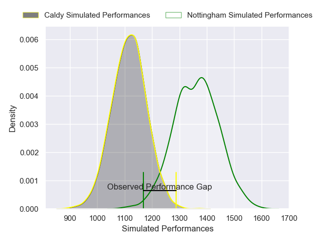
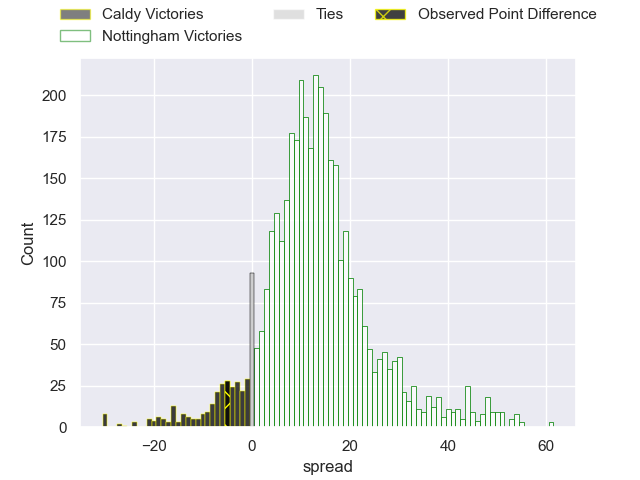
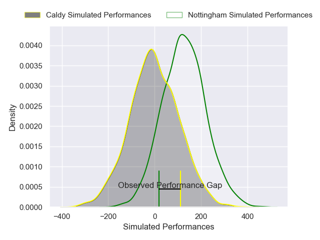
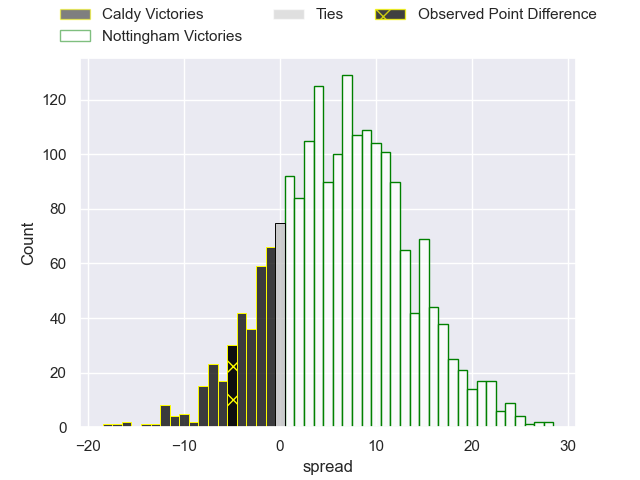
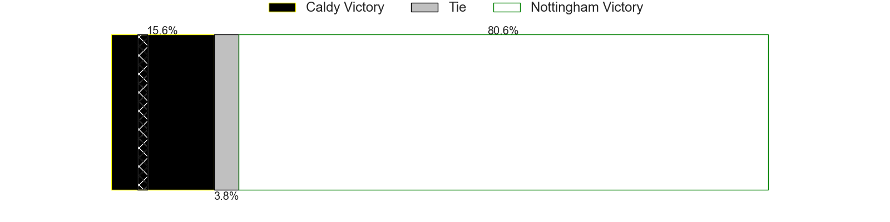

---  
layout: page  
title: Caldy at Nottingham; 34-29  
date: 2025-05-09 18:00:00 -0500  
categories: "RFU Championship 24/25" match review  
---
# Caldy at Nottingham; 34-29

# Club Level Predictions

The first set of predictions treats a club as the smallest object, as the club develops its members, organizes a gameplan, and deploys its players as needed for each match. This club model has a prediction of 0.803, which translates to predicting Nottingham to win by 12.5.

Our Over/Under is 65.5 - and combined with the spread above, we have a predicted scoreline of 27 to 39

Each club has a rating and a rating deviation (similar to a Glicko rating), and expected performances can be generated. This allows for simulated matches and spreads like the ones below.
## Projected Performances - Club Model

## Projected Spreads - Club Model

## Projected Results - Club Model

# Player Level Predictions

Treating teams instead as an entity made up of the currently active players, I have ratings for each player in an altogether different system. These can be combined to form team ratings once teamsheets are announced, weighting starters a bit higher than the reserves. After the match is played, players can be weighted by their minutes on the field, allowing for an accurate measure of the team's composition. With these compiled team ratings, we can make predictions, measure inaccuracy, and update the individual player ratings.
## Prediction without Player Minutes: Nottingham by 9.9

Nottingham by 5.1 on a neutral pitch

## Projected Performances - Player Model

## Projected Spreads - Player Model

## Projected Results - Player Model

|   Away Minutes | Away Player       |   Away Percentile |   Number |   Home Percentile | Home Player          |   Home Minutes |
|---------------:|:------------------|------------------:|---------:|------------------:|:---------------------|---------------:|
|             80 | Monty Weatherby   |             81.02 |        1 |             23.18 | Aniseko Sio          |              0 |
|             80 | Oliver Hearn      |              5.28 |        2 |             71.13 | Harry Clayton        |             67 |
|             80 | Joe Sproston      |              7.03 |        3 |             81.66 | Dan Richardson       |             80 |
|             80 | Freddie Stevenson |             36.39 |        4 |             88.59 | Finn Carnduff        |             34 |
|             70 | Thomas Sanders    |             37.27 |        5 |             36.68 | Tom Manz             |             26 |
|             80 | Jos Gilmore       |             62.64 |        6 |             29.98 | Jacob Wright         |              0 |
|             13 | Callum Ridgway    |              8.43 |        7 |             41.28 | Seb Kelly            |             21 |
|             26 | Josiah Dickinson  |             15.29 |        8 |             27.39 | James Cherry         |             25 |
|             54 | Ollie Wynn        |             29.14 |        9 |             24.64 | Josh Goodwin         |             48 |
|             80 | Lewis Barker      |             17.34 |       10 |              8.67 | Tom Threlfall        |             80 |
|              6 | William Robinson  |              3.7  |       11 |             35.12 | Ryan Olowofela       |             10 |
|             74 | Michael Barlow    |             25.78 |       12 |              7.28 | Gwyn Parks           |             80 |
|             33 | Connor Wilkinson  |             10.11 |       13 |             16.89 | Kegan Christian-Goss |             70 |
|             26 | Charlie Hyde      |             45.14 |       14 |              4.96 | David Williams       |             80 |
|             10 | Matt Kilcourse    |             15.74 |       15 |              0.43 | Jack Stapley         |             70 |

