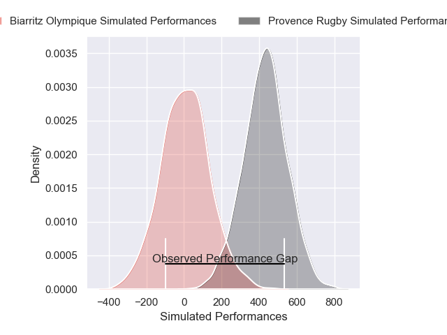
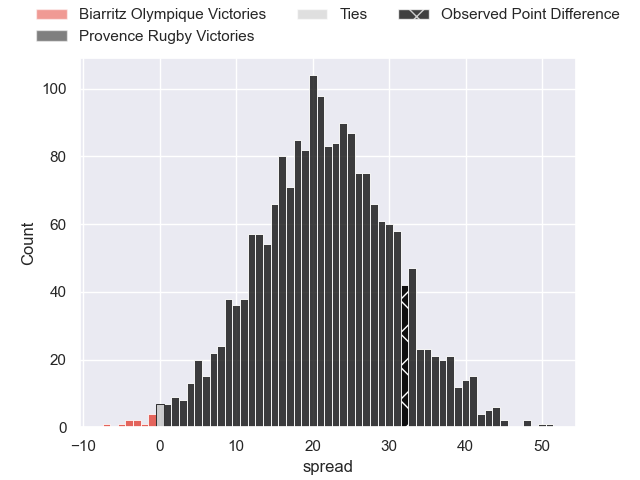
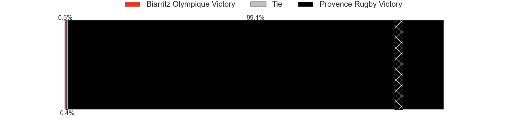

---  
layout: page  
title: Biarritz Olympique at Provence Rugby; 14-46  
date: 2025-05-09 18:00:00 -0500  
categories: "Pro D2 24/25" match review  
---
# Biarritz Olympique at Provence Rugby; 14-46

# Club Level Predictions

The first set of predictions treats a club as the smallest object, as the club develops its members, organizes a gameplan, and deploys its players as needed for each match. This club model has a prediction of 0.724, which translates to predicting Provence Rugby to win by 8.4.

Our Over/Under is 58.5 - and combined with the spread above, we have a predicted scoreline of 25 to 33

Each club has a rating and a rating deviation (similar to a Glicko rating), and expected performances can be generated. This allows for simulated matches and spreads like the ones below.
## Projected Performances - Club Model

## Projected Spreads - Club Model

## Projected Results - Club Model

# Player Level Predictions

Treating teams instead as an entity made up of the currently active players, I have ratings for each player in an altogether different system. These can be combined to form team ratings once teamsheets are announced, weighting starters a bit higher than the reserves. After the match is played, players can be weighted by their minutes on the field, allowing for an accurate measure of the team's composition. With these compiled team ratings, we can make predictions, measure inaccuracy, and update the individual player ratings.
## Prediction without Player Minutes: Provence Rugby by 24.8

Provence Rugby by 15.0 on a neutral pitch

## Projected Performances - Player Model

## Projected Spreads - Player Model

## Projected Results - Player Model

|   Away Minutes | Away Player       |   Away Percentile |   Number |   Home Percentile | Home Player           |   Home Minutes |
|---------------:|:------------------|------------------:|---------:|------------------:|:----------------------|---------------:|
|             15 | François Mur      |             21.39 |        1 |             58.34 | Federico Wegrzyn      |             80 |
|             54 | Yohan Beheregaray |              9.67 |        2 |             10.9  | Kapeli Pifeleti       |             80 |
|             46 | Solomone Tukuafu  |             41.82 |        3 |             98.64 | Tomas Francis         |             80 |
|             40 | Johnny Dyer       |              1.13 |        4 |              2.74 | Andres Zafra Tarazona |             55 |
|             80 | Eliande Sanderson |             15.39 |        5 |             82.72 | Izack Rodda           |             54 |
|             52 | Ekain Imaz Agirre |             15.38 |        6 |             83.27 | Guillaume Piazzoli    |             80 |
|             59 | Jessy Jegerlehner |              0.58 |        7 |             80.46 | Charly Gambini        |             26 |
|             80 | Filimo Taofifenua |             75.53 |        8 |             67.72 | Teimana Harrison      |             40 |
|             23 | Pierre Pages      |              7.65 |        9 |             20.7  | Arthur Coville        |             26 |
|             80 | Thomas Dolhagaray |             23.16 |       10 |             90.32 | Jimmy Gopperth        |             69 |
|             80 | Baptiste Fariscot |             64.8  |       11 |             91.18 | Nadir Bouhedjeur      |             60 |
|             21 | Carlo Mignot      |             64.17 |       12 |             83.7  | Kaveinga Finau        |             20 |
|             80 | Nathan Van de Ven |             30.47 |       13 |             99.39 | George North          |             31 |
|             40 | Nicolas Elissondo |             43.26 |       14 |             11.2  | Adrien Lapegue-Lafaye |             31 |
|             47 | Kylian Jaminet    |             84.91 |       15 |             79.87 | Jules Soulan          |             80 |
|             55 | Zakaria El Fakir  |              5.67 |       16 |             77.17 | Thomas Vernet         |             25 |
|             40 | Nodari Shengelia  |            nan    |       17 |             76.27 | Thomas Sauveterre     |              0 |
|             80 | Mathieu Acebes    |             91.46 |       18 |             37.19 | Eliott Yemsi          |             31 |
|             66 | Enzo Selponi      |             88.26 |       19 |             13.29 | Tornike Jalagonia     |             59 |
|             80 | Clement Martinez  |              7.56 |       20 |             41.09 | Mathias Colombet      |             40 |
|             80 | Aitor Hourcade    |              0.97 |       21 |            nan    | Paul Cellio Zwiler    |             80 |
|             14 | Piula Faasalele   |             40.79 |       22 |             83.76 | Yannick Youyoutte     |             28 |
|             28 | Anoa Laurent      |             22.43 |       23 |             84    | Joris Cazenave        |             80 |

