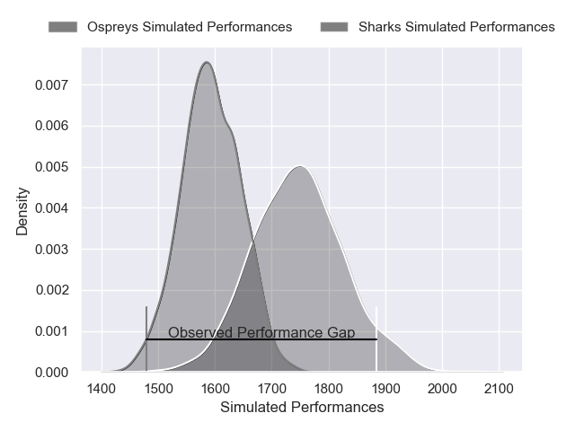
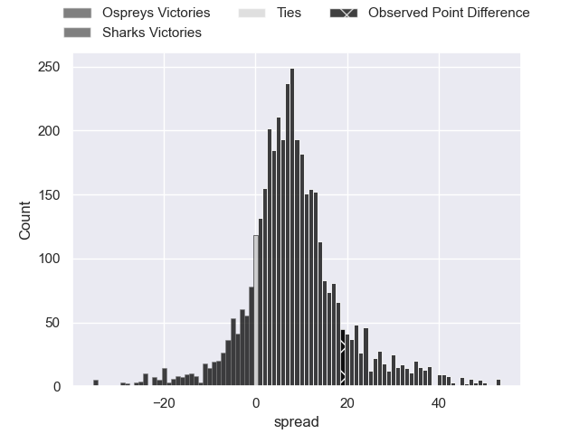
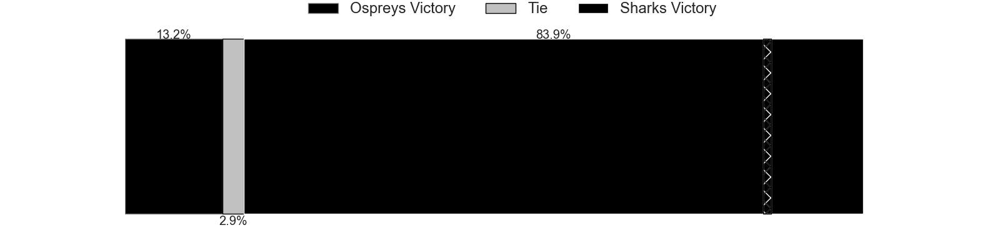
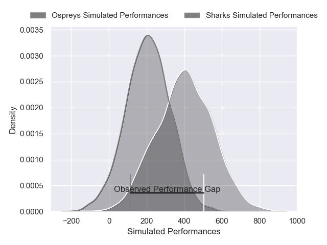
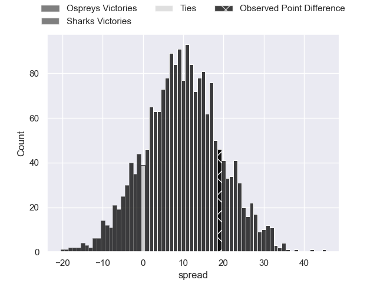
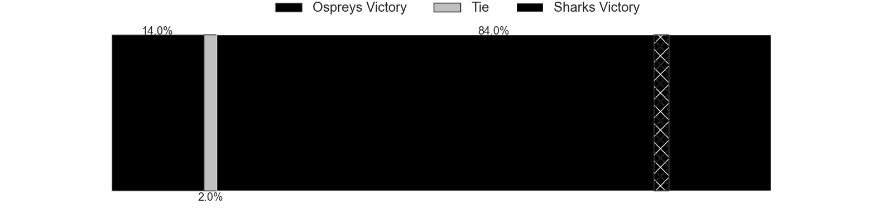

---  
layout: page  
title: Ospreys at Sharks; 10-29  
date: 2025-05-09 18:00:00 -0500  
categories: "United Rugby Championship 24/25" match review  
---
# Ospreys at Sharks; 10-29

# Club Level Predictions

The first set of predictions treats a club as the smallest object, as the club develops its members, organizes a gameplan, and deploys its players as needed for each match. This club model has a prediction of 0.704, which translates to predicting Sharks to win by 7.6.

Our Over/Under is 58.5 - and combined with the spread above, we have a predicted scoreline of 26 to 33

Each club has a rating and a rating deviation (similar to a Glicko rating), and expected performances can be generated. This allows for simulated matches and spreads like the ones below.
## Projected Performances - Club Model

## Projected Spreads - Club Model

## Projected Results - Club Model

# Player Level Predictions

Treating teams instead as an entity made up of the currently active players, I have ratings for each player in an altogether different system. These can be combined to form team ratings once teamsheets are announced, weighting starters a bit higher than the reserves. After the match is played, players can be weighted by their minutes on the field, allowing for an accurate measure of the team's composition. With these compiled team ratings, we can make predictions, measure inaccuracy, and update the individual player ratings.
## Prediction without Player Minutes: Sharks by 16.9

Sharks by 8.6 on a neutral pitch

## Projected Performances - Player Model

## Projected Spreads - Player Model

## Projected Results - Player Model

|   Away Minutes | Away Player            |   Away Percentile |   Number |   Home Percentile | Home Player       |   Home Minutes |
|---------------:|:-----------------------|------------------:|---------:|------------------:|:------------------|---------------:|
|             49 | Gareth Thomas          |             45.49 |        1 |             83.08 | Dian Bleuler      |             46 |
|             49 | Gareth Thomas          |             45.49 |        1 |             83.08 | Dian Bleuler      |             80 |
|             49 | Gareth Thomas          |             45.49 |        1 |             83.08 | Dian Bleuler      |             53 |
|             49 | Gareth Thomas          |             45.49 |        1 |             83.08 | Dian Bleuler      |             51 |
|             80 | Dewi Lake              |             34.09 |        2 |             98.24 | Bongi Mbonambi    |             29 |
|             23 | Tom Botha              |             65.84 |        3 |             54.83 | Vincent Koch      |             80 |
|             49 | Will Spencer           |             65.53 |        4 |             99.34 | Eben Etzebeth     |              0 |
|             23 | Adam Beard             |             91.03 |        5 |             70.25 | Jason Jenkins     |             30 |
|             80 | James Ratti            |             75.05 |        6 |             27.85 | James Venter      |             31 |
|             23 | Jac Morgan             |             92.65 |        7 |             91.59 | Vincent Tshituka  |             26 |
|             57 | Morgan Morse           |             21.31 |        8 |             78.48 | Siya Kolisi       |             15 |
|             64 | Kieran Hardy           |             41.57 |        9 |             89.91 | Jaden Hendrikse   |             80 |
|             73 | Dan Edwards            |             71.16 |       10 |             82.11 | Siya Masuku       |             80 |
|             80 | Keelan Giles           |             13.76 |       11 |             99.34 | Makazole Mapimpi  |             46 |
|             77 | Keiran Williams        |             86.54 |       12 |             99.09 | Andre Esterhuizen |             71 |
|             23 | Evardi Boshoff         |              8.2  |       13 |             80.87 | Jurenzo Julius    |             71 |
|             66 | Daniel Kasende         |             96.68 |       14 |             86.05 | Ethan Hooker      |             80 |
|              1 | Jack Walsh             |             73.38 |       15 |             89.52 | Aphelele Fassi    |             38 |
|             49 | Sam Parry              |            nan    |       16 |             83.13 | Fez Mbatha        |             16 |
|             57 | Steffan Thomas         |            nan    |       17 |             41.9  | Ntuthuko Mchunu   |             80 |
|              0 | Ben Warren             |             81.32 |       18 |            nan    | Hanro Jacobs      |              0 |
|             80 | William Griffiths      |            nan    |       19 |             66.54 | Emmanuel Tshituka |             22 |
|             80 | William Griffiths      |            nan    |       19 |             66.54 | Emmanuel Tshituka |             11 |
|             31 | Harri Deaves           |             91.68 |       20 |             66.15 | Phepsi Buthelezi  |             57 |
|              7 | Reuben Morgan-Williams |             91.48 |       21 |             66.26 | Bradley Davids    |             80 |
|             28 | Owen Williams          |             95.14 |       22 |             70.95 | Francois Venter   |             36 |
|             18 | Iestyn Hopkins         |            nan    |       23 |              7.4  | Yaw Penxe         |             51 |

