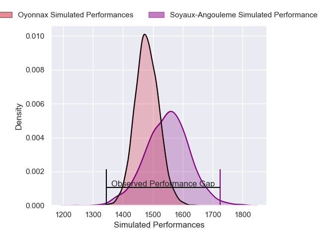
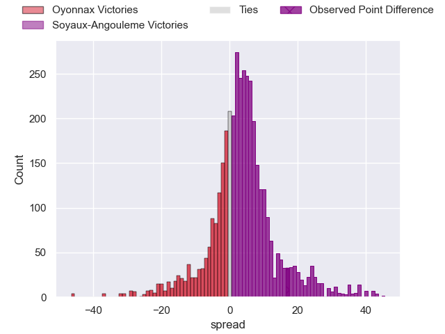
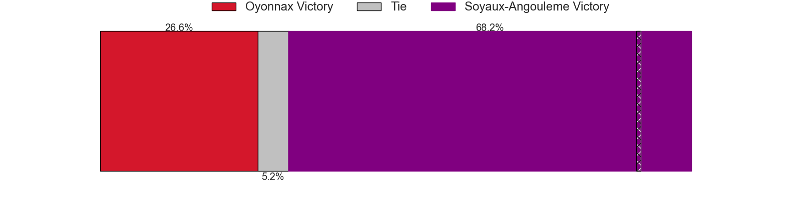
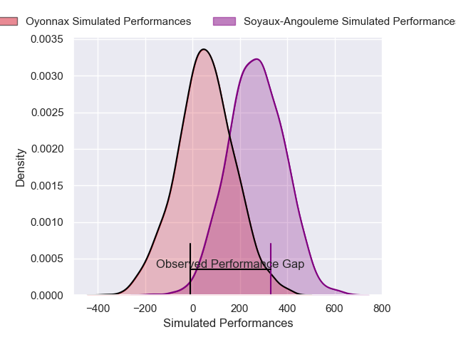
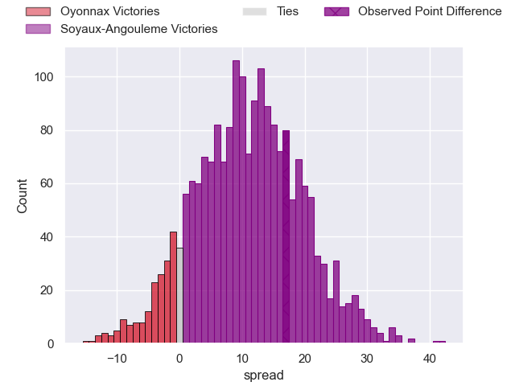
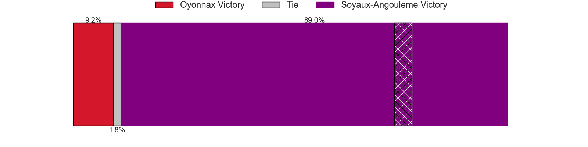

---  
layout: page  
title: Oyonnax at Soyaux-Angouleme; 27-44  
date: 2025-05-09 18:00:00 -0500  
categories: "Pro D2 24/25" match review  
---
# Oyonnax at Soyaux-Angouleme; 27-44

# Club Level Predictions

The first set of predictions treats a club as the smallest object, as the club develops its members, organizes a gameplan, and deploys its players as needed for each match. This club model has a prediction of 0.595, which translates to predicting Soyaux-Angouleme to win by 3.4.

Our Over/Under is 75.5 - and combined with the spread above, we have a predicted scoreline of 36 to 39

Each club has a rating and a rating deviation (similar to a Glicko rating), and expected performances can be generated. This allows for simulated matches and spreads like the ones below.
## Projected Performances - Club Model

## Projected Spreads - Club Model

## Projected Results - Club Model

# Player Level Predictions

Treating teams instead as an entity made up of the currently active players, I have ratings for each player in an altogether different system. These can be combined to form team ratings once teamsheets are announced, weighting starters a bit higher than the reserves. After the match is played, players can be weighted by their minutes on the field, allowing for an accurate measure of the team's composition. With these compiled team ratings, we can make predictions, measure inaccuracy, and update the individual player ratings.
## Prediction without Player Minutes: Soyaux-Angouleme by 12.5

Soyaux-Angouleme by 7.0 on a neutral pitch

## Projected Performances - Player Model

## Projected Spreads - Player Model

## Projected Results - Player Model

|   Away Minutes | Away Player        |   Away Percentile |   Number |   Home Percentile | Home Player        |   Home Minutes |
|---------------:|:-------------------|------------------:|---------:|------------------:|:-------------------|---------------:|
|             50 | Adrien Bordenave   |             10.47 |        1 |             98.28 | Sami Zouhair       |             80 |
|             66 | Peniami Narisia    |             89.81 |        2 |             14.77 | Mamoudou Meite     |              0 |
|             58 | Paulo Tafili       |             61.49 |        3 |             47.18 | Yassine Boutemane  |             80 |
|             80 | Manuel Leindekar   |              0.77 |        4 |             74.83 | Enzo Morand-Bruyat |             14 |
|             21 | Hugo Fabregue      |             17.61 |        5 |             92.82 | Sikeli Nabou       |             80 |
|             49 | Kevin Lebreton     |             24.31 |        6 |              5.13 | Gautier Gibouin    |             22 |
|             56 | Hugo Hermet        |             13.2  |        7 |             85.28 | Germain Burgaud    |             80 |
|             59 | Antoine Miquel     |             21.68 |        8 |             56.44 | Alexander Masibaka |             80 |
|             80 | Vasil Lobzhanidze  |              8.83 |        9 |             70.85 | Manu Saubusse      |             14 |
|             11 | Justin Bouraux     |              2.09 |       10 |             68.41 | Corentin Glenat    |             25 |
|             80 | Karim Qadiri       |             61.24 |       11 |             33.68 | Nathan Farissier   |             31 |
|             80 | Afusipa Taumoepeau |             42.56 |       12 |             62.97 | Mathis Lafon       |             14 |
|             21 | Zack Holmes        |             77.33 |       13 |              8.82 | Arthur Proult      |             73 |
|             66 | Gavin Stark        |              3.16 |       14 |              5.36 | Jonny May          |             68 |
|              0 | Darren Sweetnam    |             74    |       15 |             64.48 | Jules Dubecq       |             80 |
|             12 | Maxime Salles      |             60.67 |       16 |             12.05 | Motu Matu'u        |             80 |
|             24 | Jonathan Ruru      |             93.46 |       17 |             81.53 | Maxence Lemardelet |             41 |
|             21 | Ali Oz             |             16.43 |       18 |             23.71 | Seydou Diakité     |             56 |
|             12 | Loic Godener       |              4.7  |       19 |             64.84 | Paul Tailhades     |             47 |
|             80 | Antonin Corso      |             70.14 |       20 |             60.78 | Clément Sentubery  |             55 |
|             80 | Oli Kebble         |             95.75 |       21 |             94.15 | George Tilsley     |             60 |
|             24 | Benjamin Geledan   |             27.84 |       22 |             10.36 | Massimo Ortolan    |             14 |
|             80 | Kevin Kornath      |             24.88 |       23 |              6.36 | Adrien Bau         |             80 |

