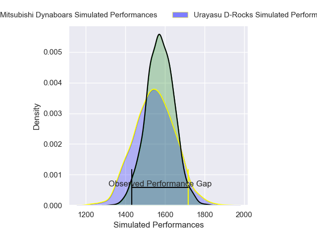
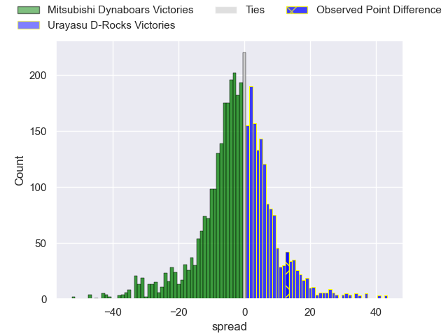
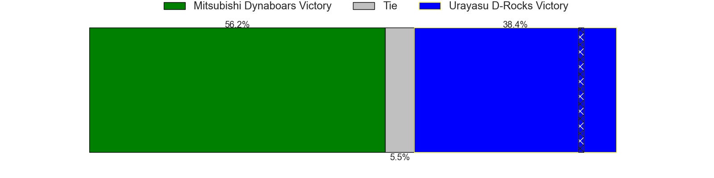
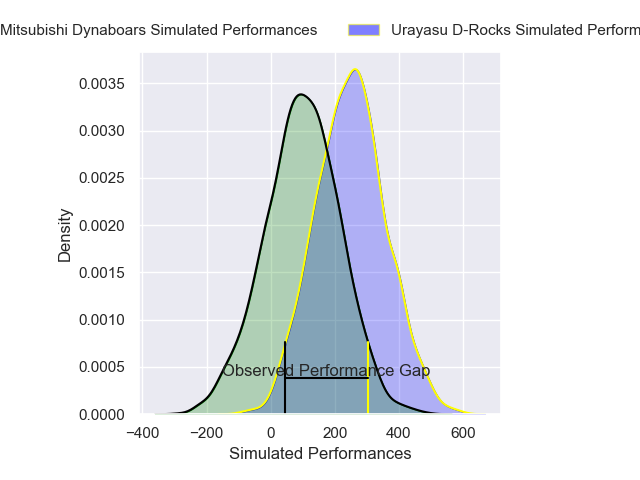
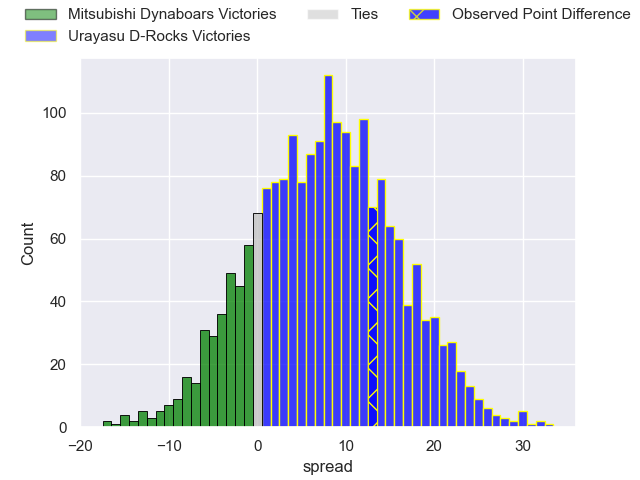
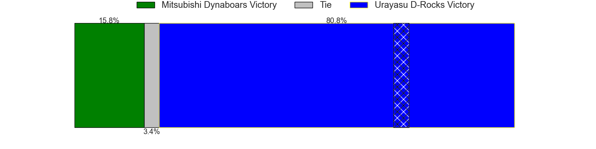

---  
layout: page  
title: Mitsubishi Dynaboars at Urayasu D-Rocks; 21-34  
date: 2025-05-09 18:00:00 -0500  
categories: "Japan Rugby League One 24/25" match review  
---
# Mitsubishi Dynaboars at Urayasu D-Rocks; 21-34

# Club Level Predictions

The first set of predictions treats a club as the smallest object, as the club develops its members, organizes a gameplan, and deploys its players as needed for each match. This club model has a prediction of 0.461, which translates to predicting Mitsubishi Dynaboars to win by 1.4.

Our Over/Under is 65.5 - and combined with the spread above, we have a predicted scoreline of 34 to 32

Each club has a rating and a rating deviation (similar to a Glicko rating), and expected performances can be generated. This allows for simulated matches and spreads like the ones below.
## Projected Performances - Club Model

## Projected Spreads - Club Model

## Projected Results - Club Model

# Player Level Predictions

Treating teams instead as an entity made up of the currently active players, I have ratings for each player in an altogether different system. These can be combined to form team ratings once teamsheets are announced, weighting starters a bit higher than the reserves. After the match is played, players can be weighted by their minutes on the field, allowing for an accurate measure of the team's composition. With these compiled team ratings, we can make predictions, measure inaccuracy, and update the individual player ratings.
## Prediction without Player Minutes: Urayasu D-Rocks by 9.1

Urayasu D-Rocks by 4.8 on a neutral pitch

## Projected Performances - Player Model

## Projected Spreads - Player Model

## Projected Results - Player Model

|   Away Minutes | Away Player               |   Away Percentile |   Number |   Home Percentile | Home Player          |   Home Minutes |
|---------------:|:--------------------------|------------------:|---------:|------------------:|:---------------------|---------------:|
|             40 | Hayato Hosoda             |              8.09 |        1 |             59.93 | Kaisei Umeda         |             80 |
|             80 | Seung Hyok Lee            |             52.12 |        2 |              5.6  | Junichiro Matsushita |             49 |
|             54 | Khuthuzani Kingdom Mchunu |             45.63 |        3 |             84.22 | Sekonaia Pole        |             60 |
|             26 | Friedle Olivier           |             89.47 |        4 |             56.17 | Yuzuki Sasaki        |             51 |
|             80 | Epineri Uluiviti          |              7.46 |        5 |             72.92 | Lourens Erasmus      |             17 |
|             80 | Kyo Yoshida               |             60.3  |        6 |             79.58 | Tom Parsons          |             47 |
|             59 | Kohki Sato                |             26.88 |        7 |             45.2  | Tetta Shigemitsu     |             49 |
|             31 | Marino Mikaele-Tu'u       |             13.7  |        8 |             81.8  | Nathan Hughes        |             20 |
|              0 | Ryuta Nakamori            |             26.5  |        9 |             48.94 | Ren Iinuma           |             25 |
|             28 | James Grayson             |             35.36 |       10 |             80.1  | Yu Tamura            |              0 |
|             25 | Honeti Taumoha'apai       |             67.56 |       11 |             79.14 | Siosifa Lisala       |             31 |
|             25 | Charlie Lawrence          |             92.92 |       12 |             96.1  | Samu Kerevi          |             59 |
|             54 | Haniteli Vailea           |             23.79 |       13 |             22.26 | Shane Gates          |             52 |
|             80 | Naco Joape                |             31.87 |       14 |             62.87 | Soma Matsumoto       |             59 |
|             55 | Matt Vaega                |             23.68 |       15 |             69.34 | Otere Black          |             75 |
|             80 | Tomoaki Ishii             |             96.89 |       16 |             87.37 | Takuhei Yasuda       |             80 |
|             23 | Lewis Chessum             |             30.33 |       17 |             43.73 | Uwe Helu             |             31 |
|             15 | Shunsuke Sakamoto         |            nan    |       18 |             13.32 | Israel Folau         |             20 |
|             63 | Shoma Sagawa              |            nan    |       19 |             93.25 | Tone Tukufuka        |             50 |
|             20 | Tonishio Vaiahu           |             16.92 |       20 |             25.81 | Ryuji Fujimura       |             55 |
|             46 | Shinnosuke Yamashita      |            nan    |       21 |             37.53 | Kim Ryom             |             55 |
|             80 | Ryoto Fukuyama            |            nan    |       22 |            nan    | Gakuto Ishida        |             80 |
|             54 | Kohki Matsumoto           |             41.15 |       23 |            nan    | Takuya Shirae        |             20 |

