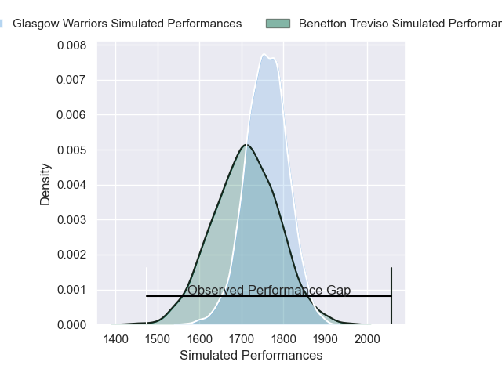
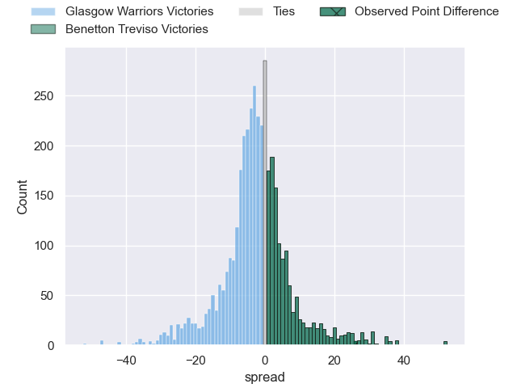
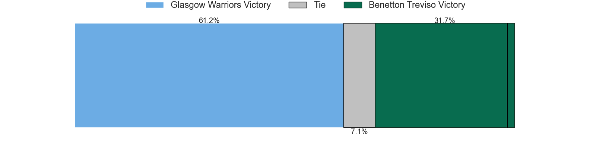
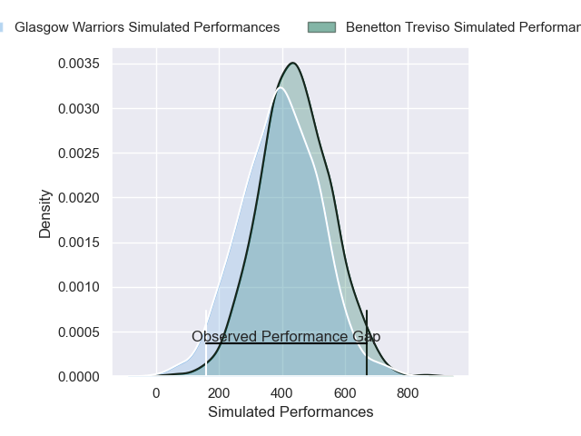
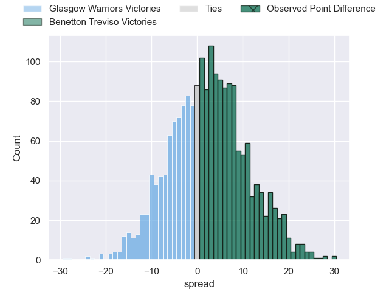
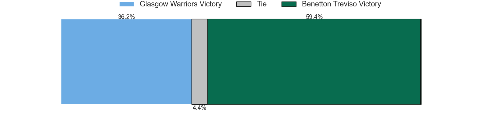

---  
layout: page  
title: Glasgow Warriors at Benetton Treviso; 7-33  
date: 2025-05-10 18:00:00 -0500  
categories: "United Rugby Championship 24/25" match review  
---
# Glasgow Warriors at Benetton Treviso; 7-33

# Club Level Predictions

The first set of predictions treats a club as the smallest object, as the club develops its members, organizes a gameplan, and deploys its players as needed for each match. This club model has a prediction of 0.436, which translates to predicting Glasgow Warriors to win by 2.2.

Our Over/Under is 63.5 - and combined with the spread above, we have a predicted scoreline of 33 to 30

Each club has a rating and a rating deviation (similar to a Glicko rating), and expected performances can be generated. This allows for simulated matches and spreads like the ones below.
## Projected Performances - Club Model

## Projected Spreads - Club Model

## Projected Results - Club Model

# Player Level Predictions

Treating teams instead as an entity made up of the currently active players, I have ratings for each player in an altogether different system. These can be combined to form team ratings once teamsheets are announced, weighting starters a bit higher than the reserves. After the match is played, players can be weighted by their minutes on the field, allowing for an accurate measure of the team's composition. With these compiled team ratings, we can make predictions, measure inaccuracy, and update the individual player ratings.
## Prediction without Player Minutes: Benetton Treviso by 0.1

Glasgow Warriors by 7.7 on a neutral pitch

## Projected Performances - Player Model

## Projected Spreads - Player Model

## Projected Results - Player Model

|   Away Minutes | Away Player       |   Away Percentile |   Number |   Home Percentile | Home Player        |   Home Minutes |
|---------------:|:------------------|------------------:|---------:|------------------:|:-------------------|---------------:|
|           51   | Jamie Bhatti      |             96.45 |        1 |             94.59 | Thomas Gallo       |           56   |
|           80   | Johnny Matthews   |             29.23 |        2 |              5.63 | Siua Maile         |           80   |
|           67   | Finlay Richardson |             75.53 |        3 |             96.85 | Simone Ferrari     |           80   |
|           80   | Max Williamson    |             68.98 |        4 |             65.76 | Scott Scrafton     |           24   |
|           29   | Alex Samuel       |             48.78 |        5 |             95.51 | Federico Ruzza     |           40   |
|           23   | Scott Cummings    |             99.14 |        6 |             11.02 | Riccardo Favretto  |           68   |
|           46   | Rory Darge        |             89.37 |        7 |             78.35 | Manuel Zuliani     |           66   |
|           70   | Sione Vailanu     |             14.65 |        8 |             97.45 | Lorenzo Cannone    |           29   |
|           74   | George Horne      |             99.64 |        9 |             78.78 | Alessandro Garbisi |           47   |
|           69   | Tom Jordan        |             58.77 |       10 |             62.37 | Jacob Umaga        |           47   |
|            0   | Kyle Steyn        |             99.32 |       11 |             92.12 | Paolo Odogwu       |           33   |
|           67   | Stafford McDowall |             87.56 |       12 |             95.85 | Juan Ignacio Brex  |           19   |
|            1   | Huw Jones         |             90.29 |       13 |             93.43 | Tommaso Menoncello |           26   |
|           30.5 | Jamie Dobie       |             89.49 |       14 |             41.44 | Ignacio Mendy      |           47   |
|           65   | Ollie Smith       |             88.51 |       15 |             94.68 | Rhyno Smith        |           80   |
|           62   | Gregor Hiddleston |             71.3  |       16 |             38.37 | Giosue Zilocchi    |           41   |
|           29   | Nathan McBeth     |             76.01 |       17 |             93.49 | Agustin Creevy     |           50   |
|           30   | Kyle Rowe         |             70.43 |       18 |             55.41 | Mirco Spagnolo     |           30.5 |
|           80   | JP du Preez       |            nan    |       19 |             85.44 | Sebastian Negri    |           80   |
|           80   | Euan Ferrie       |             43.01 |       20 |             66.43 | Malakai Fekitoa    |           80   |
|           33   | Murphy Walker     |             45.4  |       21 |             63.61 | Niccolo Cannone    |           67   |
|           56   | Adam Hastings     |             98.31 |       22 |             72.77 | Leonardo Marin     |           33   |
|           53   | Ben Afshar        |             35.07 |       23 |            nan    | Nicolo Casilio     |           61   |

