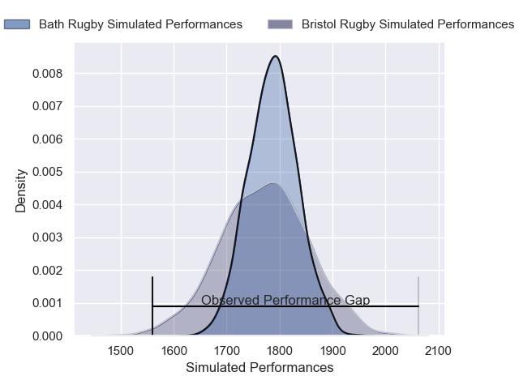
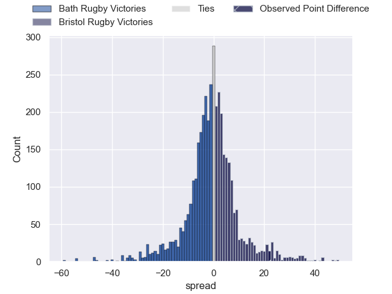
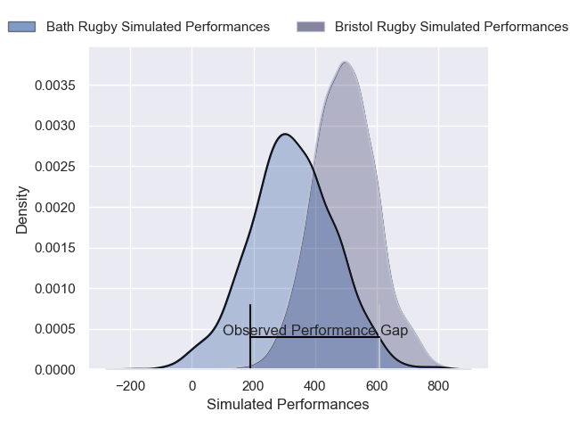
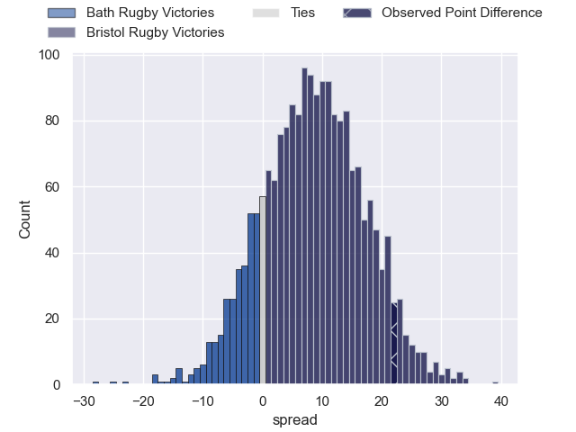

---  
layout: page  
title: Bath Rugby at Bristol Rugby; 14-36  
date: 2025-05-10 18:00:00 -0500  
categories: "Gallagher Premiership 24/25" match review  
---
# Bath Rugby at Bristol Rugby; 14-36

# Club Level Predictions

The first set of predictions treats a club as the smallest object, as the club develops its members, organizes a gameplan, and deploys its players as needed for each match. This club model has a prediction of 0.48, which translates to predicting Bath Rugby to win by 0.7.

Our Over/Under is 66.5 - and combined with the spread above, we have a predicted scoreline of 34 to 33

Each club has a rating and a rating deviation (similar to a Glicko rating), and expected performances can be generated. This allows for simulated matches and spreads like the ones below.
## Projected Performances - Club Model

## Projected Spreads - Club Model

## Projected Results - Club Model

# Player Level Predictions

Treating teams instead as an entity made up of the currently active players, I have ratings for each player in an altogether different system. These can be combined to form team ratings once teamsheets are announced, weighting starters a bit higher than the reserves. After the match is played, players can be weighted by their minutes on the field, allowing for an accurate measure of the team's composition. With these compiled team ratings, we can make predictions, measure inaccuracy, and update the individual player ratings.
## Prediction without Player Minutes: Bristol Rugby by 15.8

Bristol Rugby by 8.8 on a neutral pitch

## Projected Performances - Player Model

## Projected Spreads - Player Model

## Projected Results - Player Model

|   Away Minutes | Away Player         |   Away Percentile |   Number |   Home Percentile | Home Player                |   Home Minutes |
|---------------:|:--------------------|------------------:|---------:|------------------:|:---------------------------|---------------:|
|             68 | Francois van Wyk    |             86.83 |        1 |             77.79 | Ellis Genge                |             33 |
|             80 | Jasper Spandler     |             72.71 |        2 |             67.78 | Gabriel Oghre              |             27 |
|             80 | Archie Griffin      |             60.42 |        3 |             81.26 | Max Lahiff                 |             23 |
|             55 | Ewan Richards       |             59.71 |        4 |             70.93 | Josh Caulfield             |              8 |
|             80 | Ross Molony         |             92.88 |        5 |             92.68 | Joe Batley                 |             25 |
|             18 | Josh Bayliss        |             55.75 |        6 |            100    | Steven Luatua              |             33 |
|             80 | Ethan Staddon       |             72.99 |        7 |             94.64 | Fitz Harding               |             27 |
|             14 | Arthur Green        |             32.91 |        8 |             10.62 | Viliame Mata               |             14 |
|             21 | Louis Schreuder     |             88.67 |        9 |             96.22 | Harry Randall              |             80 |
|             53 | Ciaran Donoghue     |             39.53 |       10 |             95.35 | AJ MacGinty                |             80 |
|             80 | Austin Emens        |             86.28 |       11 |             98.54 | Gabriel Ibitoye            |             24 |
|             68 | Orlando Bailey      |             73.51 |       12 |             84.63 | James Williams             |              3 |
|             74 | Louie Hennessey     |              9.81 |       13 |             96.46 | Benhard Janse van Rensburg |             80 |
|             80 | Joe Cokanasiga      |             96.21 |       14 |             89.01 | Kalaveti Ravouvou          |             66 |
|             49 | Tom de Glanville    |             64.68 |       15 |             35.32 | Richard Lane               |             29 |
|             56 | Arthur Cordwell     |             36.35 |       16 |             92.41 | Yann Thomas                |             80 |
|             72 | Kepu Tuipulotu      |             62.15 |       17 |             23.06 | Will Capon                 |             51 |
|             61 | Kieran Verden       |             38.05 |       18 |             46.28 | George Kloska              |             80 |
|             80 | Will Jeanes         |             39.12 |       19 |             94.93 | James Dun                  |             72 |
|             19 | Miles Reid          |             95.88 |       20 |             64.88 | Joe Owen                   |             80 |
|             31 | Tom Cowan           |             50    |       21 |             77.07 | Benjamin Grondona          |             24 |
|             53 | Tom Carr-Smith      |             66.73 |       22 |             96.4  | Kieran Marmion             |             55 |
|             80 | Ruaridh McConnochie |             92.7  |       23 |             81.71 | Ratu Naulago               |             29 |

