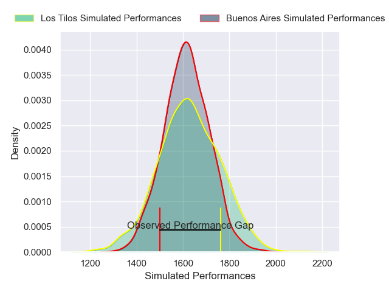
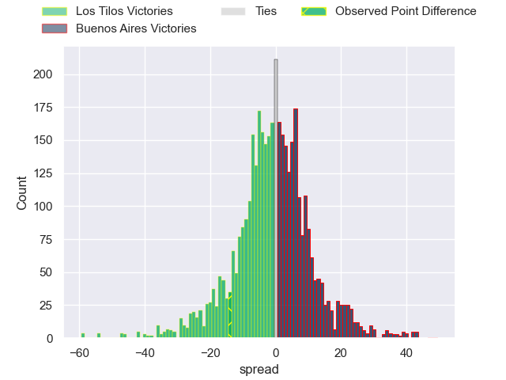

---  
layout: page  
title: Los Tilos at Buenos Aires; 39-25  
date: 2025-05-10 18:00:00 -0500  
categories: "URBA Top 13 2025" match review  
---
# Los Tilos at Buenos Aires; 39-25

# Club Level Predictions

The first set of predictions treats a club as the smallest object, as the club develops its members, organizes a gameplan, and deploys its players as needed for each match. This club model has a prediction of 0.486, which translates to predicting Los Tilos to win by 0.5.

Our Over/Under is 37.5 - and combined with the spread above, we have a predicted scoreline of 19 to 19

Each club has a rating and a rating deviation (similar to a Glicko rating), and expected performances can be generated. This allows for simulated matches and spreads like the ones below.
## Projected Performances - Club Model

## Projected Spreads - Club Model

## Projected Results - Club Model

