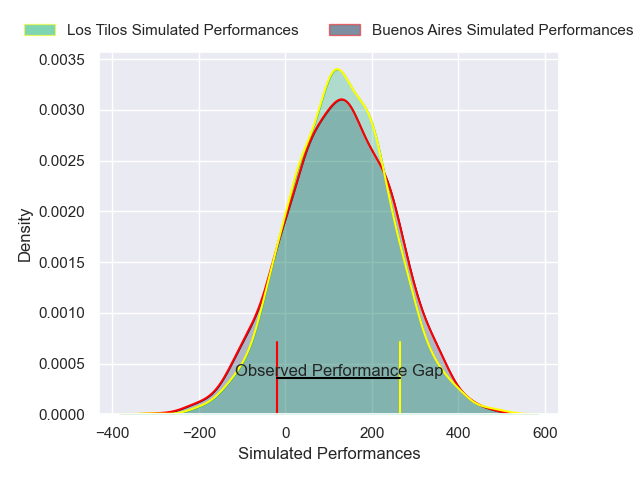
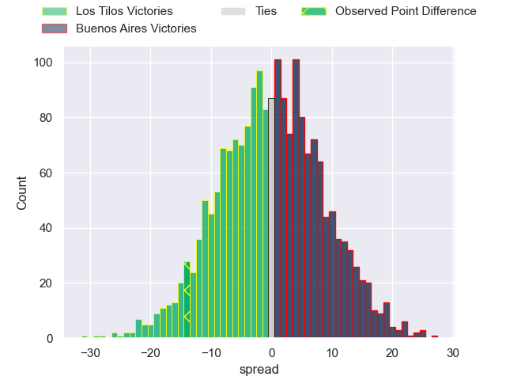

---  
layout: page  
title: Los Tilos at Buenos Aires; 39-25  
date: 2025-05-10 18:00:00 -0500  
categories: "URBA Top 13 2025" match review  
---
# Los Tilos at Buenos Aires; 39-25

# Club Level Predictions

The first set of predictions treats a club as the smallest object, as the club develops its members, organizes a gameplan, and deploys its players as needed for each match. This club model has a prediction of 0.486, which translates to predicting Los Tilos to win by 0.5.

Our Over/Under is 52.5 - and combined with the spread above, we have a predicted scoreline of 26 to 26

Each club has a rating and a rating deviation (similar to a Glicko rating), and expected performances can be generated. This allows for simulated matches and spreads like the ones below.
## Projected Performances - Club Model

## Projected Spreads - Club Model

## Projected Results - Club Model

# Player Level Predictions

Treating teams instead as an entity made up of the currently active players, I have ratings for each player in an altogether different system. These can be combined to form team ratings once teamsheets are announced, weighting starters a bit higher than the reserves. After the match is played, players can be weighted by their minutes on the field, allowing for an accurate measure of the team's composition. With these compiled team ratings, we can make predictions, measure inaccuracy, and update the individual player ratings.
## Prediction without Player Minutes: Buenos Aires by 0.2

Los Tilos by 3.2 on a neutral pitch

## Projected Performances - Player Model

## Projected Spreads - Player Model

## Projected Results - Player Model

|   Away Minutes | Away Player                |   Away Percentile |   Number |   Home Percentile | Home Player            |   Home Minutes |
|---------------:|:---------------------------|------------------:|---------:|------------------:|:-----------------------|---------------:|
|             33 | Joaquin Briozzo            |             57.07 |        1 |             17.66 | Tomas Gallo            |             58 |
|             32 | Hipolito San Sebastian     |             55.18 |        2 |             11.88 | Tomas Rosasco          |             80 |
|             61 | Adriel Armenti             |             64.02 |        3 |             20.93 | Blas Armando Coria     |             80 |
|             51 | Carlos Augusto Cabano Wall |             59.81 |        4 |             25.36 | Francisco Jose Sluga   |             54 |
|             80 | Juan Blaiotta Lago         |             64.98 |        5 |             27.94 | Francisco Syrianni     |             80 |
|             75 | Felipe Bares               |             65.62 |        6 |             29.34 | Pablo Bourdal          |             64 |
|             26 | Eliseo Chiavassa           |             54.99 |        7 |             14.62 | Pedro Maria del Carril |             67 |
|             73 | Bautista Gatti             |             59.92 |        8 |             14.93 | Jordi Dieguez          |             80 |
|             29 | Marcos Albina              |             53    |        9 |             10.6  | Mateo Freire           |             51 |
|             13 | Matias Cordero             |             43.31 |       10 |             13.39 | Tomas Bunge            |             80 |
|             14 | Gaston Martinez Salgado    |             50.62 |       11 |             27.18 | Juan Ignacio Giovenali |             51 |
|             33 | Tomas Fernandez Armendariz |             51.38 |       12 |             29.33 | Agustin Lamensa Sanudo |              0 |
|             39 | Tiago Bassagaisteguy       |             52.92 |       13 |             52.62 | Tobias Diaz Borda      |             46 |
|             28 | Mateo Fernandez Armendariz |             54.16 |       14 |             15.41 | Benjamin Handley       |             54 |
|             28 | Ignacio Guichon            |             49.68 |       15 |             26.22 | Francisco Lamensa      |             67 |
|             67 | Away Team 16               |            nan    |       16 |            nan    | Home Team 16           |             80 |
|             66 | Away Team 17               |            nan    |       17 |            nan    | Home Team 17           |             80 |
|             80 | Away Team 18               |            nan    |       18 |            nan    | Home Team 18           |             29 |
|             67 | Away Team 19               |            nan    |       19 |            nan    | Home Team 19           |             29 |
|             80 | Away Team 20               |            nan    |       20 |            nan    | Home Team 20           |             29 |
|             28 | Away Team 21               |            nan    |       21 |            nan    | Home Team 21           |             29 |
|             26 | Away Team 22               |            nan    |       22 |            nan    | Home Team 22           |             52 |
|             80 | Away Team 23               |            nan    |       23 |            nan    | Home Team 23           |             14 |

