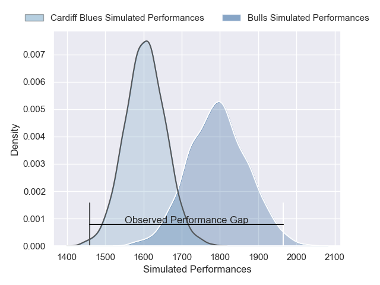
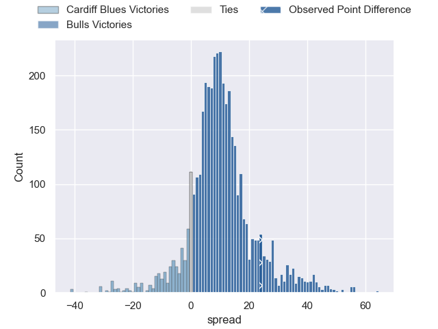
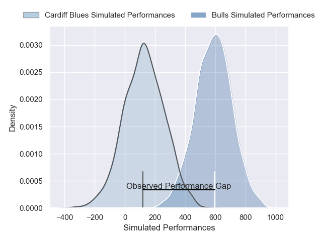
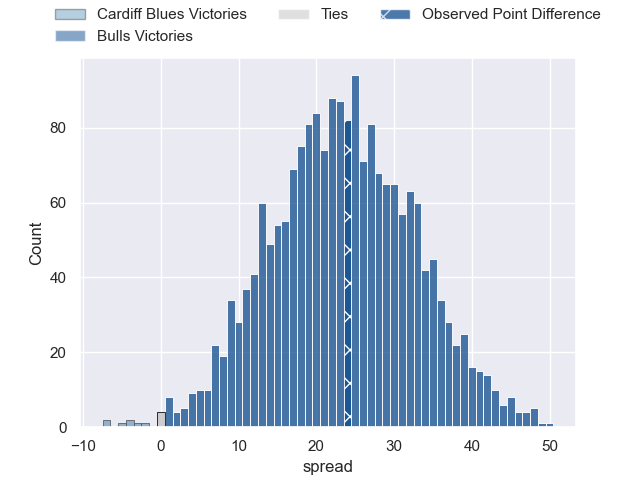

---  
layout: page  
title: Cardiff Blues at Bulls; 21-45  
date: 2025-05-10 18:00:00 -0500  
categories: "United Rugby Championship 24/25" match review  
---
# Cardiff Blues at Bulls; 21-45

# Club Level Predictions

The first set of predictions treats a club as the smallest object, as the club develops its members, organizes a gameplan, and deploys its players as needed for each match. This club model has a prediction of 0.746, which translates to predicting Bulls to win by 9.5.

Our Over/Under is 66.5 - and combined with the spread above, we have a predicted scoreline of 28 to 38

Each club has a rating and a rating deviation (similar to a Glicko rating), and expected performances can be generated. This allows for simulated matches and spreads like the ones below.
## Projected Performances - Club Model

## Projected Spreads - Club Model

## Projected Results - Club Model

# Player Level Predictions

Treating teams instead as an entity made up of the currently active players, I have ratings for each player in an altogether different system. These can be combined to form team ratings once teamsheets are announced, weighting starters a bit higher than the reserves. After the match is played, players can be weighted by their minutes on the field, allowing for an accurate measure of the team's composition. With these compiled team ratings, we can make predictions, measure inaccuracy, and update the individual player ratings.
## Prediction without Player Minutes: Bulls by 29.2

Bulls by 20.7 on a neutral pitch

## Projected Performances - Player Model

## Projected Spreads - Player Model

## Projected Results - Player Model

|   Away Minutes | Away Player        |   Away Percentile |   Number |   Home Percentile | Home Player         |   Home Minutes |
|---------------:|:-------------------|------------------:|---------:|------------------:|:--------------------|---------------:|
|             80 | Corey Domachowski  |             83.32 |        1 |             58.71 | Jan-Hendrik Wessels |             80 |
|              0 | Evan Lloyd         |             18.34 |        2 |             87.95 | Johan Grobbelaar    |             80 |
|             67 | Keiron Assiratti   |             12.43 |        3 |             98.61 | Wilco Louw          |             51 |
|             11 | Keiron Assiratti   |             12.43 |        3 |             98.61 | Wilco Louw          |             51 |
|             30 | Josh McNally       |             85.36 |        4 |             95.41 | Cobus Wiese         |             54 |
|             36 | Rory Thornton      |              4.31 |        5 |             11.39 | JF van Heerden      |             44 |
|             14 | Alex Mann          |              4.84 |        6 |             97.82 | Marcell Coetzee     |             66 |
|             14 | James Botham       |             85.66 |        7 |             86.7  | Ruan Nortje         |             80 |
|             24 | Alun Lawrence      |             84.87 |        8 |             54.81 | Cameron Hanekom     |             56 |
|             68 | Johan Mulder       |             79.86 |        9 |             92.93 | Zak Burger          |             80 |
|             50 | Tinus de Beer      |             71.76 |       10 |             71.55 | Johan Goosen        |             16 |
|             68 | Gabriel Hamer-Webb |             79.33 |       11 |             95.31 | Sebastian de Klerk  |              7 |
|             66 | Ben Thomas         |             23.59 |       12 |             95.28 | Harold Vorster      |              0 |
|             51 | Harri Millard      |              2.26 |       13 |             84.82 | David Kriel         |             17 |
|             80 | Josh Adams         |             86.12 |       14 |             99.33 | Canan Moodie        |             37 |
|             80 | Cameron Winnett    |             12.26 |       15 |             95.14 | Willie le Roux      |             80 |
|             32 | Liam Belcher       |             49.92 |       16 |             97.62 | Akker van der Merwe |             48 |
|             60 | Danny Southworth   |             43.34 |       17 |             67.29 | Alulutho Tshakweni  |             80 |
|             37 | Rhys Litterick     |             16.11 |       18 |             80.13 | Mornay Smith        |             80 |
|             60 | Teddy Williams     |              6.79 |       19 |             90.31 | Jannes Kirsten      |             48 |
|             80 | Dan Thomas         |             23.55 |       20 |             91.45 | Marco van Staden    |             66 |
|             80 | Taulupe Faletau    |             83.44 |       21 |             11.09 | Keagan Johannes     |             78 |
|             80 | Aled Davies        |             76.15 |       22 |             90.49 | Devon Williams      |             32 |
|             70 | Rory Jennings      |             32    |       23 |             86.15 | Stedman Gans        |             29 |

