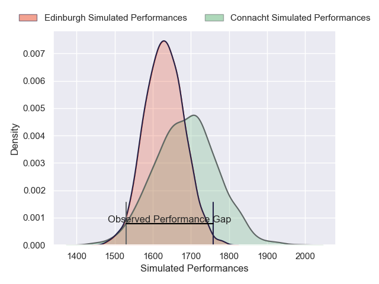
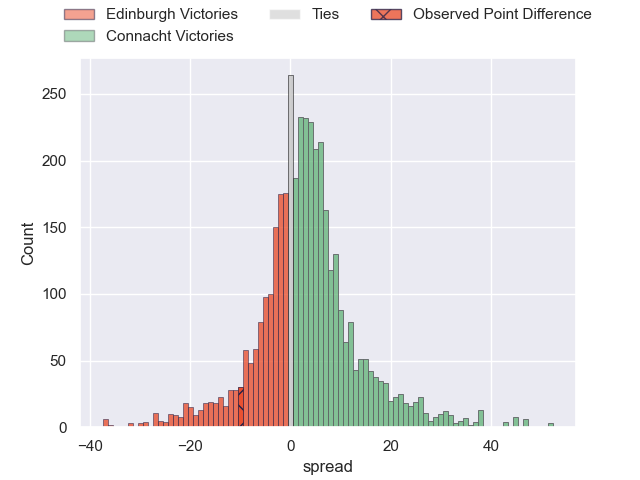
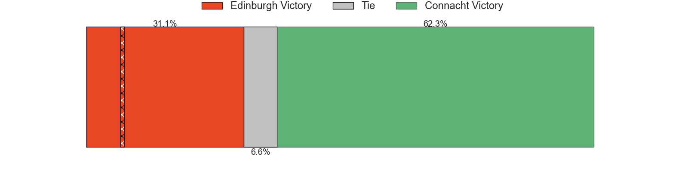
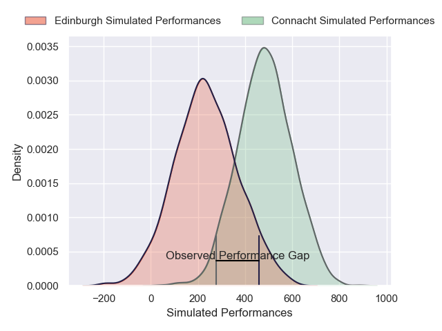
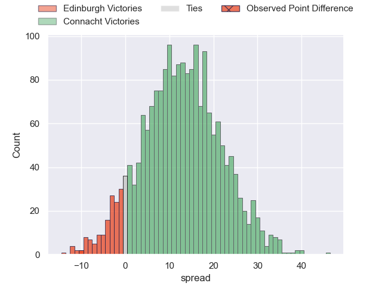
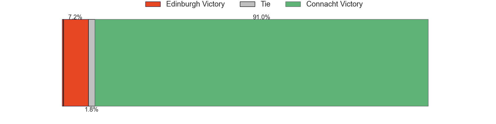

---  
layout: page  
title: Edinburgh at Connacht; 31-21  
date: 2025-05-10 18:00:00 -0500  
categories: "United Rugby Championship 24/25" match review  
---
# Edinburgh at Connacht; 31-21

# Club Level Predictions

The first set of predictions treats a club as the smallest object, as the club develops its members, organizes a gameplan, and deploys its players as needed for each match. This club model has a prediction of 0.584, which translates to predicting Connacht to win by 3.0.

Our Over/Under is 46.5 - and combined with the spread above, we have a predicted scoreline of 22 to 25

Each club has a rating and a rating deviation (similar to a Glicko rating), and expected performances can be generated. This allows for simulated matches and spreads like the ones below.
## Projected Performances - Club Model

## Projected Spreads - Club Model

## Projected Results - Club Model

# Player Level Predictions

Treating teams instead as an entity made up of the currently active players, I have ratings for each player in an altogether different system. These can be combined to form team ratings once teamsheets are announced, weighting starters a bit higher than the reserves. After the match is played, players can be weighted by their minutes on the field, allowing for an accurate measure of the team's composition. With these compiled team ratings, we can make predictions, measure inaccuracy, and update the individual player ratings.
## Prediction without Player Minutes: Connacht by 12.0

Connacht by 3.6 on a neutral pitch

## Projected Performances - Player Model

## Projected Spreads - Player Model

## Projected Results - Player Model

|   Away Minutes | Away Player      |   Away Percentile |   Number |   Home Percentile | Home Player          |   Home Minutes |
|---------------:|:-----------------|------------------:|---------:|------------------:|:---------------------|---------------:|
|             55 | Pierre Schoeman  |             82.6  |        1 |             88.43 | Denis Buckley        |             26 |
|             80 | Ewan Ashman      |             84.89 |        2 |             29    | Dave Heffernan       |             15 |
|             80 | D'Arcy Rae       |             77.81 |        3 |             89.7  | Finlay Bealham       |             24 |
|             19 | Marshall Sykes   |             66.29 |        4 |             90.46 | Josh Murphy          |             70 |
|             55 | Sam Skinner      |             93.77 |        5 |             27.76 | Darragh Murray       |             80 |
|             22 | Ben Muncaster    |             58.03 |        6 |             29.21 | Cian Prendergast     |              4 |
|             58 | Hamish Watson    |             90.43 |        7 |             86.75 | Conor Oliver         |             58 |
|             80 | Magnus Bradbury  |             89.45 |        8 |              6.12 | Sean Jansen          |             80 |
|              4 | Ali Price        |             93.74 |        9 |             44.87 | Ben Murphy           |             22 |
|             55 | Ross Thompson    |             89.26 |       10 |             78.95 | JJ Hanrahan          |             39 |
|             18 | Jack Brown       |             53.61 |       11 |             33.4  | Finn Treacy          |             65 |
|             58 | Mosese Tuipulotu |             68.83 |       12 |             98.99 | Bundee Aki           |             80 |
|             51 | Matt Currie      |             90.79 |       13 |             22.27 | Hugh Gavin           |             56 |
|             73 | Darcy Graham     |             69.07 |       14 |             66.41 | Shayne Bolton        |             51 |
|             29 | Wes Goosen       |             87.21 |       15 |             97.06 | Santiago Cordero     |             51 |
|             80 | Patrick Harrison |              9.84 |       16 |             71.35 | Dylan Tierney-Martin |             80 |
|             80 | Boan Venter      |             77.02 |       17 |             96.41 | Peter Dooley         |             31 |
|             80 | Javan Sebastian  |            nan    |       18 |             61.93 | Jack Aungier         |             54 |
|             29 | Glen Young       |              5    |       19 |             74.22 | Oisin Dowling        |             80 |
|             51 | Liam McConnell   |            nan    |       20 |             63.92 | Paul Boyle           |             80 |
|             65 | Charlie Shiel    |             64.35 |       21 |             83.3  | Caolin Blade         |             80 |
|             80 | Ben Healy        |             68.21 |       22 |             12.96 | Cathal Forde         |              0 |
|             80 | Findlay Thomson  |            nan    |       23 |             70.24 | David Hawkshaw       |             50 |

