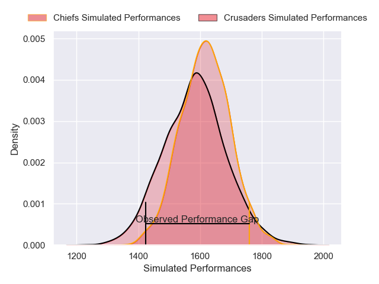
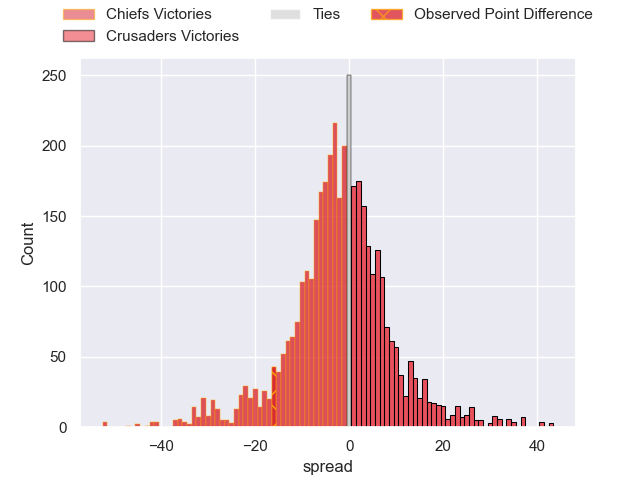
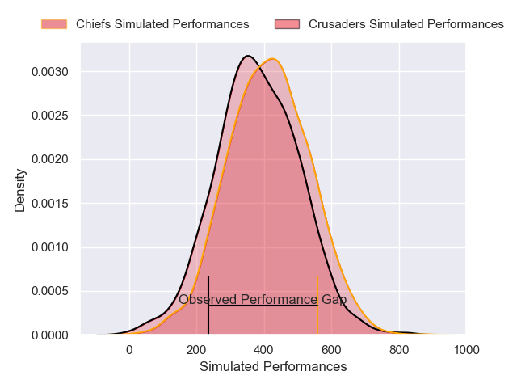
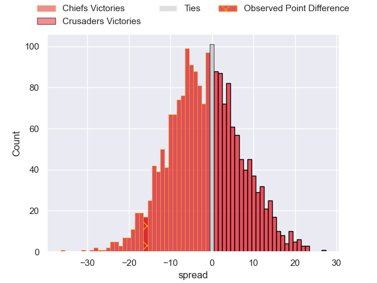

---  
layout: page  
title: Chiefs at Crusaders; 35-19  
date: 2025-05-10 18:00:00 -0500  
categories: "Super Rugby Pacific 2025" match review  
---
# Chiefs at Crusaders; 35-19

# Club Level Predictions

The first set of predictions treats a club as the smallest object, as the club develops its members, organizes a gameplan, and deploys its players as needed for each match. This club model has a prediction of 0.454, which translates to predicting Chiefs to win by 1.7.

Our Over/Under is 62.5 - and combined with the spread above, we have a predicted scoreline of 32 to 30

Each club has a rating and a rating deviation (similar to a Glicko rating), and expected performances can be generated. This allows for simulated matches and spreads like the ones below.
## Projected Performances - Club Model

## Projected Spreads - Club Model

## Projected Results - Club Model

# Player Level Predictions

Treating teams instead as an entity made up of the currently active players, I have ratings for each player in an altogether different system. These can be combined to form team ratings once teamsheets are announced, weighting starters a bit higher than the reserves. After the match is played, players can be weighted by their minutes on the field, allowing for an accurate measure of the team's composition. With these compiled team ratings, we can make predictions, measure inaccuracy, and update the individual player ratings.
## Prediction without Player Minutes: Chiefs by 3.2

Chiefs by 10.8 on a neutral pitch

## Projected Performances - Player Model

## Projected Spreads - Player Model

## Projected Results - Player Model

|   Away Minutes | Away Player         |   Away Percentile |   Number |   Home Percentile | Home Player          |   Home Minutes |
|---------------:|:--------------------|------------------:|---------:|------------------:|:---------------------|---------------:|
|           20   | Ollie Norris        |             94.17 |        1 |             90.02 | Tamaiti Williams     |             80 |
|           28   | Brodie McAlister    |             91.04 |        2 |             98.42 | Codie Taylor         |             80 |
|           23.5 | George Dyer         |             94.01 |        3 |              3.03 | Fletcher Newell      |             62 |
|           80   | Naitoa Ah Kuoi      |             94.33 |        4 |             87.91 | Scott Barrett        |             80 |
|           32   | Tupou Vaa'i         |             89.33 |        5 |             10.01 | Antonio Shalfoon     |             53 |
|           15   | Tupou Vaa'i         |             89.33 |        5 |             10.01 | Antonio Shalfoon     |             53 |
|           80   | Simon Parker        |             90.62 |        6 |             78.34 | Cullen Grace         |             50 |
|           80   | Luke Jacobson       |             94.1  |        7 |             66.92 | Tom Christie         |             80 |
|           73   | Wallace Sititi      |             75.11 |        8 |             56.96 | Christian Lio-Willie |             50 |
|           13   | Cortez Ratima       |             83.48 |        9 |             61.91 | Noah Hotham          |             80 |
|           33   | Damian McKenzie     |             97.05 |       10 |              4.21 | Rivez Reihana        |             67 |
|           80   | Leroy Carter        |             54.74 |       11 |             80.55 | Sevu Reece           |             40 |
|            0   | Quinn Tupaea        |             96.96 |       12 |             90.69 | David Havili         |             28 |
|           32   | Daniel Rona         |             90.18 |       13 |             88.66 | Braydon Ennor        |             29 |
|           80   | Emoni Narawa        |             95.35 |       14 |             12.52 | Chay Fihaki          |             26 |
|           79   | Shaun Stevenson     |             91.61 |       15 |             97.48 | Will Jordan          |              7 |
|            7   | Samisoni Taukei'aho |             95.78 |       16 |             39.19 | Ioane Moananu        |             80 |
|           48   | Aidan Ross          |             99.28 |       17 |              9.98 | George Bower         |             64 |
|           25   | Reuben O'Neill      |             51.8  |       18 |            nan    | Seb Calder           |             80 |
|           48   | Josh Lord           |             38.15 |       19 |             15.77 | Jamie Hannah         |             80 |
|           66   | Samipeni Finau      |             94.49 |       20 |             29.4  | Corey Kellow         |             60 |
|           62   | Xavier Roe          |             48    |       21 |             85.57 | Kyle Preston         |              8 |
|           43   | Josh Jacomb         |             80.63 |       22 |            nan    | James O'Connor       |             50 |
|           40   | Gideon Wrampling    |             66.9  |       23 |             60.43 | Dallas McLeod        |             46 |

