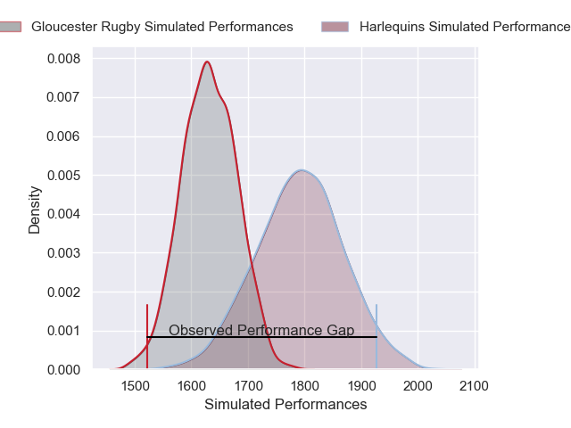
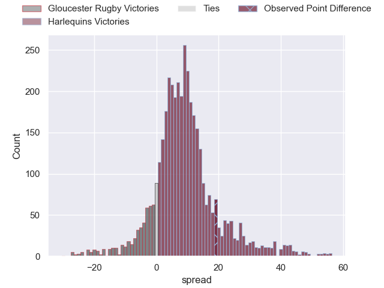
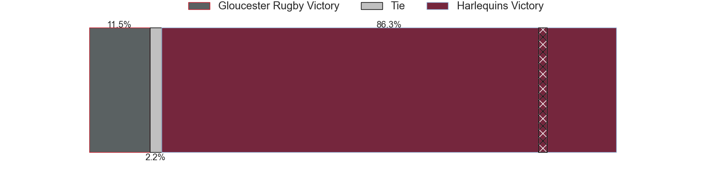
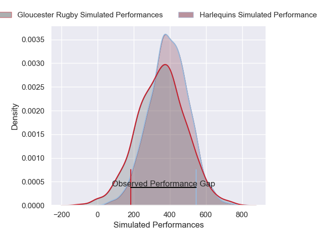
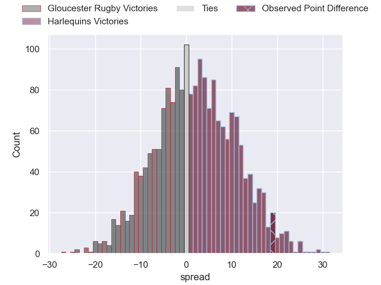

---  
layout: page  
title: Gloucester Rugby at Harlequins; 19-38  
date: 2025-05-10 18:00:00 -0500  
categories: "Gallagher Premiership 24/25" match review  
---
# Gloucester Rugby at Harlequins; 19-38

# Club Level Predictions

The first set of predictions treats a club as the smallest object, as the club develops its members, organizes a gameplan, and deploys its players as needed for each match. This club model has a prediction of 0.713, which translates to predicting Harlequins to win by 8.0.

Our Over/Under is 57.5 - and combined with the spread above, we have a predicted scoreline of 25 to 33

Each club has a rating and a rating deviation (similar to a Glicko rating), and expected performances can be generated. This allows for simulated matches and spreads like the ones below.
## Projected Performances - Club Model

## Projected Spreads - Club Model

## Projected Results - Club Model

# Player Level Predictions

Treating teams instead as an entity made up of the currently active players, I have ratings for each player in an altogether different system. These can be combined to form team ratings once teamsheets are announced, weighting starters a bit higher than the reserves. After the match is played, players can be weighted by their minutes on the field, allowing for an accurate measure of the team's composition. With these compiled team ratings, we can make predictions, measure inaccuracy, and update the individual player ratings.
## Prediction without Player Minutes: Harlequins by 9.6

Gloucester Rugby by 4.4 on a neutral pitch

## Projected Performances - Player Model

## Projected Spreads - Player Model

## Projected Results - Player Model

|   Away Minutes | Away Player        |   Away Percentile |   Number |   Home Percentile | Home Player     |   Home Minutes |
|---------------:|:-------------------|------------------:|---------:|------------------:|:----------------|---------------:|
|             50 | Val Rapava-Ruskin  |             80.78 |        1 |             24.47 | Fin Baxter      |             64 |
|             80 | Sebastian Blake    |             49.3  |        2 |              2.11 | Jack Walker     |             67 |
|             19 | Afolabi Fasogban   |             81.42 |        3 |             17.45 | Titi Lamositele |             53 |
|             80 | Arthur Clark       |              8.39 |        4 |             31.22 | Irne Herbst     |             53 |
|             30 | Freddie Thomas     |             52.29 |        5 |             76.98 | George Hammond  |             64 |
|             34 | Jack Clement       |              4.5  |        6 |             92.82 | Jack Kenningham |             71 |
|             80 | Lewis Ludlow       |              8.52 |        7 |             73.85 | Will Evans      |             46 |
|             55 | Ruan Ackermann     |             64.97 |        8 |             83.01 | Alex Dombrandt  |             46 |
|             67 | Tomos Williams     |             64.75 |        9 |             24.46 | Will Porter     |             29 |
|             53 | Gareth Anscombe    |             59.2  |       10 |             77.59 | Marcus Smith    |             30 |
|             80 | Jake Morris        |             10.21 |       11 |             15.76 | Cadan Murley    |             34 |
|             35 | Sebastien Atkinson |             22.14 |       12 |             89.18 | Ben Waghorn     |             29 |
|             24 | Chris Harris       |             30.43 |       13 |              2.22 | Oscar Beard     |             35 |
|             80 | Christian Wade     |             96.98 |       14 |             70.14 | Rodrigo Isgro   |             80 |
|             40 | Santiago Carreras  |             82.98 |       15 |             52.77 | Tyrone Green    |             80 |
|             47 | Ciaran Knight      |              6.98 |       16 |             60.66 | Jordan Els      |             26 |
|             47 | Jack Singleton     |             91.9  |       17 |             30.81 | Nathan Jibulu   |             69 |
|             14 | Kirill Gotovtsev   |             88.53 |       18 |            nan    | Ollie Streeter  |             47 |
|             61 | Cameron Jordan     |             97.46 |       19 |             98.24 | Joe Launchbury  |             60 |
|             80 | Cameron Jordan     |             97.46 |       19 |             98.24 | Joe Launchbury  |             60 |
|             80 | Freddie Clarke     |             21.56 |       20 |             63.41 | Tom Lawday      |             40 |
|             30 | Caolan Englefield  |             35.97 |       21 |            nan    | Jake Murray     |             26 |
|             26 | Jack Cotgreave     |             41.34 |       22 |             50.05 | Luke Northmore  |             56 |
|             80 | Charlie Atkinson   |             81.4  |       23 |             19.45 | Jamie Benson    |             80 |

