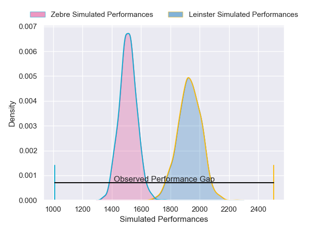
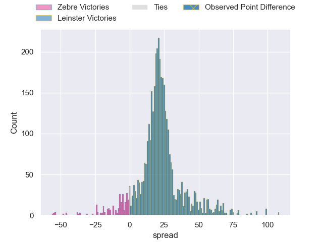
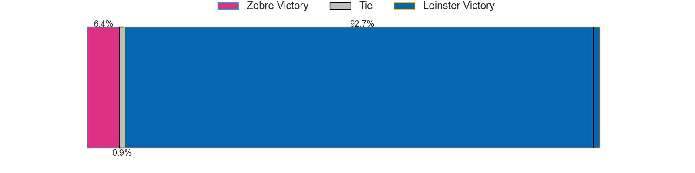
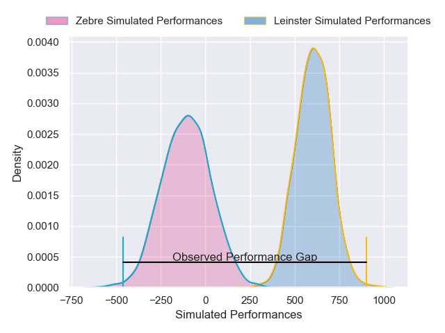
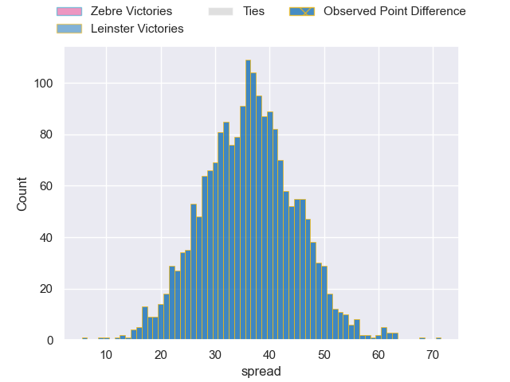

---  
layout: page  
title: Zebre at Leinster; 5-76  
date: 2025-05-10 18:00:00 -0500  
categories: "United Rugby Championship 24/25" match review  
---
# Zebre at Leinster; 5-76

# Club Level Predictions

The first set of predictions treats a club as the smallest object, as the club develops its members, organizes a gameplan, and deploys its players as needed for each match. This club model has a prediction of 0.915, which translates to predicting Leinster to win by 21.0.

Our Over/Under is 45.5 - and combined with the spread above, we have a predicted scoreline of 12 to 33

Each club has a rating and a rating deviation (similar to a Glicko rating), and expected performances can be generated. This allows for simulated matches and spreads like the ones below.
## Projected Performances - Club Model

## Projected Spreads - Club Model

## Projected Results - Club Model

# Player Level Predictions

Treating teams instead as an entity made up of the currently active players, I have ratings for each player in an altogether different system. These can be combined to form team ratings once teamsheets are announced, weighting starters a bit higher than the reserves. After the match is played, players can be weighted by their minutes on the field, allowing for an accurate measure of the team's composition. With these compiled team ratings, we can make predictions, measure inaccuracy, and update the individual player ratings.
## Prediction without Player Minutes: Leinster by 43.1

Leinster by 32.9 on a neutral pitch

## Projected Performances - Player Model

## Projected Spreads - Player Model

## Projected Results - Player Model

|   Away Minutes | Away Player           |   Away Percentile |   Number |   Home Percentile | Home Player         |   Home Minutes |
|---------------:|:----------------------|------------------:|---------:|------------------:|:--------------------|---------------:|
|             47 | Luca Franceschetto    |             77.06 |        1 |             30.45 | Jack Boyle          |             10 |
|              0 | Giampietro Ribaldi    |             10.92 |        2 |             95.95 | Ronan Kelleher      |             34 |
|             61 | Juan Pitinari         |             27.71 |        3 |             84.65 | Thomas Clarkson     |             10 |
|             80 | Rusiate Nasove        |             58.93 |        4 |             76.49 | Joe McCarthy        |             19 |
|             80 | Leonard Krumov        |              0.68 |        5 |             25.17 | Diarmuid Mangan     |             34 |
|             52 | Bautista Stavile      |             10.54 |        6 |             78.83 | Ryan Baird          |             34 |
|             56 | Iacopo Bianchi        |              2.11 |        7 |             97.89 | Josh van der Flier  |             61 |
|             29 | Davide Ruggeri        |             35.24 |        8 |             97.88 | Jack Conan          |             80 |
|             80 | Gonzalo Garcia        |              0.18 |        9 |             98.74 | Luke McGrath        |             45 |
|             64 | Giovanni Montemauri   |              0.63 |       10 |             18.39 | Sam Prendergast     |             48 |
|             75 | Alessandro Gesi       |             42.51 |       11 |            100    | James Lowe          |             33 |
|             33 | Enrico Lucchin        |             68.15 |       12 |             89.59 | Jordie Barrett      |             12 |
|             80 | Fetuli Paea           |             18.2  |       13 |             98.48 | Garry Ringrose      |             66 |
|             40 | Scott Gregory         |             56.91 |       14 |             90.86 | Jimmy O'Brien       |             47 |
|             47 | Jacopo Trulla         |              4.89 |       15 |             89.15 | Jamie Osborne       |             68 |
|             70 | Muhamed Hasa          |             25.69 |       16 |            nan    | James Culhane       |             80 |
|             33 | Tommaso Di Bartolomeo |             27.82 |       17 |              1.13 | Rabah Slimani       |             40 |
|             80 | Giacomo Da Re         |              7.61 |       18 |            nan    | John McKee          |             80 |
|             80 | Alessandro Fusco      |              1.98 |       19 |             96.2  | James Ryan          |             68 |
|             80 | Matteo Canali         |             79.9  |       20 |             91.61 | Robbie Henshaw      |             30 |
|             54 | Ion Neculai           |             21.73 |       21 |             44.59 | Ciaran Frawley      |             29 |
|             80 | Giacomo Ferrari       |             56.05 |       22 |             91.44 | Andrew Porter       |             45 |
|             20 | Filippo Drago         |             36.2  |       23 |             96.94 | Jamison Gibson-Park |             33 |

