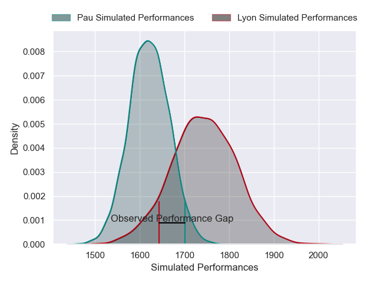
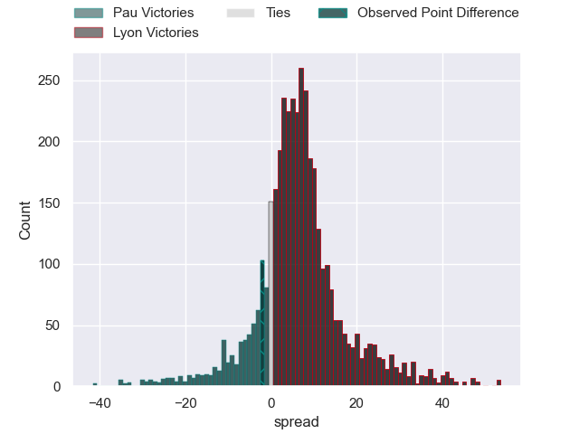
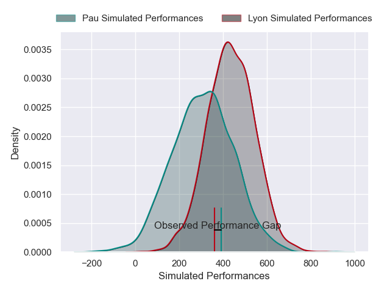
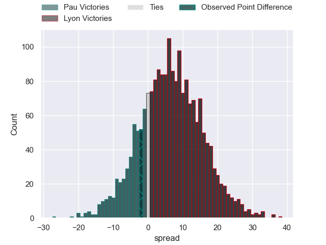
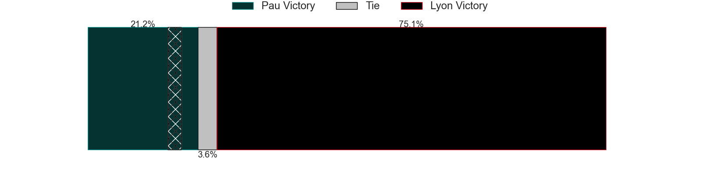

---  
layout: page  
title: Pau at Lyon; 29-27  
date: 2025-05-10 18:00:00 -0500  
categories: "Top 14 Orange 24/25" match review  
---
# Pau at Lyon; 29-27

# Club Level Predictions

The first set of predictions treats a club as the smallest object, as the club develops its members, organizes a gameplan, and deploys its players as needed for each match. This club model has a prediction of 0.667, which translates to predicting Lyon to win by 6.1.

Our Over/Under is 54.5 - and combined with the spread above, we have a predicted scoreline of 24 to 30

Each club has a rating and a rating deviation (similar to a Glicko rating), and expected performances can be generated. This allows for simulated matches and spreads like the ones below.
## Projected Performances - Club Model

## Projected Spreads - Club Model

## Projected Results - Club Model

# Player Level Predictions

Treating teams instead as an entity made up of the currently active players, I have ratings for each player in an altogether different system. These can be combined to form team ratings once teamsheets are announced, weighting starters a bit higher than the reserves. After the match is played, players can be weighted by their minutes on the field, allowing for an accurate measure of the team's composition. With these compiled team ratings, we can make predictions, measure inaccuracy, and update the individual player ratings.
## Prediction without Player Minutes: Lyon by 6.3

Pau by 6.3 on a neutral pitch

## Projected Performances - Player Model

## Projected Spreads - Player Model

## Projected Results - Player Model

|   Away Minutes | Away Player        |   Away Percentile |   Number |   Home Percentile | Home Player          |   Home Minutes |
|---------------:|:-------------------|------------------:|---------:|------------------:|:---------------------|---------------:|
|             80 | Hugo Parrou        |             67.61 |        1 |             36.75 | Jerome Rey           |             60 |
|             51 | Lucas Rey          |              3.52 |        2 |             38.2  | Yanis Charcosset     |             19 |
|             80 | Siate Tokolahi     |             91.68 |        3 |             65.02 | Irakli Aptsiauri     |              0 |
|             20 | Hugo Auradou       |             45.66 |        4 |             71.8  | Felix Lambey         |             41 |
|             57 | Remi Picquette     |             71.61 |        5 |             23.02 | Killian Geraci       |             26 |
|             14 | Luke Whitelock     |             98.37 |        6 |             62.55 | Beka Shvangiradze    |             76 |
|             14 | Reece Hewat        |             81.32 |        7 |             76.05 | Liam Allen           |             67 |
|             66 | Beka Gorgadze      |             79.62 |        8 |             46.92 | Maxime Gouzou        |             28 |
|             80 | Dan Robson         |             99.46 |        9 |             86.15 | Charlie Cassang      |             13 |
|             80 | Axel Desperes      |             92.81 |       10 |              3.81 | Martin Meliande      |             65 |
|             28 | Theo Attissogbe    |              9.63 |       11 |             93.39 | Vincent Rattez       |             28 |
|             80 | Theo Attissogbe    |              9.63 |       11 |             93.39 | Vincent Rattez       |             28 |
|             43 | Fabien Brau Boirie |             86.75 |       12 |             10.92 | Josiah Maraku        |              0 |
|             43 | Emilien Gailleton  |             75.23 |       13 |             92.72 | Thibault Regard      |             80 |
|             31 | Clement Laporte    |             98.25 |       14 |             70.53 | Alfred Parisien      |             28 |
|             67 | Jack Maddocks      |             84.26 |       15 |             61.91 | Alexandre Tchaptchet |             28 |
|             43 | Thibault Daubagna  |             89.39 |       16 |             77.07 | Mickael Guillard     |             39 |
|             80 | Youri Delhommel    |             52.11 |       17 |             42.61 | Guillaume Marchand   |             80 |
|             63 | Remi Seneca        |             86.19 |       18 |             24.88 | Jermaine Ainsley     |             80 |
|             72 | Loic Credoz        |             19.92 |       19 |             64.39 | Martin Page-Relo     |             80 |
|             60 | Guram Papidze      |             13.41 |       20 |             74.23 | Wayan de Benedittis  |             80 |
|             29 | Sacha Zegueur      |             17.72 |       21 |             93.66 | Tomas Lavanini       |             80 |
|             80 | Tumua Manu         |             93.87 |       22 |             27.59 | Steeve Blanc-Mappaz  |             11 |
|             80 | Carwyn Tuipulotu   |             69.64 |       23 |             99.19 | Semi Radradra        |              0 |

