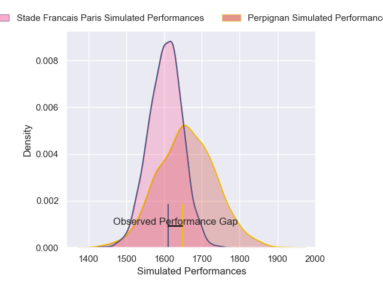
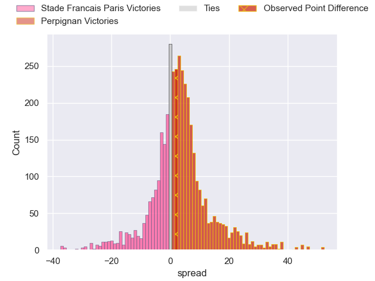
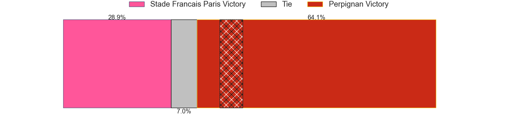
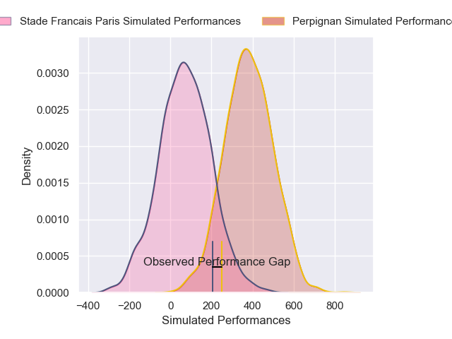
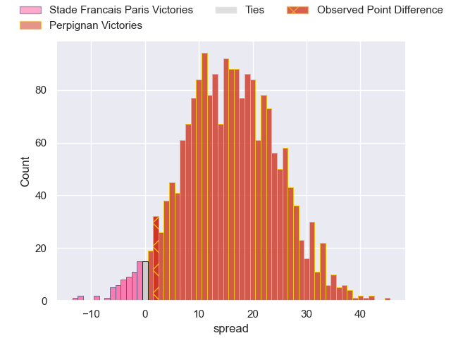
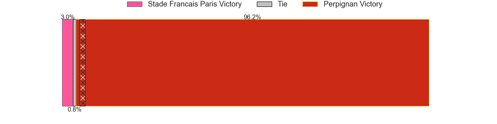

---  
layout: page  
title: Stade Francais Paris at Perpignan; 18-20  
date: 2025-05-10 18:00:00 -0500  
categories: "Top 14 Orange 24/25" match review  
---
# Stade Francais Paris at Perpignan; 18-20

# Club Level Predictions

The first set of predictions treats a club as the smallest object, as the club develops its members, organizes a gameplan, and deploys its players as needed for each match. This club model has a prediction of 0.581, which translates to predicting Perpignan to win by 2.9.

Our Over/Under is 51.5 - and combined with the spread above, we have a predicted scoreline of 24 to 27

Each club has a rating and a rating deviation (similar to a Glicko rating), and expected performances can be generated. This allows for simulated matches and spreads like the ones below.
## Projected Performances - Club Model

## Projected Spreads - Club Model

## Projected Results - Club Model

# Player Level Predictions

Treating teams instead as an entity made up of the currently active players, I have ratings for each player in an altogether different system. These can be combined to form team ratings once teamsheets are announced, weighting starters a bit higher than the reserves. After the match is played, players can be weighted by their minutes on the field, allowing for an accurate measure of the team's composition. With these compiled team ratings, we can make predictions, measure inaccuracy, and update the individual player ratings.
## Prediction without Player Minutes: Perpignan by 19.0

Perpignan by 4.2 on a neutral pitch

## Projected Performances - Player Model

## Projected Spreads - Player Model

## Projected Results - Player Model

|   Away Minutes | Away Player              |   Away Percentile |   Number |   Home Percentile | Home Player           |   Home Minutes |
|---------------:|:-------------------------|------------------:|---------:|------------------:|:----------------------|---------------:|
|             51 | Clement Castets          |             68.74 |        1 |             14.05 | Bruce Devaux          |             52 |
|             80 | Giacomo Nicotera         |             97.01 |        2 |             90.49 | Ignacio Ruiz          |             52 |
|             58 | Paul Alo-Emile           |             54.2  |        3 |              4.04 | Kieran Brookes        |             50 |
|             26 | Paul Gabrillagues        |              2.73 |        4 |             55.41 | Jacobus van Tonder    |             18 |
|             80 | Baptiste Pesenti         |             28.59 |        5 |             69.95 | Mathieu Tanguy        |              4 |
|             80 | Tanginoa Halaifonua      |              8.72 |        6 |             88.22 | Patrick Sobela        |             18 |
|             65 | Romain Briatte           |              8.24 |        7 |             50.38 | Noe Della Schiava     |             18 |
|             80 | Sekou Macalou            |             76.01 |        8 |              6.58 | Lucas Velarte         |             67 |
|              9 | Louis Foursans-Bourdette |              3.24 |        9 |             83.99 | James Hall            |             80 |
|             66 | Zack Henry               |             58.14 |       10 |             76.53 | Jake McIntyre         |             80 |
|             80 | Lester Etien             |             64.01 |       11 |              1.56 | Alivereti Duguivalu   |             52 |
|             37 | Julien Delbouis          |             91    |       12 |             96.26 | Jeronimo de la Fuente |             36 |
|             80 | Joe Marchant             |             47.32 |       13 |              5.46 | Eneriko Buliruarua    |             80 |
|             11 | Peniasi Dakuwaqa         |             57    |       14 |             26.17 | Tavite Veredamu       |             60 |
|             60 | Joe Jonas                |             72.55 |       15 |             90    | Valentin Delpy        |             11 |
|             73 | Jeremy Ward              |             52.68 |       16 |             60.26 | Pietro Ceccarelli     |             79 |
|             58 | Moses Alo-Emile          |             18.09 |       17 |             10.73 | Posolo Tuilagi        |             80 |
|             60 | Juan Martin Scelzo       |              7.12 |       18 |             80.61 | Giorgi Beria          |             61 |
|             80 | Lucas Peyresblanques     |             13.03 |       19 |              9.76 | Max Hicks             |             80 |
|             35 | Pierre-Henri Azagoh      |             88.1  |       20 |             60.21 | Seilala Lam           |             80 |
|             15 | Giorgi Melikidze         |            nan    |       21 |             73.61 | Apisai Naqalevu       |             80 |
|            nan | nan                      |            nan    |       22 |             60.04 | Tommaso Allan         |             13 |

