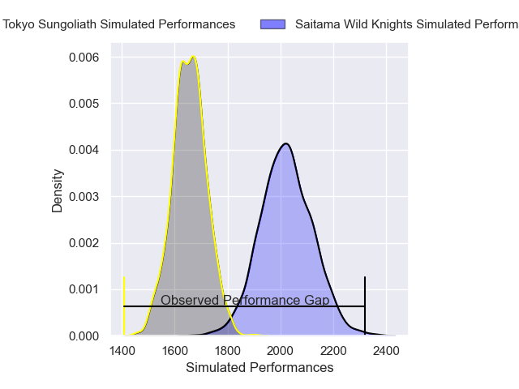
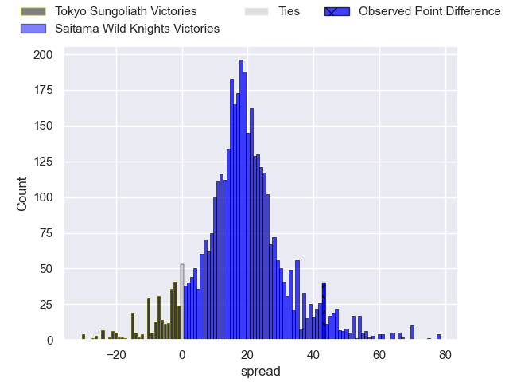
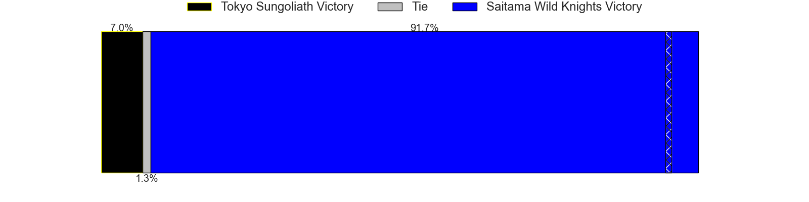
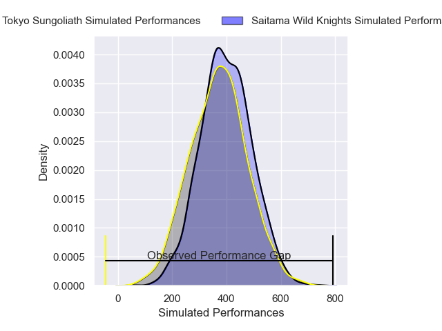
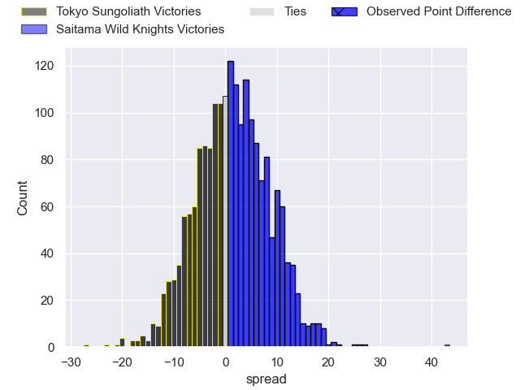
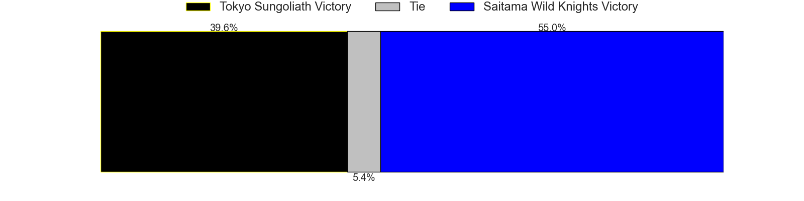

---  
layout: page  
title: Tokyo Sungoliath at Saitama Wild Knights; 17-60  
date: 2025-05-10 18:00:00 -0500  
categories: "Japan Rugby League One 24/25" match review  
---
# Tokyo Sungoliath at Saitama Wild Knights; 17-60

# Club Level Predictions

The first set of predictions treats a club as the smallest object, as the club develops its members, organizes a gameplan, and deploys its players as needed for each match. This club model has a prediction of 0.889, which translates to predicting Saitama Wild Knights to win by 18.5.

Our Over/Under is 62.5 - and combined with the spread above, we have a predicted scoreline of 22 to 40

Each club has a rating and a rating deviation (similar to a Glicko rating), and expected performances can be generated. This allows for simulated matches and spreads like the ones below.
## Projected Performances - Club Model

## Projected Spreads - Club Model

## Projected Results - Club Model

# Player Level Predictions

Treating teams instead as an entity made up of the currently active players, I have ratings for each player in an altogether different system. These can be combined to form team ratings once teamsheets are announced, weighting starters a bit higher than the reserves. After the match is played, players can be weighted by their minutes on the field, allowing for an accurate measure of the team's composition. With these compiled team ratings, we can make predictions, measure inaccuracy, and update the individual player ratings.
## Prediction without Player Minutes: Saitama Wild Knights by 9.5

Saitama Wild Knights by 4.8 on a neutral pitch

## Projected Performances - Player Model

## Projected Spreads - Player Model

## Projected Results - Player Model

|   Away Minutes | Away Player       |   Away Percentile |   Number |   Home Percentile | Home Player       |   Home Minutes |
|---------------:|:------------------|------------------:|---------:|------------------:|:------------------|---------------:|
|              8 | Kenta Kobayashi   |             72.23 |        1 |             56.9  | Craig Millar      |             32 |
|             19 | Kosuke Horikoshi  |             52.72 |        2 |             56.41 | Kenji Sato        |             80 |
|             31 | Sanshiro Kihara   |             39.19 |        3 |             97.85 | Asaeli Ai Valu    |             80 |
|             50 | Sam Jeffries      |             96.69 |        4 |             88.48 | Liam Mitchell     |             10 |
|             55 | Harry Hockings    |             98.58 |        5 |             98.49 | Lood de Jager     |             30 |
|             64 | Kanji Shimokawa   |             70.7  |        6 |             91.39 | Ben Gunter        |             22 |
|             43 | Sam Cane          |             96.91 |        7 |             99.03 | Lachlan Boshier   |             22 |
|             80 | Koji Iino         |             47.68 |        8 |             98.1  | Jack Cornelsen    |             30 |
|             80 | Yutaka Nagare     |             52.7  |        9 |             80.7  | Yuta Takagi       |             80 |
|             55 | Keisuke Moriya    |             96.42 |       10 |             82.32 | Kyohei Yamasawa   |             25 |
|             80 | Cheslin Kolbe     |             99.62 |       11 |             35.67 | Tomoki Osada      |             80 |
|             33 | Shogo Nakano      |             10.02 |       12 |             99.8  | Damian de Allende |             68 |
|             80 | Taiga Ozaki       |             54.96 |       13 |             99.29 | Dylan Riley       |             80 |
|             47 | Seiya Ozaki       |             93.17 |       14 |             98.2  | Koki Takeyama     |             80 |
|             76 | Kotaro Matsushima |             93.92 |       15 |             96.44 | Takuya Yamasawa   |              4 |

