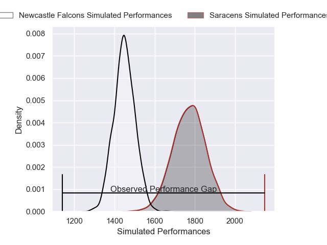
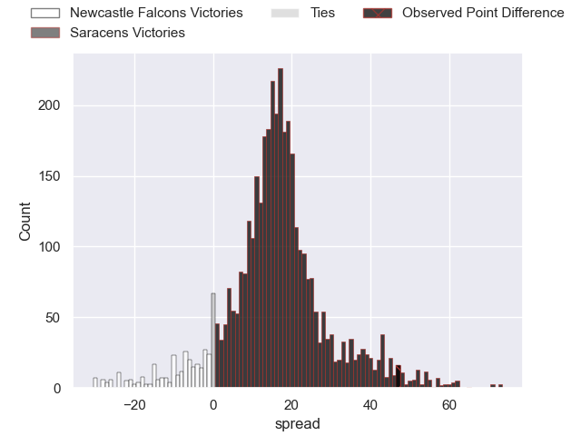
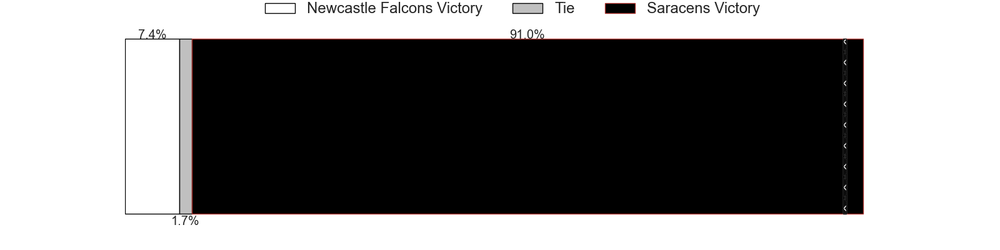
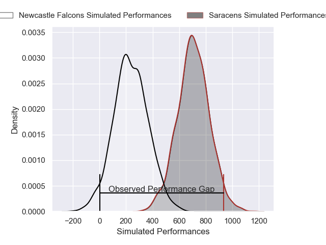
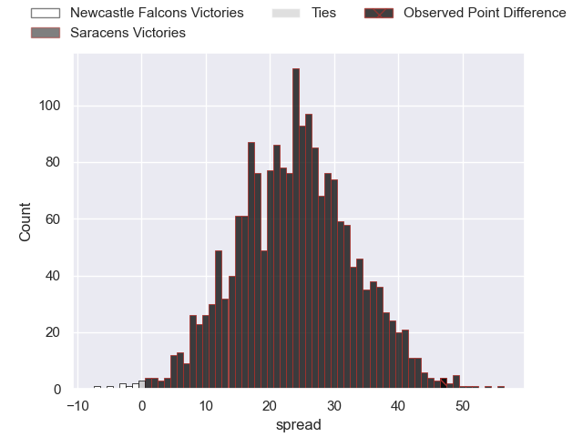
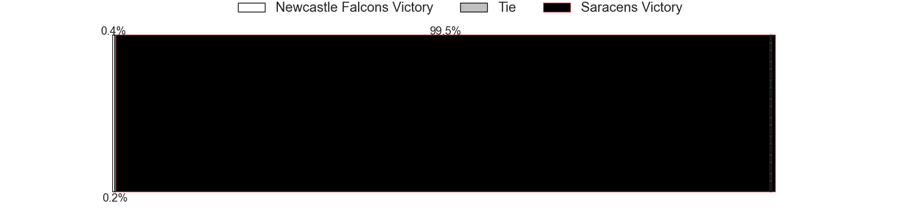

---  
layout: page  
title: Newcastle Falcons at Saracens; 28-75  
date: 2025-05-10 18:00:00 -0500  
categories: "Gallagher Premiership 24/25" match review  
---
# Newcastle Falcons at Saracens; 28-75

# Club Level Predictions

The first set of predictions treats a club as the smallest object, as the club develops its members, organizes a gameplan, and deploys its players as needed for each match. This club model has a prediction of 0.863, which translates to predicting Saracens to win by 16.2.

Our Over/Under is 58.5 - and combined with the spread above, we have a predicted scoreline of 21 to 37

Each club has a rating and a rating deviation (similar to a Glicko rating), and expected performances can be generated. This allows for simulated matches and spreads like the ones below.
## Projected Performances - Club Model

## Projected Spreads - Club Model

## Projected Results - Club Model

# Player Level Predictions

Treating teams instead as an entity made up of the currently active players, I have ratings for each player in an altogether different system. These can be combined to form team ratings once teamsheets are announced, weighting starters a bit higher than the reserves. After the match is played, players can be weighted by their minutes on the field, allowing for an accurate measure of the team's composition. With these compiled team ratings, we can make predictions, measure inaccuracy, and update the individual player ratings.
## Prediction without Player Minutes: Saracens by 36.1

Saracens by 25.0 on a neutral pitch

## Projected Performances - Player Model

## Projected Spreads - Player Model

## Projected Results - Player Model

|   Away Minutes | Away Player         |   Away Percentile |   Number |   Home Percentile | Home Player           |   Home Minutes |
|---------------:|:--------------------|------------------:|---------:|------------------:|:----------------------|---------------:|
|             28 | Adam Brocklebank    |              5.41 |        1 |             89.82 | Eroni Mawi            |             26 |
|             53 | Jamie Blamire       |              1.23 |        2 |             19.54 | Theo Dan              |             33 |
|             80 | Murray McCallum     |             17.37 |        3 |             89.26 | Alec Clarey           |             47 |
|             28 | John Hawkins        |             22.73 |        4 |             97.66 | Maro Itoje            |             26 |
|             53 | Sebastian de Chaves |              2.34 |        5 |             97.56 | Nick Isiekwe          |             53 |
|             65 | Freddie Lockwood    |             57.95 |        6 |             32.85 | Theo McFarland        |              8 |
|             53 | Cameron Neild       |             36.78 |        7 |             96.46 | Juan Martin Gonzalez  |             80 |
|             17 | Callum Chick        |              0.42 |        8 |             99.36 | Ben Earl              |             80 |
|             23 | Sam Stuart          |              0.36 |        9 |             83.09 | Ivan van Zyl          |             66 |
|             50 | Brett Connon        |              1.06 |       10 |             38.48 | Fergus Burke          |             11 |
|             50 | Ben Stevenson       |              5.16 |       11 |             80.93 | Rotimi Segun          |             69 |
|             53 | Sammy Arnold        |             54.6  |       12 |             99.29 | Nick Tompkins         |             80 |
|             52 | Max Clark           |             99.9  |       13 |             92.11 | Elliot Daly           |             80 |
|             80 | Max Clark           |             99.9  |       13 |             92.11 | Elliot Daly           |             80 |
|             29 | Alex Hearle         |             60.31 |       14 |             44.55 | Tobias Elliott        |             62 |
|             23 | Elliott Obatoyinbo  |              5.74 |       15 |             94.26 | Alex Goode            |             53 |
|             20 | Mike Rewcastle      |             15.43 |       16 |             89.58 | Sam Crean             |             80 |
|             72 | Ollie Fletcher      |             10.74 |       17 |            100    | Jamie George          |             75 |
|             80 | Luan de Bruin       |             75.85 |       18 |             39.34 | Harvey Beaton         |             48 |
|             74 | Oscar Usher         |            nan    |       19 |            nan    | Andy Onyeama-Christie |             53 |
|             24 | Tom Gordon          |             90.42 |       20 |             64.57 | Charlie Bracken       |             20 |
|             20 | Tom Gordon          |             90.42 |       20 |             64.57 | Charlie Bracken       |             20 |
|             54 | Joe Davis           |            nan    |       21 |             12.05 | Louie Johnson         |             80 |
|             12 | Max Pepper          |             76.46 |       22 |             74.32 | Angus Hall            |             80 |
|             52 | Oliver Spencer      |              6.32 |       23 |             23.99 | Tom Willis            |             47 |
|             42 | Oliver Spencer      |              6.32 |       23 |             23.99 | Tom Willis            |             47 |

